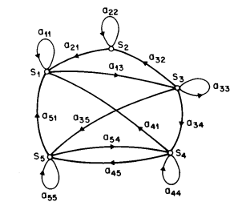
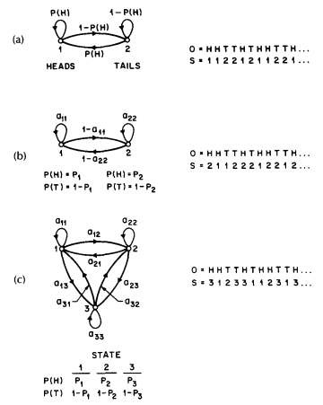
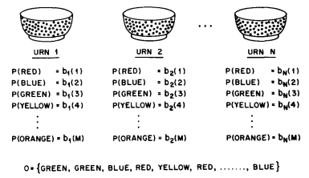
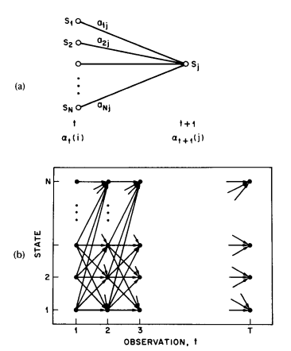

Notes on: Rabiner, L. R. (1990): A tutorial on hidden markov models and selected applications in speech recognition
===================================================================================================================

.. code-block:: bibtex

   @article{Rabiner_tutor_HMM,
     author    = {Rabiner, Lawrence R.},
     title     = {A Tutorial on Hidden Markov Models and Selected Applications in Speech Recognition},
     journal   = {Readings in Speech Recognition},
     pages     = {267–296},
     year      = {1990},
     doi       = {10.1016/b978-0-08-051584-7.50027-9},
     url       = {http://dx.doi.org/10.1016/b978-0-08-051584-7.50027-9},
     isbn      = {http://id.crossref.org/isbn/9781558601246},
     publisher = {Elsevier BV},
   }

Although initially introduced and studied in the late 1960s and early 1970s,
statistical methods of Markov source or hidden Markov modeling have become
increasingly popular in the last several years. There are two strong reasons why
this has occurred. First the models are very rich in mathematical structure and
hence can form the theoretical basis for use in a wide range of applications.
Second the models, when applied properly, work very well in practice for several
important applications. In this paper we attempt to carefully and methodically
review the theoretical aspects of this type of statistical modeling and show how
they have been applied to selected problems in machine recognition of speech.

INTRODUCTION
------------

Real-world processes generally produce observable outputs which can be
characterized as signals. The signals can be discrete in nature (e.g.,
characters from a finite alphabet, quantized vectors from a codebook, etc.), or
continuous in nature (e.g., speech samples, temperature measurements, music,
etc.). The signal source can be stationary (i.e., its statistical properties do
not vary with time), or nonstationary (i.e., the signal properties vary over
time). The signals can be pure (i.e., coming strictly from a single source), or
can be corrupted from other signal sources (e.g., noise) or by transmission
distortions, reverberation, etc.

A problem of fundamental interest is characterizing such real-world signals in
terms of signal models. There are several reasons why one is interested in
applying signal models. First of all, a signal model can provide the basis for a
theoretical description of a signal processing system which can be used to
process the signal so as to provide a desired output. For example if we are
interested in enhancing a speech signal corrupted by noise and transmission
distortion, we can use the signal model to design a system which will optimally
remove the noise and undo the transmission distortion. A second reason why
signal models are important is that they are potentially capable of letting us
learn a great deal about the signal source (i.e., the real-world process which
produced the signal) without having to have the source available. This property
is especially important when the cost of getting signals from the actual source
is high. In this case, with a good signal model, we can simulate the source and
learn as much as possible via simulations. Finally, the most important reason
why signal models are important is that they often work extremely well in
practice, and enable us to realize important practical systems-e.g., prediction
systems, recognition systems, identification systems, etc., in a very efficient
manner.

These are several possible choices for what type of signal model is used for
characterizing the properties of a given signal. Broadly one can dichotomize the
types of signal models into the class of deterministic models, and the class of
statistical models. Deterministic models generally exploit some known specific
properties of the signal, e.g., that the signal is a sine wave, or a sum of
exponentials, etc. In these cases, specification of the signal model is
generally straightforward; all that is required is to determine (estimate)
values of the parameters of the signal model (e.g., amplitude, frequency, phase
of a sine wave, amplitudes and rates of exponentials, etc.). The second broad
class of signal models is the set of statistical models in which one tries to
characterize only the statistical properties of the signal. Examples of such
statistical models include Gaussian processes, Poisson processes, Markov
processes, and hidden Markov processes, among others. The underlying assumption
of the statistical model is that the signal can be well characterized as a
parametric random process, and that the parameters of the stochastic process can
be determined (estimated) in a precise, well-defined manner.

For the applications of interest, namely speech processing, both deterministic
and stochastic signal models have had good success. In this paper we will
concern ourselves strictly with one type of stochastic signal model, namely the
hidden Markov model (HMM). (These models are referred to as Markov sources or
probabilistic functions of Markov chains in the communications literature.) We
will first review the theory of Markov chains and then extend the ideas to the
class of hidden Markov models using several simple examples. We will then focus
our attention on the three fundamental problems [#hmm1]_ for HMM design, namely:
the evaluation of the probability (or likelihood) of a sequence of observations
given a specific HMM; the determination of a best sequence of model states; and
the adjustment of model parameters so as to best account for the observed
signal. We will show that once these three fundamental problems are solved, we
can apply HMMs to selected problems in speech recognition.

Neither the theory of hidden Markov models nor its applications to speech
recognition is new. The basic theory was published in a series of classic papers
by Baum and his colleagues [Ref1]_, [Ref2]_, [Ref3]_, [Ref4]_, [Ref5]_ in the
late 1960s and early 1970s and was implemented for speech processing
applications by Baker [Ref6]_ at CMU, and by Jelinek and his colleagues at IBM
[Ref7]_, [Ref8]_, [Ref9]_, [Ref10]_, [Ref11]_, [Ref12]_, [Ref13]_ in the 1970s.
However, widespread understanding and application of the theory of HMMs to
speech processing has occurred only within the past several years. There are
several reasons why this has been the case. First, the basic theory of hidden
Markov models was published in mathematical journals which were not generally
read by engineers working on problems in speech processing. The second reason
was that the original applications of the theory to speech processing did not
provide sufficient tutorial material for most readers to understand the theory
and to be able to apply it to their own research. As a result, several tutorial
papers were written which provided a sufficient level of detail for a number of
research labs to begin work using HMMs in individual speech processing
applications [Ref14]_, [Ref15]_, [Ref16]_, [Ref17]_, [Ref18]_, [Ref19]_. This
tutorial is intended to provide an overview of the basic theory of HMMs (as
originated by Baum and his colleagues), provide practical details on methods of
implementation of the theory, and describe a couple of selected applications of
the theory to distinct problems in speech recognition. The paper combines
results from a number of original sources and hopefully provides a single source
for acquiring the background required to pursue further this fascinating area of
research.

The organization of this paper is as follows. In Section II we review the theory
of discrete Markov chains and show how the concept of hidden states, where the
observation is a probabilistic function of the state, can be used effectively.
We illustrate the theory with two simple examples, namely coin-tossing, and the
classic balls-in-urns system. In Section III we discuss the three fundamental
problems of HMMs, and give several practical techniques for solving these
problems. In Section IV we discuss the various types of HMMs that have been
studied including ergodic as well as left-right models. In this section we also
discuss the various model features including the form of the observation density
function, the state duration density, and the optimization criterion for
choosing optimal HMM parameter values. In Section V we discuss the issues that
arise in implementing HMMs including the topics of scaling, initial parameter
estimates, model size, model form, missing data, and multiple observation
sequences. In Section VI we describe an isolated word speech recognizer,
implemented with HMM ideas, and show how it performs as compared to alternative
implementations. In Section VII we extend the ideas presented in Section VI to
the problem of recognizing a string of spoken words based on concatenating
individual HMMs of each word in the vocabulary. In Section VIII we briefly
outline how the ideas of HMM have been applied to a large vocabulary speech
recognizer, and in Section IX we summarize the ideas discussed throughout the
paper.

DISCRETE MARKOV PROCESSES [#hmm2]_
----------------------------------

.. _hmmfig1:

   A Markov chain with 5 states (labeled :math:`S_1` to :math:`S_5`) with selected state transitions.

Consider a system which may be described at any time as being in one of a set of
:math:`N` distinct states, :math:`S_1, S_2, \ldots, S_N`, as illustrated in
:numref:`hmmfig1` (where :math:`N = 5` for simplicity). At regularly spaced
discrete times, the system undergoes a change of state (possibly back to the
same state) according to a set of probabilities associated with the state. We
denote the time instants associated with state changes as :math:`t = 1, 2,
\ldots` , and we denote the actual state at time :math:`t` as :math:`q_t`. A
full probabilistic description of the above system would, in general, require
specification of the current state (at time :math:`t`), as well as all the
predecessor states. For the special case of a discrete, first order, Markov
chain, this probabilistic description is truncated to just the current and the
predecessor state, i.e.,

.. math::
   P[q_t = S_j \mid q_{t-1} = S_i, q_{t-2} = S_k, \ldots] = P[q_t = S_j \mid q_{t-1} = S_i].
   :label: hmmeq1

Further more we only consider those processes in which the right-hand side of
:eq:`hmmeq1` is independent of time, thereby leading to the set of state
transition probabilities :math:`a_{ij}` of the form

.. math::
   a_{ij} = P[q_t = S_j \mid q_{t-1} = S_i], \quad 1 \leq i, j \leq N
   :label: hmmeq2

with the state transition coefficients having the properties

.. math::
   a_{ij} & \geq 0 \\
   \sum_{j = 1}^{N} a_{ij} & = 1
   :label: hmmeq3

since they obey standard stochastic constraints.

The above stochastic process could be called an observable Markov model since
the output of the process is the set of states at each instant of time, where
each state corresponds to a physical (observable) event. To set ideas, consider
a simple 3-state Markov model of the weather. We assume that once a day (e.g.,
at noon), the weather is observed as being one of the following:

   State 1: rain or (snow)

   State 2: cloudy

   State 3: sunny

We postulate that the weather on day :math:`t` is characterized by a single one
of the three states above, and that the matrix :math:`A` of state transition
probabilities is

.. math::
   A = \{a_{ij}\} =
   \begin{bmatrix}
   0.4 & 0.3 & 0.3 \\
   0.2 & 0.6 & 0.2 \\
   0.1 & 0.1 & 0.8
   \end{bmatrix}
   .

Given that the weather on day 1 (:math:`t = 1`) is sunny (state 3), we can ask
the question: What is the probability (according to the model) that the weather
for the next 7 days will be "sun-sun-rain-rain-sun-cloudy-sun"? Stated more
formally, we define the observation sequence :math:`O` as
:math:`O = \{S_3, S_3, S_3, S_1, S_1, S_3, S_2, S_3\}`
corresponding to :math:`t = 1, 2, \ldots, 8,` and we
wish to determine the probability of :math:`O` , given the model. This
probability can be expressed (and evaluated) as

.. math::
   P(O \mid \text{Model}) & = P[S_3, S_3, S_3, S_1, S_1, S_3, S_2, S_3 \mid \text{Model}] \\
   & = P[S_3] \cdot P[S_3 \mid S_3] \cdot P[S_3 \mid S_3] \cdot P[S_1 \mid S_3] \\
   & \quad \cdot P[S_1 \mid S_1] \cdot P[S_3 \mid S_1] \mid P[S_2 \mid S_3] \mid P[S_3 \mid S_2] \\
   & = \pi_3 \cdot a_{33} a_{33} a_{31} a_{11} a_{13} a_{32} a_{23} \\
   & = 1 \times 0.8 \times 0.8 \times 0.1 \times 0.4 \times 0.3 \times 0.1 \times 0.2 \\
   & = 1.536 \times 10^{-4}

where we use the notation

.. math::
   \pi_i = P[q_1 = S_i], \quad 1 \leq i \leq N
   :label: hmmeq4

to denote the initial state probabilities.

Another interesting question we can ask (and answer using the model) is: Given
that the model is in a known state, what is the probability it stays in that
state for exactly :math:`d` days? This probability can be evaluated as the
probability of the observation sequence

.. math::
   O = \{S_i, S_i, S_i, \ldots, S_i, S_j \neq S_i\},

given the model, which is

.. math::
   P(O \mid \text{Model}, q_1 = S_i) = (a_{ii})^{d-1} (1 - a_{ii}) = p_i(d).
   :label: hmmeq5

The quantity :math:`p_i(d)` is the (discrete) probability density function of
duration :math:`d` in state :math:`i` . This exponential duration density is
characteristic of the state duration in a Markov chain. Based on :math:`p_i(d)`
, we can readily calculate the expected number of observations (duration) in a
state, conditioned on starting in that state as

.. math::
   \bar{d}_i & = \sum_{d=1}^{\infty} d p_i(d) \\
   & = \sum_{d=1}^{\infty} d (a_{ii})^{d-1} (1 - a_{ii}) = \dfrac{1}{1 - a_{ii}}.
   :label: hmmeq6

Thus the expected number of consecutive days of sunny weather, according to the
model, is :math:`1/0.2 = 5` ; for cloudy it is :math:`2.5` ; for rain it is
:math:`1.67` .

Extension to Hidden Markov Models
~~~~~~~~~~~~~~~~~~~~~~~~~~~~~~~~~

So far we have considered Markov models in which each state corresponded to an
observable (physical) event. This model is too restrictive to be applicable to
many problems of interest. In this section we extend the concept of Markov
models to include the case where the observation is a probabilistic function of
the state-i.e., the resulting model (which is called a hidden Markov model) is a
doubly embedded stochastic process with an underlying stochastic process that is
not observable (it is hidden), but can only be observed through another set of
stochastic processes that produce the sequence of observations. To fix ideas,
consider the following model of some simple coin tossing experiments.

**Coin Toss Models**: Assume the following scenario. You are in a room with a
barrier (e.g., a curtain) through which you cannot see what is happening. On the
other side of the barrier is another person who is performing a coin (or
multiple coin) tossing experiment. The other person will not tell you anything
about what he is doing exactly; he will only tell you the result of each coin
flip. Thus a sequence of hidden coin tossing experiments is performed, with the
observation sequence consisting of a series of heads and tails; e.g., a typical
observation sequence would be

.. math::
   \mathcal{O} & = O_1 O_2 O_3 \cdots O_T \\
   & = \mathscr{H} \mathscr{H} \mathscr{T} \cdots \mathscr{H}

where :math:`\mathscr{H}` stands for heads and :math:`\mathscr{T}` stands for
tails.

Given the above scenario, the problem of interest is how do we build an HMM to
explain (model) the observed sequence of heads and tails. The first problem one
faces is deciding what the states in the model correspond to, and then deciding
how many states should be in the model. One possible choice would be to assume
that only a single biased coin was being tossed. In this case we could model the
situation with a 2-state model where each state corresponds to a side of the
coin (i.e., heads or tails). This model is depicted in :numref:`hmmfig2` (a)
[#hmm3]_. In this case the Markov model is observable, and the only issue for
complete specification of the model would be to decide on the best value for the
bias (i.e., the probability of, say, heads). Interestingly, an equivalent HMM to
that of :numref:`hmmfig2` (a) would be a degenerate 1-state model, where the
state corresponds to the single biased coin, and the unknown parameter is the
bias of the coin.

.. _hmmfig2:

   Three possible Markov models which can account for the results of hidden coin tossing experiments. (a) 1-coin model. (b) 2-coins model. (c) 3-coins model.

A second form of HMM for explaining the observed sequence of coin toss outcome
is given in :numref:`hmmfig2` (b). In this case there are 2 states in the model
and each state corresponds to a different, biased, coin being tossed. Each state
is characterized by a probability distribution of heads and tails, and
transitions between states are characterized by a state transition matrix. The
physical mechanism which accounts for how state transitions are selected could
itself be a set of independent coin tosses, or some other probabilistic event.

A third form of HMM for explaining the observed sequence of coin toss outcomes
is given in :numref:`hmmfig2` (c). This model corresponds to using 3 biased
coins, and choosing from among the three, based on some probabilistic event.

Given the choice among the three models shown in :numref:`hmmfig2` for
explaining the observed sequence of heads and tails, a natural question would be
which model best matches the actual observations. It should be clear that the
simple 1-coin model of :numref:`hmmfig2` (a) has only 1 unknown parameter; the
2-coin model of :numref:`hmmfig2` (b) has 4 unknown parameters; and the 3-coin
model of :numref:`hmmfig2` (c) has 9 unknown parameters. Thus, with the greater
degrees of freedom, the larger HMMs would seem to inherently be more capable of
modeling a series of coin tossing experiments than would equivalently smaller
models. Although this is theoretically true, we will see later in this paper
that practical considerations impose some strong limitations on the size of
models that we can consider. Furthermore, it might just be the case that only a
single coin is being tossed. Then using the 3-coin model of
:numref:`hmmfig2` (c) would be inappropriate, since the actual physical event
would not correspond to the model being used-i.e., we would be using an
underspecified system.

**The Urn and Ball Mode** [#hmm4]_: To extend the ideas of the HMM to a somewhat
more complicated situation, consider the urn and ball system of
:numref:`hmmfig3` . We assume that there are :math:`N` (large) glass urns in a
room. Within each urn there are a large number of colored balls. We assume there
are :math:`M` distinct colors of the balls. The physical process for obtaining
observations is as follows. A genie is in the room, and according to some random
process, he (or she) chooses an initial urn. From this urn, a ball is chosen at
random, and its color is recorded as the observation. The ball is then replaced
in the urn from which it was selected. A new urn is then selected according to
the random selection process associated with the current urn, and the ball
selection process is repeated. This entire process generates a finite
observation sequence of colors, which we would like to model as the observable
output of an HMM.

.. _hmmfig3:

   An :math:`N\text{-state}` urn and ball model which illustrates the general
   case of a discrete symbol HMM.

It should be obvious that the simplest HMM that corresponds to the urn and ball
process is one in which each state corresponds to a specific urn, and for which
a (ball) color probability is defined for each state. The choice of urns is
dictated by the state transition matrix of the HMM.

Elements of an HMM
~~~~~~~~~~~~~~~~~~

The above examples give us a pretty good idea of what an HMM is and how it can
be applied to some simple scenarios. We now formally define the elements of an
HMM, and explain how the model generates observation sequences.

An HMM is characterized by the following:

1) :math:`N`, the number of states in the model. Although the states are hidden,
   for many practical applications there is often some physical significance
   attached to the states or to sets of states of the model. Hence, in the coin
   tossing experiments, each state corresponded to a distinct biased coin. In
   the urn and ball model, the states corresponded to the urns. Generally the
   states are interconnected in such a way that any state can be reached from
   any other state (e.g., an ergodic model); however, we will see later in this
   paper that other possible interconnections of states are often of interest.
   We denote the individual states as :math:`S = \{S_1, S_2, \ldots, S_N\}`, and
   the state at time :math:`t` as :math:`q_t`.

2) :math:`M`, the number of distinct observation symbols per state, i.e., the
   discrete alphabet size. The observation symbols correspond to the physical
   output of the system being modeled. For the coin toss experiments the
   observation symbols were simply heads or tails; for the ball and urn model
   they were the colors of the balls selected from the urns. We denote the
   individual symbols as :math:`V = \{v_1, v_2, \ldots, v_M\}`.

3) The state transition probability distribution :math:`A = \{a_{ij}\}` where

   .. math::
      a_{ij} = P[q_{t+1} = S_j \mid q_t = S_i], \quad 1 \leq i, j \leq N.
      :label: hmmeq7

   For the special case where any state can reach any other state in a single
   step, we have :math:`a_{ij} \geq 0` for all :math:`i, j` . For other types of
   HMMs, we would have :math:`a_{ij} = 0` for one or more :math:`(i,j)` pairs.

4) The observation symbol probability distribution in state :math:`j`,
   :math:`B = \{b_j(k)\}`, where

   .. math::
      b_j(k) = P[v_k \text{ at } t \mid q_t = S_j], \quad 1 \leq j \leq N, \quad 1 \leq k \leq M.
      :label: hmmeq8

5) The initial state distribution :math:`\pi = \{\pi_i\}` where

   .. math::
      \pi_i = P[q_1 = S_i], \quad 1 \leq i \leq N.
      :label: hmmeq9

Given appropriate values of :math:`N, M, A, B`, and :math:`\pi`, the HMM can be
used as a generator to give and observation sequence

.. math::
   \mathcal{O} = O_1 O_2 \cdots O_T
   :label: hmmeq10

(where each observation :math:`O_t` is one of the symbols from :math:`V`, and
:math:`T` is the number of observations in the sequence) as follows:

1. Choose an initial state :math:`q_1 = S_i` according to the initial state
   distribution :math:`\pi`.

2. Set :math:`t = 1`.

3. Choose :math:`O_t = v_k` according to the symbol probability distribution in
   state :math:`S_i`, i.e., :math:`b_i(k)`.

4. Transit to a new state :math:`q_{t+1} = S_j` according to the state
   transition probability distribution for state :math:`S_i`, i.e.,
   :math:`a_{ij}`.

5. Set :math:`t = t + 1`; return to step 3 if :math:`t < T`; otherwise terminate
   the procedure.

The above procedure can be used as both a generator of observations, and as a
model for how a given observation sequence was generated by an appropriate HMM.

It can be seen from the above discussion that a complete specification of an HMM
requires specification of two model parameters (:math:`N` and :math:`M`),
specification of observation symbols, and the specification of the three
probability measures :math:`A, B`, and :math:`\pi` . For convenience, we use the
compact notation

.. math::
   \lambda = (A, B, \pi)
   :label: hmmeq11

to indicate the complete parameter set of the model.

The Three Basic Problems for HMMs [#hmm5]_
~~~~~~~~~~~~~~~~~~~~~~~~~~~~~~~~~~~~~~~~~~

Given the form of HMM of the previous section, there are three basic problems of
interest that must be solved for the model to be useful in real-world
applications. These problems are the following:

**Problem 1**: Given the observation sequence :math:`\mathcal{O} = O_1 O_2
\cdots O_T`, and a model :math:`\lambda = (A, B, \pi)`, how do we efficiently
compute :math:`P(\mathcal{O} \mid \lambda`, the probability of the observation
sequence, given the model?

**Problem 2**: Given the observation sequence :math:`\mathcal{O} = O_1 O_2
\cdots O_T`, and the model :math:`\lambda`, how do we choose a corresponding
state sequence :math:`Q = q_1 q_2 \cdots q_T` which is optimal in some
meaningful sense (i.e., best "explains" the observations?

**Problem 3**: How do we adjust the model parameters :math:`\lambda = (A, B,
\pi)` to maximize :math:`P(\mathcal{O} \mid \lambda)`?

Problem 1 is the evaluation problem, namely given a model and asequence of
observations, how do we compute the probability that the observed sequence was
produced by the model. We can also view the problem as one of scoring how well a
given model matches a given observation sequence. The latter viewpoint is
extremely useful. For example, if we consider the case in which we are trying to
choose among several competing models, the solution to Problem 1 allows us to
choose the model which best matches the observations.

Problem 2 is the one in which we attempt to uncover the hidden part of the
model, i.e., to find the “correct” state sequence. It should be clear that for
all but the case of degenerate models, there is no “correct” state sequence to
be found. Hence for practical situations, we usually use an optimality criterion
to solve this problem as best as possible. Unfortunately, as we will see, there
are several reasonable optimality criteria that can be imposed, and hence the
choice of criterion is a strong function of the intended use for the uncovered
state sequence. Typical uses might be to learn about the structure of the model,
to find optimal state sequences for continuous speech recognition, or to get
average statistics of individual states, etc.

Problem 3 is the one in which we attempt to optimize the model parameters so as
to best describe how a given observation sequence comes about. The observation
sequence used to adjust the model parameters is called a training sequence since
it is used to “train” the HMM. The training problem is the crucial one for most
applications of HMMs, since it allows us to optimally adapt model parameters to
observed training data-i.e., to create best models for real phenomena.

To fix ideas, consider the following simple isolated word speech recognizer. For
each word of a :math:`W` word vocabulary, we want to design a separate
:math:`N` -state HMM. We represent the speech signal of a given word as a time
sequence of coded spectral vectors. We assume that the coding is done using a
spectral codebook with :math:`M` unique spectral vectors; hence each observation
is the index of the spectral vector closest (in some spectral sense) to the
original speech signal. Thus, for each vocabulary word, we have a training
sequence consisting of a number of repetitions of sequences of codebook indices
of the word (by one or more talkers). The first task is to build individual word
models. This task is done by using the solution to Problem 3 to optimally
estimate model parameters for each word model. To develop an understanding of
the physical meaning of the model states, we use the solution to Problem 2 to
segment each of the word training sequences into states, and then study the
properties of the spectral vectors that lead to the observations occurring in
each state. The goal here would be to make refinements on the model (e.g., more
states, different codebook size, etc.) so as to improve its capability of
modeling the spoken word sequences. Finally, once the set of :math:`W` HMMs has
been designed and optimized and thoroughly studied, recognition of an unknown
word is performed using the solution to Problem 1 to score each word model based
upon the given test observation sequence, and select the word whose model score
is highest (i.e., the highest likelihood).

In the next section we present formal mathematical solutions to each of the
three fundamental problems for HMMs. We shall see that the three problems are
linked together tightly under our probabilistic framework.

SOLUTIONS TO THE THREE BASIC PROBLEMS OF HMMs
---------------------------------------------

Solution to Problem 1
~~~~~~~~~~~~~~~~~~~~~

We wish to calculate the probability of the observation sequence,
:math:`\mathcal{O} = O_1 O_2 \cdots O_T`, given the model :math:`\lambda`, i.e.,
:math:`P(\mathcal{O} \mid \lambda)`. The most straightforward way of doing this
is through enumerating every possible state sequence of length :math:`T` (the
number of observations). Consider one such fixed state sequence

.. math::
   Q = q_1 q_2 \cdots q_T
   :label: hmmeq12

where :math:`q_1` is the initial state. The probability of the observation
sequence :math:`\mathcal{O}` for the state sequence of :eq:`hmmeq12` is

.. math::
   P(\mathcal{O} \mid Q, \lambda) = \prod_{t = 1}^T P(O_t \mid q_t, \lambda)
   :label: hmmeq13a

where we have assumed statistical indepencence of observations. Thus we get

.. math::
   P(\mathcal{O} \mid Q, \lambda) = b_{q_1}(O_1) \cdot b_{q_2}(O_2) \cdots b_{q_t}(O_T).
   :label: hmmeq13b

The probability of such a state sequence :math:`Q` can be written as

.. math::
   P(Q \mid \lambda) = \pi_{q_1} a_{q_1 q_2} a_{q_2 q_3} \cdots a_{q_{T-1} q_T}.
   :label: hmmeq14

The joint probability of :math:`\mathcal{O}` and :math:`Q`, i.e., the
probability that :math:`\mathcal{O}` and :math:`Q` occur simultaneously, is
simply the product of the above two terms, i.e.,

.. math::
   P(\mathcal{O}, Q \mid \lambda) = P(\mathcal{O} \mid Q, \lambda) P(Q, \lambda).
   :label: hmmeq15

The probability of :math:`\mathcal{O}` (given the model) is obtained by summing
this joint probability over all possible state sequences :math:`q` giving

.. math::
   P(\mathcal{O} \mid \lambda) & = \sum_{\text{all} Q} P(\mathcal{O} \mid Q, \lambda) P(Q \mid \lambda) \\
   & = \sum_{q_1, q_2, \ldots, q_T} \pi_{q_1} b_{q_1}(O_1) a_{q_1 q_2} b_{q_2}(O_2) \cdots a_{q_{T-1} q_T} b_{q_T}(O_T).
   :label: hmmeq17

The interpretation of the computation in the above equation is the following.
Initially (at time :math:`t = 1`) we are in state :math:`q_1` with probability
:math:`\pi_{q_1}`, and generate the symbol :math:`O_1` (in this state) with
probability :math:`b_{q_1}(O_1)`. The clock changes from time :math:`t` to
:math:`t+1` (:math:`t = 2`) and we make a transition to state :math:`q_2` from
state :math:`q_1` with probability :math:`a_{q_1 q_2}`, and generate symbol
:math:`O_2` with probability :math:`b_{q_2}(O_2)`. This process continues in
this manner until we make the list transition (at time :math:`T`) from state
:math:`q_{T-1}` to state :math:`q_T` with probability :math:`a_{q_{T-1} q_T}`
and generate symbol :math:`O_T` with probability :math:`b_{q_T}(O_T)`.

A little thought should convince the reader that the calculation of
:math:`P(\mathcal{O} \mid \lambda)`, according to its direct definition
:eq:`hmmeq17` involves on the order of :math:`2 T \cdot N^T` calculations, since
at every :math:`t = 1, 2, \ldots, T`, there are :math:`N` possible states which
can be reached (i.e., there are :math:`N^T` possible state sequences), and for
each such state sequence about :math:`2T` calculations are required for each
term in the sum of :eq:`hmmeq17`. (To be precise, we need :math:`(2T-1)N^T`
multiplications, and :math:`N^T-1` additions.) This calculation is
computationally unfeasible, even for small values of :math:`N` and :math:`T`;
e.g., for :math:`N = 5` (states), :math:`T = 100` (observations), there are on
the order of :math:`2 \cdot 100 \cdot 5^{100} \sim 10^{72}` computations!
Clearly a more efficient procedure is required to solve Problem 1. Fortunately
such a procedure exists and is called the forward-backward procedure.

**The Forward-Backward Procedure** [#hmm6]_ [Ref2]_, [Ref3]_: Consider the
forward variable :math:`\alpha_t(j)` defined as

.. math::
   \alpha_t(i) = P(O_1 O_2 \cdots O_t, q_t = S_i \mid \lambda)
   :label: hmmeq18

i.e., the probability of the partial observation sequence, :math:`O_1 O_2 \cdots
O_t`, (until time :math:`t`) and state :math:`S_i` at time :math:`t`, given the
model :math:`\lambda`. We can solve for :math:`\alpha_t(i)` inductively, as
follows:

1. Initialization:

   .. math::
      \alpha_1(i) = \pi_i b_i(O_1), \quad 1 \leq i \leq N.
      :label: hmmeq19

2. Induction:

   .. math::
      \alpha_{t+1}(j) = \left[ \sum_{i = 1}^N \alpha_t(i) a_{ij} \right] b_j(O_{t+1}), \quad 1 \leq t \leq T - 1, \quad 1 \leq j \leq N.
      :label: hmmeq20

3. Termination:

   .. math::
      P(\mathcal{O} \mid \lambda) = \sum_{i = 1}^N \alpha_{T}(i).
      :label: hmmeq21

Step 1) initializes the forward probabilities as the joint probability of state
:math:`S_i` and initial observation :math:`O_1`. The induction step, which is
the heart of the forward calculation, is illustrated in :numref:`hmmfig4`. This
figure shows how state :math:`S_j` can be reached at time :math:`t + 1` from the
:math:`N` possible states, :math:`S_i, 1 \leq i \leq N`, at time :math:`t`.
Since :math:`\alpha_t(i)` is the probability of the joint event that :math:`O_1
O_2 \cdots O_t` are observed, and the state at time :math:`t` is :math:`S_i`,
the product :math:`\alpha_t(i) a_{ij}` is then the probability of the joint
event that :math:`O_1 O_2 \cdots O_t` are observed, and state :math:`S_j` is
reached at time :math:`t + 1` via state :math:`S_i` at time :math:`t`. Summing
this product over all the :math:`N` possible states :math:`S_i, 1 \leq i \leq N`
at time :math:`t` results in the probability of :math:`S_j` at time :math:`t +
1` with all the accompanying previous partial observations. Once this is done
and :math:`S_j` is known, it is easy to see that :math:`\alpha_{t+1}(j)` is
obtained by accounting for quantity by the probability :math:`b_j(O_{t+1})`. The
computation of :eq:`hmmeq20` is performed for all states :math:`j, 1 \leq j \leq
N`, for a given :math:`t`; the computation is then iterated for :math:`t = 1, 2,
\ldots, T - 1`. Finally, step 3) gives the desired calculation of
:math:`P(\mathcal{O} \mid \lambda)` as the sum of the terminal forward variables
:math:`\alpha_T(i)`. This is the case since, by definition,

.. math::
   \alpha_T(i) = P(O_1 O_2 \cdots O_T, q_T = S_i \mid \lambda)
   :label: hmmeq22

and hence :math:`P(\mathcal{O} \mid \lambda)` is just the sum of the
:math:`\alpha_T(i)`'s.

.. _hmmfig4:

   (a) Illustration of the sequence of operations required for the computation
   of the forward variable :math:`\alpha_{t+1}(j)`. (b) Implementation of the
   computation of :math:`\alpha_{t}(j)` in terms of a lattice of observations
   :math:`t`, and states :math:`i`.

If we examine the computation involved in the calculation of
:math:`\alpha_t(j)`, :math:`1 \leq t \leq T`, :math:`1 \leq j \leq N`, we see
that it requires on the order of :math:`N^2 T` calculations, rather than
:math:`2 T N^T` as required by the direct calculation. (Again, to be precise, we
need :math:`N(N+1)(T-1) + N` multiplications and :math:`N(N-1)(T-1)` additions.)
For :math:`N = 5`, :math:`T = 100`, we need about :math:`3000` computations for
the forward method, versus :math:`10^{72}` computations for the direct
calculation, a savings of about :math:`69` orders of magnitude.

The forward probability calculation is, in effect, based upon the lattice (or
trellis) structure shown in :numref:`hmmfig4` (b). The key is that since there
are only :math:`N` states (nodes at each time slot in the lattice), all the
possible state sequences will re-merge into these :math:`N` nodes, no matter how
long the observation sequence. At time :math:`t = 1` (the first time slot in the
lattice), we need to calculate values of :math:`\alpha_1(i)`, :math:`1 \leq i
\leq N`. At times :math:`t = 2, 3, \ldots, T`, we only need to calculate values
of :math:`\alpha_t(j)`, :math:`1 \leq j \leq N`, where each calculation involves
only :math:`N` previous values of :math:`\alpha_{t-1}(i)` because each of the
:math:`N` grid points is reached from the same :math:`N` grid points at the
previous time slot.

In a similar manner [#hmm7]_, we can consider a backward variable
:math:`\beta_t(i)` defined as

.. math::
   \beta_t(i) = P(O_{t+1} O_{t+2} \cdots O_T \mid q_t = S_i, \lambda)
   :label: hmmeq23

i.e., the probability of the partial observation sequence from :math:`t + 1` to
the end, given state :math:`S_i` at time :math:`t` and the model
:math:`\lambda`. Again we can solve for :math:`\beta_t(i)` inductively, as
follows:

1. Initialization:

   .. math::
      \beta_T(i) = 1, \quad 1 \leq i \leq N.
      :label: hmmeq24

2. Induction:

   .. math::
      \beta_t(i) = \sum_{j = 1}^N a_{ij} b_j(O_{t+1}) \beta_{t+1}(j), \quad t = T-1, T-2, \cdots, 1, \quad 1 \leq i \leq N.
      :label: hmmeq25

The initialization step 1) arbitrarily defines :math:`\beta_T(i)` to be
:math:`1` for all :math:`i`. Step 2), which is illustrated in :numref:`hmmfig5`,
shows that in order to have been in state :math:`S_i` at time :math:`t`, and to
account for the observation sequence from time :math:`t + 1` on, you have to
consider all possible states :math:`S_j` at time :math:`t + 1`, accounting for
the transition from :math:`S_i` to :math:`S_j` (the :math:`a_{ij}` term), and
then account for the remaining partial observation sequence from state :math:`j`
(the :math:`\beta_{t+1}(j)` term). We will see later how the backward, as well
as the forward calculations are used extensively to help solve fundamental
Problems 2 and 3 of HMMs.

.. _hmmfig5:

.. figure:: images/hmmfig5.png
   :align: center

   Illustration of the sequence of operations required for the computation of
   the backward variable :math:`\beta_t(i)`.

Again, the computation of :math:`\beta_t(i)`, :math:`1 \leq t \leq T`, :math:`1
\leq i \leq N`, requires on the order of :math:`N^2 T` calculations, and can be
computed in a lattice structure similar to that of :numref:`hmmfig4` (b).

Solution to Problem 2
~~~~~~~~~~~~~~~~~~~~~

.. rubric:: Footnotes

.. [#hmm1] The idea of characterizing the theoretical aspects of hidden Markov
           modeling in terms of solving three fundamental problems is due to
           Jack Ferguson of IDA (Institute for Defense Analysis) who introduced
           it in lectures and writing.

.. [#hmm2] A good overview of discrete Markov processes is in [Ref20]_ ch. 5.

.. [#hmm3] The model of :numref:`hmmfig2` (a) is a memoryless process and thus
           is a degenerate case of a Markov model.

.. [#hmm4] The urn and ball model was introduced by Jack Ferguson, and his
           colleagues, in lectures on HMM theory.

.. [#hmm5] The material in this section and in Section III is based on the ideas
           presented by Jack Ferguson of IDA in lectures at Bell Laboratories.

.. [#hmm6] Strictly speaking, we only need the forward part of the
           forward-backward procedure to solve Problem 1. We will introduce the
           backward part of the procedure in this section since it will be used
           to help solve Problem 3.

.. [#hmm7] Again we remind the reader that the backward procedure will be used
           in the solution to Problem 3, and is not required for the solution of
           Problem 1.

.. rubric:: References

.. [Ref1] L. E. Baum and T. Petrie, "Statistical inference for probabilistic
          functions of finite state Markov chains", Ann. Math. Stat., vol. 37,
          pp. 1554-1563, 1966.

.. [Ref2] L. E. Baum and J. A. Egon, "An inequality with applications to
          statistical estimation for probabilistic functions of a Markov process
          and to a model for ecology", Bull. Amer. Meteorol. Soc., vol. 73, pp.
          360-363, 1967.

.. [Ref3] L. E. Baum and G. R. Sell, "Growth functions for transformations on
          manifolds", Pac. J. Math., vol. 27, no. 2, pp. 211-227, 1968.

.. [Ref4] L. E. Baum, T. Petrie, G. Soules and N. Weiss, "A maximization
          technique occurring in the statistical analysis of probabilistic
          functions of Markov chains", Ann. Math. Stat., vol. 41, no. 1, pp.
          164-171, 1970.

.. [Ref5] L. E. Baum, "An inequality and associated maximization technique in
          statistical estimation for probabilistic functions of Markov
          processes", Inequalities, vol. 3, pp. 1-8, 1972.

.. [Ref6] J. K. Baker, "The dragon system—An overview", IEEE Trans. Acoust.
          Speech Signal Processing, vol. ASSP-23, no. 1, pp. 24-29, Feb. 1975.

.. [Ref7] F. Jelinek, "A fast sequential decoding algorithm using a stack",
          IBM J. Res. Develop., vol. 13, pp. 675-685, 1969.

.. [Ref8] L. R. Bahl and F. Jelinek, "Decoding for channels with insertions
          deletions and substitutions with applications to speech recognition",
          IEEE Trans. In format. Theory, vol. IT-21, pp. 404-411, 1975.

.. [Ref9] F. Jelinek, L. R. Bahl and R. L. Mercer, "Design of a linguistic
          statistical decoder for the recognition of continuous speech", IEEE
          Trans. Informat. Theory, vol. IT-21, pp. 250-256, 1975.

.. [Ref10] F. Jelinek, "Continuous speech recognition by statistical methods",
           Proc. IEEE, vol. 64, pp. 532-536, Apr. 1976.

.. [Ref11] R. Bakis, "Continuous speech word recognition via centisecond
           acoustic states", Proc. ASA Meeting, 1976-Apr.

.. [Ref12] F. Jelinek, L. R. Bahl and R. L. Mercer, "Continuous speech
           recognition: Statistical methods" in Handbook of Statistics II, The
           Netherlands, Amsterdam:North-Holland, 1982.

.. [Ref13] L. R. Bahl, F. Jelinek and R. L. Mercer, "A maximum likelihood
           approach to continuous speech recognition", IEEE Trans. Pattern Anal.
           Machine Intell., vol. PAMI-5, pp. 179-190, 1983.

.. [Ref14] S. E. Levinson, L. R. Rabiner and M. M. Sondhi, "An introduction to
           the application of the theory of probabilistic functions of a Markov
           process to automatic speech recognition", Bell Syst. Tech. J., vol.
           62, no. 4, pp. 1035-1074, Apr. 1983.

.. [Ref15] B. H. Juang, "On the hidden Markov model and dynamic time warping for
           speech recognition—A unified view", AT&T Tech., vol. 63, no. 7, pp.
           1213-1243, Sept. 1984.

.. [Ref16] L. R. Rabiner and B. H. Juang, "An introduction to hidden Markov
           models", IEEE ASSP Mag., vol. 3, no. 1, pp. 4-16, 1986.

.. [Ref17] J. S. Bridle, "Stochastic models and template matching: Some
           important relationships between two apparently different techniques
           for automatic speech recognition", Proc. Inst. of Acoustics Autum
           Conf., pp. 1-8, 1984-Nov.

.. [Ref18] J. Makhoul, S. Roucos and H. Gish, "Vector quantization in speech
           coding", Proc. IEEE, vol. 73, no. 11, pp. 1551-1588, Nov. 1985.

.. [Ref19] S. E. Levinson, "Structural methods in automatic speech recognition",
           Proc. IEEE, vol. 73, no. 11, pp. 1625-1650, Nov. 1985.

.. [Ref20] A. W. Drake, "Discrete—state Markov processes" in Fundamentals of
           Applied Probability Theory, NY, New York:McGraw-Hill, 1967.

.. [Ref21] A. J. Viterbi, "Error bounds for convolutional codes and an
           asymptotically optimal decoding algorithm", IEEE Trans. Informat.
           Theory, vol. IT-13, pp. 260-269, Apr. 1967.

.. [Ref22] G. D. Forney, "The Viterbi algorithm", Proc. IEEE, vol. 61, pp.
           268-278, Mar. 1973.

.. [Ref23] A. P. Dempster, N. M. Laird and D. B. Rubin, "Maximum likelihood from
           incomplete data via the EM algorithm", J. Roy. Stat. Soc., vol. 39,
           no. 1, pp. 1-38, 1977.

.. [Ref24] L. A. Liporace, "Maximum likelihood estimation for multivariate
           observations of Markov sources", IEEE Trans. Informat. Theory, vol.
           IT-28, no. 5, pp. 729-734, 1982.

.. [Ref25] B. H. Juang, "Maximum likelihood estimation for mixture multivariate
           stochastic observations of Markov chains", AT&T Tech. J., vol. 64,
           no. 6, pp. 1235-1249, July-Aug. 1985.

.. [Ref26] B. H. Juang, S. E. Levinson and M. M. Sondhi, "Maximum likelihood
           estimation for multivariate mixture observations of Markov chains",
           IEEE Trans. Informat. Theory, vol. IT-32, no. 2, pp. 307-309,
           Mar. 1986.

.. [Ref27] A. B. Poritz, "Linear predictive hidden Markov models and the speech
           signal", Proc. ICASSP '82, pp. 1291-1294, 1982-May.

.. [Ref28] B. H. Juang and L. R. Rabiner, "Mixture autoregressive hidden Markov
           models for speech signals", IEEE Trans. Acoust. Speech Signal
           Processing, vol. ASSP-33, no. 6, pp. 1404-1413, Dec. 1985.

.. [Ref29] M. J. Russell and R. K. Moore, "Explicit modeling of state occupancy
           in hidden Markov models for automatic speech recognition", Proc.
           ICASSP'85, pp. 5-8, 1985-Mar.

.. [Ref30] S. E. Levinson, "Continuously variable duration hidden Markov models
           for automatic speech recognition", Computer Speech and Language, vol.
           1, no. 1, pp. 29-45, Mar. 1986.

.. [Ref31] B. Lowerre and R. Reddy, "The HARPY speech understanding system" in
           Trends in Speech Recognition, NJ, Englewood Cliffs:Prentice-Hall, pp.
           340-346, 1980.

.. [Ref32] L. R. Bahl, P. F. Brown, P. V. de Souza and R. L. Mercer, "Maximum
           mutual information estimation of hidden Markov model parameters for
           speech recognition", Proc. ICASSP '86, pp. 49-52, 1986-Apr.

.. [Ref33] Y. Ephraim, A. Dembo and L. R. Rabiner, "A minimum discrimination
           information approach for hidden Markov modeling", Proc. ICASSP '87,
           1987-Apr.

.. [Ref34] B. H. Juang and L. R. Rabiner, "A probabilistic distance measure for
           hidden Markov models", AT&T Tech. J., vol. 64, no. 2, pp. 391-408,
           Feb. 1985.

.. [Ref35] L. R. Rabiner, B. H. Juang, S. E. Levinson and M. M. Sondhi, "Some
           properties of continuous hidden Markov model representations", AT&T
           Tech. J., vol. 64, no. 6, pp. 1251-1270, July-Aug. 1985.

.. [Ref36] F. Jelinek and R. L. Mercer, "Interpolated estimation of Markov
           source parameters from sparse data" in Pattern Recognition in
           Practice, The Netherlands, Amsterdam:North-Holland, pp.
           381-397, 1980.

.. [Ref37] R. Schwartz, "Context-dependent modeling for acoustic-phonetic
           recognition of continuous speech", Conf. Proc. IEEE Int. Conf. on
           Acoustics Speech and Signal Processing, pp. 1205-1208, 1985-Apr.

.. [Ref38] K. F. Lee and H. W. Hon, "Large-vocabulary speaker-independent
           continuous speech recognition", Conf. Proc. IEEE Int. Conf. on
           Acoustics Speech and Signal Processing, pp. 123-126, 1988-Apr.

.. [Ref39] L. R. Rabiner, S. E. Levinson and M. M. Sondhi, "On the application
           of vector quantization and hidden Markov models to
           speaker-independent isolated word recognition", Bell Syst. Tech. J.,
           vol. 62, no. 4, pp. 1075-1105, Apr. 1983.

.. [Ref40] L. R. Rabiner, S. E. Levinson and M. M. Sondhi, "On the use of hidden
           Markov models for speaker-independent recognition of isolated words
           from a medium-size vocabulary", AT&T Tech. J., vol. 63, no. 4, pp.
           627-642, Apr. 1984.

.. [Ref41] R. Billi, "Vector quantization and Markov source models applied to
           speech recognition", Proc. ICASSP '82, pp. 574-577, 1982-May.

.. [Ref42] L. R. Rabiner, B. H. Juang, S. E. Levinson and M. M. Sondhi,
           "Recognition of isolated digits using hidden Markov models with
           continuous mixture densities", AT&T Tech. J., vol. 64, no. 6, pp.
           1211-1222, July-Aug. 1986.

.. [Ref43] A. B. Poritz and A. G. Richter, "Isolated word recognition", Proc.
           ICASSP '86, pp. 705-708, 1986-Apr.

.. [Ref44] R. P. Lippmann, E. A. Martin and D. B. Paul, "Multistyle training for
           robust isolated word speech recognition", Proc. ICASSP '87, pp.
           705-708, 1987-Apr.

.. [Ref45] D. B. Paul, "A speaker stress resistant HMM isolated word
           recognizer", Proc. ICASSP'87, pp. 713-716, 1987-Apr.

.. [Ref46] V. N. Gupta, M. Lennig and P. Mermelstein, "Integration of acoustic
           information in a large vocabulary word recognizer", Conf. Proc. IEEE
           Int. Conf. on Acoustics Speech and Signal Processing, pp. 697-700,
           1987-Apr.

.. [Ref47] S. E. Levinson, "Continuous speech recognition by means of
           acoustic-phonetic classification obtained from a hidden Markov
           model", Proc. ICASSP '87, 1987-Apr.

.. [Ref48] J. C. Wilpon, L. R. Rabiner and T. Martin, "An improved word
           detection algorithm for telephone quality speech incorporating both
           syntactic and semantic constraints", AT&T Bell Labs Tech. J., vol.
           63, no. 3, pp. 479-498, Mar. 1984.

.. [Ref49] J. G. Wilpon and L. R. Rabiner, "Application of hidden Markov models
           to automatic speech endpoint detection", Computer Speech and
           Language, vol. 2, no. 3/4, pp. 321-341, Sept./Dec. 1987.

.. [Ref50] A. Averbuch, "Experiments with the TANGORA 20000 word speech
           recognizer", Conf. Proc. IEEE Int. Conf. on Acoustics Speech and
           Signal Processing, pp. 701-704, 1987-Apr.

.. [Ref51] B. S. Atal and S. L. Hanauer, "Speech analysis and synthesis by
           linear prediction of the speech wave", J. Acoust. Soc. Am., vol. 50,
           pp. 637-655, 1971.

.. [Ref52] F. I. Itakura and S. Saito, "Analysis-synthesis telephony based upon
           the maximum likelihood method", Proc. 6th Int. Congress on Acoustics,
           pp. C17-20, 1968.

.. [Ref53] J. Makhoul, "Linear prediction: A tutorial review", Proc. IEEE, vol.
           63, pp. 561-580, 1975.

.. [Ref54] J. D. Markel and A. H. Gray, Linear Prediction of Speech, NY, New
           York:Springer-Verlag, 1976.

.. [Ref55] Y. Tokhura, "A weighted cepstral distance measure for speech
           recognition", IEEE Trans. Acoust. Speech Signal Processing, vol.
           ASSP-35, no. 10, pp. 1414-1422, Oct. 1987.

.. [Ref56] B. H. Juang, L. R. Rabiner and J. G. Wilpon, "On the use of bandpass
           liftering in speech recognition", IEEE Trans. Acoust. Speech Signal
           Processing, vol. ASSP-35, no. 7, pp. 947-954, July 1987.

.. [Ref57] S. Furui, "Speaker independent isolated word recognition based on
           dynamics emphasized cepstrum", Trans. IECE of Japan, vol. 69, no. 12,
           pp. 1310-1317, Dec. 1986.

.. [Ref58] F. K. Soong and A. E. Rosenberg, "On the use of instantaneous and
           transitional spectral information in speaker recognition", Proc.
           ICASSP '86, pp. 877-880, 1986-Apr.

.. [Ref59] L. R. Rabiner, J. G. Wilpon and B. H. Juang, "A segmental k-means
           training procedure for connected word recognition", AT&T Tech. J.,
           vol. 65, no. 3, pp. 21-31, May-June 1986.

.. [Ref60] L. R. Rabiner and S. E. Levinson, "A speaker-independent
           syntax-directed connected word recognition system based on hidden
           Markov models and level building", IEEE Trans. Acoust. Speech Signal
           Processing, vol. ASSP-33, no. 3, pp. 561-573, June 1985.

.. [Ref61] L. R. Rabiner, J. G. Wilpon and B. H. Juang, "A modei-based connected
           digit recognition system using either hidden Markov models or
           templates", Computer Speech and Language, vol. 1, no. 2, pp. 167-197,
           Dec. 1986.

.. [Ref62] H. Bourlard, Y. Kamp, H. Ney and C. J. Wellekens, "Speaker-dependent
           connected speech recognition via dynamic programming and statistical
           methods" in Speech and Speaker Recognition, Switzerland,
           Basel:Karger, pp. 115-148, 1985.

.. [Ref63] C. J. Wellekens, "Global connected digit recognition using Baum-Welch
           algorithm", Proc. ICASSP '86, pp. 1081-1084, 1986-Apr.

.. [Ref64] A. M. Derouault, "Context dependent phonetic Markov models for large
           vocabulary speech recognition", Proc. ICASSP '87, 1987-Apr.

.. [Ref65] B. Merialdo, "Speech recognition with very large size dictionary",
           Proc. ICASSP '87, 1987-Apr.

.. [Ref66] Y. L. Chow, "BYBLOS: The BBN continuous speech recognition system",
           Proc. ICASSP'87, 1987-Apr.
