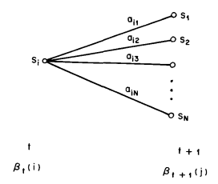
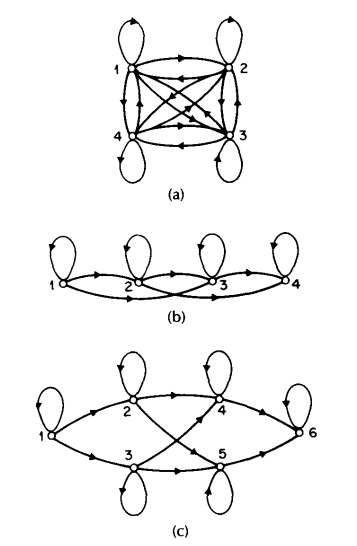

Notes on: Rabiner, L. R. (1990): A tutorial on hidden markov models and selected applications in speech recognition
===================================================================================================================

.. code-block:: bibtex

   @article{Rabiner_tutor_HMM,
     author    = {Rabiner, Lawrence R.},
     title     = {A Tutorial on Hidden Markov Models and Selected Applications in Speech Recognition},
     journal   = {Readings in Speech Recognition},
     pages     = {267–296},
     year      = {1990},
     doi       = {10.1016/b978-0-08-051584-7.50027-9},
     url       = {http://dx.doi.org/10.1016/b978-0-08-051584-7.50027-9},
     isbn      = {http://id.crossref.org/isbn/9781558601246},
     publisher = {Elsevier BV},
   }

Although initially introduced and studied in the late 1960s and early 1970s,
statistical methods of Markov source or hidden Markov modeling have become
increasingly popular in the last several years. There are two strong reasons why
this has occurred. First the models are very rich in mathematical structure and
hence can form the theoretical basis for use in a wide range of applications.
Second the models, when applied properly, work very well in practice for several
important applications. In this paper we attempt to carefully and methodically
review the theoretical aspects of this type of statistical modeling and show how
they have been applied to selected problems in machine recognition of speech.

INTRODUCTION
------------

Real-world processes generally produce observable outputs which can be
characterized as signals. The signals can be discrete in nature (e.g.,
characters from a finite alphabet, quantized vectors from a codebook, etc.), or
continuous in nature (e.g., speech samples, temperature measurements, music,
etc.). The signal source can be stationary (i.e., its statistical properties do
not vary with time), or nonstationary (i.e., the signal properties vary over
time). The signals can be pure (i.e., coming strictly from a single source), or
can be corrupted from other signal sources (e.g., noise) or by transmission
distortions, reverberation, etc.

A problem of fundamental interest is characterizing such real-world signals in
terms of signal models. There are several reasons why one is interested in
applying signal models. First of all, a signal model can provide the basis for a
theoretical description of a signal processing system which can be used to
process the signal so as to provide a desired output. For example if we are
interested in enhancing a speech signal corrupted by noise and transmission
distortion, we can use the signal model to design a system which will optimally
remove the noise and undo the transmission distortion. A second reason why
signal models are important is that they are potentially capable of letting us
learn a great deal about the signal source (i.e., the real-world process which
produced the signal) without having to have the source available. This property
is especially important when the cost of getting signals from the actual source
is high. In this case, with a good signal model, we can simulate the source and
learn as much as possible via simulations. Finally, the most important reason
why signal models are important is that they often work extremely well in
practice, and enable us to realize important practical systems-e.g., prediction
systems, recognition systems, identification systems, etc., in a very efficient
manner.

These are several possible choices for what type of signal model is used for
characterizing the properties of a given signal. Broadly one can dichotomize the
types of signal models into the class of deterministic models, and the class of
statistical models. Deterministic models generally exploit some known specific
properties of the signal, e.g., that the signal is a sine wave, or a sum of
exponentials, etc. In these cases, specification of the signal model is
generally straightforward; all that is required is to determine (estimate)
values of the parameters of the signal model (e.g., amplitude, frequency, phase
of a sine wave, amplitudes and rates of exponentials, etc.). The second broad
class of signal models is the set of statistical models in which one tries to
characterize only the statistical properties of the signal. Examples of such
statistical models include Gaussian processes, Poisson processes, Markov
processes, and hidden Markov processes, among others. The underlying assumption
of the statistical model is that the signal can be well characterized as a
parametric random process, and that the parameters of the stochastic process can
be determined (estimated) in a precise, well-defined manner.

For the applications of interest, namely speech processing, both deterministic
and stochastic signal models have had good success. In this paper we will
concern ourselves strictly with one type of stochastic signal model, namely the
hidden Markov model (HMM). (These models are referred to as Markov sources or
probabilistic functions of Markov chains in the communications literature.) We
will first review the theory of Markov chains and then extend the ideas to the
class of hidden Markov models using several simple examples. We will then focus
our attention on the three fundamental problems [#hmm1]_ for HMM design, namely:
the evaluation of the probability (or likelihood) of a sequence of observations
given a specific HMM; the determination of a best sequence of model states; and
the adjustment of model parameters so as to best account for the observed
signal. We will show that once these three fundamental problems are solved, we
can apply HMMs to selected problems in speech recognition.

Neither the theory of hidden Markov models nor its applications to speech
recognition is new. The basic theory was published in a series of classic papers
by Baum and his colleagues [Ref1]_, [Ref2]_, [Ref3]_, [Ref4]_, [Ref5]_ in the
late 1960s and early 1970s and was implemented for speech processing
applications by Baker [Ref6]_ at CMU, and by Jelinek and his colleagues at IBM
[Ref7]_, [Ref8]_, [Ref9]_, [Ref10]_, [Ref11]_, [Ref12]_, [Ref13]_ in the 1970s.
However, widespread understanding and application of the theory of HMMs to
speech processing has occurred only within the past several years. There are
several reasons why this has been the case. First, the basic theory of hidden
Markov models was published in mathematical journals which were not generally
read by engineers working on problems in speech processing. The second reason
was that the original applications of the theory to speech processing did not
provide sufficient tutorial material for most readers to understand the theory
and to be able to apply it to their own research. As a result, several tutorial
papers were written which provided a sufficient level of detail for a number of
research labs to begin work using HMMs in individual speech processing
applications [Ref14]_, [Ref15]_, [Ref16]_, [Ref17]_, [Ref18]_, [Ref19]_. This
tutorial is intended to provide an overview of the basic theory of HMMs (as
originated by Baum and his colleagues), provide practical details on methods of
implementation of the theory, and describe a couple of selected applications of
the theory to distinct problems in speech recognition. The paper combines
results from a number of original sources and hopefully provides a single source
for acquiring the background required to pursue further this fascinating area of
research.

The organization of this paper is as follows. In Section II we review the theory
of discrete Markov chains and show how the concept of hidden states, where the
observation is a probabilistic function of the state, can be used effectively.
We illustrate the theory with two simple examples, namely coin-tossing, and the
classic balls-in-urns system. In Section III we discuss the three fundamental
problems of HMMs, and give several practical techniques for solving these
problems. In Section IV we discuss the various types of HMMs that have been
studied including ergodic as well as left-right models. In this section we also
discuss the various model features including the form of the observation density
function, the state duration density, and the optimization criterion for
choosing optimal HMM parameter values. In Section V we discuss the issues that
arise in implementing HMMs including the topics of scaling, initial parameter
estimates, model size, model form, missing data, and multiple observation
sequences. In Section VI we describe an isolated word speech recognizer,
implemented with HMM ideas, and show how it performs as compared to alternative
implementations. In Section VII we extend the ideas presented in Section VI to
the problem of recognizing a string of spoken words based on concatenating
individual HMMs of each word in the vocabulary. In Section VIII we briefly
outline how the ideas of HMM have been applied to a large vocabulary speech
recognizer, and in Section IX we summarize the ideas discussed throughout the
paper.

DISCRETE MARKOV PROCESSES [#hmm2]_
----------------------------------

.. _hmmfig1:

.. figure:: images/hmmfig1.png
   :align: center

   A Markov chain with 5 states (labeled :math:`S_1` to :math:`S_5`) with selected state transitions.

Consider a system which may be described at any time as being in one of a set of
:math:`N` distinct states, :math:`S_1, S_2, \ldots, S_N`, as illustrated in
:numref:`hmmfig1` (where :math:`N = 5` for simplicity). At regularly spaced
discrete times, the system undergoes a change of state (possibly back to the
same state) according to a set of probabilities associated with the state. We
denote the time instants associated with state changes as :math:`t = 1, 2,
\ldots` , and we denote the actual state at time :math:`t` as :math:`q_t`. A
full probabilistic description of the above system would, in general, require
specification of the current state (at time :math:`t`), as well as all the
predecessor states. For the special case of a discrete, first order, Markov
chain, this probabilistic description is truncated to just the current and the
predecessor state, i.e.,

.. math::
   P[q_t = S_j \mid q_{t-1} = S_i, q_{t-2} = S_k, \ldots] = P[q_t = S_j \mid q_{t-1} = S_i].
   :label: hmmeq1

Further more we only consider those processes in which the right-hand side of
:eq:`hmmeq1` is independent of time, thereby leading to the set of state
transition probabilities :math:`a_{ij}` of the form

.. math::
   a_{ij} = P[q_t = S_j \mid q_{t-1} = S_i], \quad 1 \leq i, j \leq N
   :label: hmmeq2

with the state transition coefficients having the properties

.. math::
   a_{ij} & \geq 0 \\
   \sum_{j = 1}^{N} a_{ij} & = 1
   :label: hmmeq3

since they obey standard stochastic constraints.

The above stochastic process could be called an observable Markov model since
the output of the process is the set of states at each instant of time, where
each state corresponds to a physical (observable) event. To set ideas, consider
a simple 3-state Markov model of the weather. We assume that once a day (e.g.,
at noon), the weather is observed as being one of the following:

   State 1: rain or (snow)

   State 2: cloudy

   State 3: sunny

We postulate that the weather on day :math:`t` is characterized by a single one
of the three states above, and that the matrix :math:`A` of state transition
probabilities is

.. math::
   A = \{a_{ij}\} =
   \begin{bmatrix}
   0.4 & 0.3 & 0.3 \\
   0.2 & 0.6 & 0.2 \\
   0.1 & 0.1 & 0.8
   \end{bmatrix}
   .

Given that the weather on day 1 (:math:`t = 1`) is sunny (state 3), we can ask
the question: What is the probability (according to the model) that the weather
for the next 7 days will be "sun-sun-rain-rain-sun-cloudy-sun"? Stated more
formally, we define the observation sequence :math:`O` as
:math:`O = \{S_3, S_3, S_3, S_1, S_1, S_3, S_2, S_3\}`
corresponding to :math:`t = 1, 2, \ldots, 8,` and we
wish to determine the probability of :math:`O` , given the model. This
probability can be expressed (and evaluated) as

.. math::
   P(O \mid \text{Model}) & = P[S_3, S_3, S_3, S_1, S_1, S_3, S_2, S_3 \mid \text{Model}] \\
   & = P[S_3] \cdot P[S_3 \mid S_3] \cdot P[S_3 \mid S_3] \cdot P[S_1 \mid S_3] \\
   & \quad \cdot P[S_1 \mid S_1] \cdot P[S_3 \mid S_1] \mid P[S_2 \mid S_3] \mid P[S_3 \mid S_2] \\
   & = \pi_3 \cdot a_{33} a_{33} a_{31} a_{11} a_{13} a_{32} a_{23} \\
   & = 1 \times 0.8 \times 0.8 \times 0.1 \times 0.4 \times 0.3 \times 0.1 \times 0.2 \\
   & = 1.536 \times 10^{-4}

where we use the notation

.. math::
   \pi_i = P[q_1 = S_i], \quad 1 \leq i \leq N
   :label: hmmeq4

to denote the initial state probabilities.

Another interesting question we can ask (and answer using the model) is: Given
that the model is in a known state, what is the probability it stays in that
state for exactly :math:`d` days? This probability can be evaluated as the
probability of the observation sequence

.. math::
   O = \{S_i, S_i, S_i, \ldots, S_i, S_j \neq S_i\},

given the model, which is

.. math::
   P(O \mid \text{Model}, q_1 = S_i) = (a_{ii})^{d-1} (1 - a_{ii}) = p_i(d).
   :label: hmmeq5

The quantity :math:`p_i(d)` is the (discrete) probability density function of
duration :math:`d` in state :math:`i` . This exponential duration density is
characteristic of the state duration in a Markov chain. Based on :math:`p_i(d)`
, we can readily calculate the expected number of observations (duration) in a
state, conditioned on starting in that state as

.. math::
   \bar{d}_i & = \sum_{d=1}^{\infty} d p_i(d) \\
   & = \sum_{d=1}^{\infty} d (a_{ii})^{d-1} (1 - a_{ii}) = \dfrac{1}{1 - a_{ii}}.
   :label: hmmeq6

Thus the expected number of consecutive days of sunny weather, according to the
model, is :math:`1/0.2 = 5` ; for cloudy it is :math:`2.5` ; for rain it is
:math:`1.67` .

Extension to Hidden Markov Models
~~~~~~~~~~~~~~~~~~~~~~~~~~~~~~~~~

So far we have considered Markov models in which each state corresponded to an
observable (physical) event. This model is too restrictive to be applicable to
many problems of interest. In this section we extend the concept of Markov
models to include the case where the observation is a probabilistic function of
the state-i.e., the resulting model (which is called a hidden Markov model) is a
doubly embedded stochastic process with an underlying stochastic process that is
not observable (it is hidden), but can only be observed through another set of
stochastic processes that produce the sequence of observations. To fix ideas,
consider the following model of some simple coin tossing experiments.

**Coin Toss Models**: Assume the following scenario. You are in a room with a
barrier (e.g., a curtain) through which you cannot see what is happening. On the
other side of the barrier is another person who is performing a coin (or
multiple coin) tossing experiment. The other person will not tell you anything
about what he is doing exactly; he will only tell you the result of each coin
flip. Thus a sequence of hidden coin tossing experiments is performed, with the
observation sequence consisting of a series of heads and tails; e.g., a typical
observation sequence would be

.. math::
   \mathcal{O} & = O_1 O_2 O_3 \cdots O_T \\
   & = \mathscr{H} \mathscr{H} \mathscr{T} \cdots \mathscr{H}

where :math:`\mathscr{H}` stands for heads and :math:`\mathscr{T}` stands for
tails.

Given the above scenario, the problem of interest is how do we build an HMM to
explain (model) the observed sequence of heads and tails. The first problem one
faces is deciding what the states in the model correspond to, and then deciding
how many states should be in the model. One possible choice would be to assume
that only a single biased coin was being tossed. In this case we could model the
situation with a 2-state model where each state corresponds to a side of the
coin (i.e., heads or tails). This model is depicted in :numref:`hmmfig2` (a)
[#hmm3]_. In this case the Markov model is observable, and the only issue for
complete specification of the model would be to decide on the best value for the
bias (i.e., the probability of, say, heads). Interestingly, an equivalent HMM to
that of :numref:`hmmfig2` (a) would be a degenerate 1-state model, where the
state corresponds to the single biased coin, and the unknown parameter is the
bias of the coin.

.. _hmmfig2:

.. figure:: images/hmmfig2.png
   :align: center

   Three possible Markov models which can account for the results of hidden coin tossing experiments. (a) 1-coin model. (b) 2-coins model. (c) 3-coins model.

A second form of HMM for explaining the observed sequence of coin toss outcome
is given in :numref:`hmmfig2` (b). In this case there are 2 states in the model
and each state corresponds to a different, biased, coin being tossed. Each state
is characterized by a probability distribution of heads and tails, and
transitions between states are characterized by a state transition matrix. The
physical mechanism which accounts for how state transitions are selected could
itself be a set of independent coin tosses, or some other probabilistic event.

A third form of HMM for explaining the observed sequence of coin toss outcomes
is given in :numref:`hmmfig2` (c). This model corresponds to using 3 biased
coins, and choosing from among the three, based on some probabilistic event.

Given the choice among the three models shown in :numref:`hmmfig2` for
explaining the observed sequence of heads and tails, a natural question would be
which model best matches the actual observations. It should be clear that the
simple 1-coin model of :numref:`hmmfig2` (a) has only 1 unknown parameter; the
2-coin model of :numref:`hmmfig2` (b) has 4 unknown parameters; and the 3-coin
model of :numref:`hmmfig2` (c) has 9 unknown parameters. Thus, with the greater
degrees of freedom, the larger HMMs would seem to inherently be more capable of
modeling a series of coin tossing experiments than would equivalently smaller
models. Although this is theoretically true, we will see later in this paper
that practical considerations impose some strong limitations on the size of
models that we can consider. Furthermore, it might just be the case that only a
single coin is being tossed. Then using the 3-coin model of
:numref:`hmmfig2` (c) would be inappropriate, since the actual physical event
would not correspond to the model being used-i.e., we would be using an
underspecified system.

**The Urn and Ball Mode** [#hmm4]_: To extend the ideas of the HMM to a somewhat
more complicated situation, consider the urn and ball system of
:numref:`hmmfig3` . We assume that there are :math:`N` (large) glass urns in a
room. Within each urn there are a large number of colored balls. We assume there
are :math:`M` distinct colors of the balls. The physical process for obtaining
observations is as follows. A genie is in the room, and according to some random
process, he (or she) chooses an initial urn. From this urn, a ball is chosen at
random, and its color is recorded as the observation. The ball is then replaced
in the urn from which it was selected. A new urn is then selected according to
the random selection process associated with the current urn, and the ball
selection process is repeated. This entire process generates a finite
observation sequence of colors, which we would like to model as the observable
output of an HMM.

.. _hmmfig3:

.. figure:: images/hmmfig3.png
   :align: center

   An :math:`N\text{-state}` urn and ball model which illustrates the general
   case of a discrete symbol HMM.

It should be obvious that the simplest HMM that corresponds to the urn and ball
process is one in which each state corresponds to a specific urn, and for which
a (ball) color probability is defined for each state. The choice of urns is
dictated by the state transition matrix of the HMM.

Elements of an HMM
~~~~~~~~~~~~~~~~~~

The above examples give us a pretty good idea of what an HMM is and how it can
be applied to some simple scenarios. We now formally define the elements of an
HMM, and explain how the model generates observation sequences.

An HMM is characterized by the following:

1) :math:`N`, the number of states in the model. Although the states are hidden,
   for many practical applications there is often some physical significance
   attached to the states or to sets of states of the model. Hence, in the coin
   tossing experiments, each state corresponded to a distinct biased coin. In
   the urn and ball model, the states corresponded to the urns. Generally the
   states are interconnected in such a way that any state can be reached from
   any other state (e.g., an ergodic model); however, we will see later in this
   paper that other possible interconnections of states are often of interest.
   We denote the individual states as :math:`S = \{S_1, S_2, \ldots, S_N\}`, and
   the state at time :math:`t` as :math:`q_t`.

2) :math:`M`, the number of distinct observation symbols per state, i.e., the
   discrete alphabet size. The observation symbols correspond to the physical
   output of the system being modeled. For the coin toss experiments the
   observation symbols were simply heads or tails; for the ball and urn model
   they were the colors of the balls selected from the urns. We denote the
   individual symbols as :math:`V = \{v_1, v_2, \ldots, v_M\}`.

3) The state transition probability distribution :math:`A = \{a_{ij}\}` where

   .. math::
      a_{ij} = P[q_{t+1} = S_j \mid q_t = S_i], \quad 1 \leq i, j \leq N.
      :label: hmmeq7

   For the special case where any state can reach any other state in a single
   step, we have :math:`a_{ij} > 0` for all :math:`i, j` . For other types of
   HMMs, we would have :math:`a_{ij} = 0` for one or more :math:`(i,j)` pairs.

4) The observation symbol probability distribution in state :math:`j`,
   :math:`B = \{b_j(k)\}`, where

   .. math::
      b_j(k) = P[v_k \text{ at } t \mid q_t = S_j], \quad 1 \leq j \leq N, \quad 1 \leq k \leq M.
      :label: hmmeq8

5) The initial state distribution :math:`\pi = \{\pi_i\}` where

   .. math::
      \pi_i = P[q_1 = S_i], \quad 1 \leq i \leq N.
      :label: hmmeq9

Given appropriate values of :math:`N, M, A, B`, and :math:`\pi`, the HMM can be
used as a generator to give an observation sequence

.. math::
   \mathcal{O} = O_1 O_2 \cdots O_T
   :label: hmmeq10

(where each observation :math:`O_t` is one of the symbols from :math:`V`, and
:math:`T` is the number of observations in the sequence) as follows:

1. Choose an initial state :math:`q_1 = S_i` according to the initial state
   distribution :math:`\pi`.

2. Set :math:`t = 1`.

3. Choose :math:`O_t = v_k` according to the symbol probability distribution in
   state :math:`S_i`, i.e., :math:`b_i(k)`.

4. Transit to a new state :math:`q_{t+1} = S_j` according to the state
   transition probability distribution for state :math:`S_i`, i.e.,
   :math:`a_{ij}`.

5. Set :math:`t = t + 1`; return to step 3 if :math:`t < T`; otherwise terminate
   the procedure.

The above procedure can be used as both a generator of observations, and as a
model for how a given observation sequence was generated by an appropriate HMM.

It can be seen from the above discussion that a complete specification of an HMM
requires specification of two model parameters (:math:`N` and :math:`M`),
specification of observation symbols, and the specification of the three
probability measures :math:`A, B`, and :math:`\pi` . For convenience, we use the
compact notation

.. math::
   \lambda = (A, B, \pi)
   :label: hmmeq11

to indicate the complete parameter set of the model.

The Three Basic Problems for HMMs [#hmm5]_
~~~~~~~~~~~~~~~~~~~~~~~~~~~~~~~~~~~~~~~~~~

Given the form of HMM of the previous section, there are three basic problems of
interest that must be solved for the model to be useful in real-world
applications. These problems are the following:

**Problem 1**: Given the observation sequence :math:`\mathcal{O} = O_1 O_2
\cdots O_T`, and a model :math:`\lambda = (A, B, \pi)`, how do we efficiently
compute :math:`P(\mathcal{O} \mid \lambda)`, the probability of the observation
sequence, given the model?

**Problem 2**: Given the observation sequence :math:`\mathcal{O} = O_1 O_2
\cdots O_T`, and the model :math:`\lambda`, how do we choose a corresponding
state sequence :math:`Q = q_1 q_2 \cdots q_T` which is optimal in some
meaningful sense (i.e., best "explains" the observations?)

**Problem 3**: How do we adjust the model parameters :math:`\lambda = (A, B,
\pi)` to maximize :math:`P(\mathcal{O} \mid \lambda)`?

Problem 1 is the evaluation problem, namely given a model and a sequence of
observations, how do we compute the probability that the observed sequence was
produced by the model. We can also view the problem as one of scoring how well a
given model matches a given observation sequence. The latter viewpoint is
extremely useful. For example, if we consider the case in which we are trying to
choose among several competing models, the solution to Problem 1 allows us to
choose the model which best matches the observations.

Problem 2 is the one in which we attempt to uncover the hidden part of the
model, i.e., to find the “correct” state sequence. It should be clear that for
all but the case of degenerate models, there is no “correct” state sequence to
be found. Hence for practical situations, we usually use an optimality criterion
to solve this problem as best as possible. Unfortunately, as we will see, there
are several reasonable optimality criteria that can be imposed, and hence the
choice of criterion is a strong function of the intended use for the uncovered
state sequence. Typical uses might be to learn about the structure of the model,
to find optimal state sequences for continuous speech recognition, or to get
average statistics of individual states, etc.

Problem 3 is the one in which we attempt to optimize the model parameters so as
to best describe how a given observation sequence comes about. The observation
sequence used to adjust the model parameters is called a training sequence since
it is used to “train” the HMM. The training problem is the crucial one for most
applications of HMMs, since it allows us to optimally adapt model parameters to
observed training data-i.e., to create best models for real phenomena.

To fix ideas, consider the following simple isolated word speech recognizer. For
each word of a :math:`W` word vocabulary, we want to design a separate
:math:`N`-state HMM. We represent the speech signal of a given word as a time
sequence of coded spectral vectors. We assume that the coding is done using a
spectral codebook with :math:`M` unique spectral vectors; hence each observation
is the index of the spectral vector closest (in some spectral sense) to the
original speech signal. Thus, for each vocabulary word, we have a training
sequence consisting of a number of repetitions of sequences of codebook indices
of the word (by one or more talkers). The first task is to build individual word
models. This task is done by using the solution to Problem 3 to optimally
estimate model parameters for each word model. To develop an understanding of
the physical meaning of the model states, we use the solution to Problem 2 to
segment each of the word training sequences into states, and then study the
properties of the spectral vectors that lead to the observations occurring in
each state. The goal here would be to make refinements on the model (e.g., more
states, different codebook size, etc.) so as to improve its capability of
modeling the spoken word sequences. Finally, once the set of :math:`W` HMMs has
been designed and optimized and thoroughly studied, recognition of an unknown
word is performed using the solution to Problem 1 to score each word model based
upon the given test observation sequence, and select the word whose model score
is highest (i.e., the highest likelihood).

In the next section we present formal mathematical solutions to each of the
three fundamental problems for HMMs. We shall see that the three problems are
linked together tightly under our probabilistic framework.

SOLUTIONS TO THE THREE BASIC PROBLEMS OF HMMs
---------------------------------------------

Solution to Problem 1
~~~~~~~~~~~~~~~~~~~~~

We wish to calculate the probability of the observation sequence,
:math:`\mathcal{O} = O_1 O_2 \cdots O_T`, given the model :math:`\lambda`, i.e.,
:math:`P(\mathcal{O} \mid \lambda)`. The most straightforward way of doing this
is through enumerating every possible state sequence of length :math:`T` (the
number of observations). Consider one such fixed state sequence

.. math::
   Q = q_1 q_2 \cdots q_T
   :label: hmmeq12

where :math:`q_1` is the initial state. The probability of the observation
sequence :math:`\mathcal{O}` for the state sequence of :eq:`hmmeq12` is

.. math::
   P(\mathcal{O} \mid Q, \lambda) = \prod_{t = 1}^T P(O_t \mid q_t, \lambda)
   :label: hmmeq13a

where we have assumed statistical indepencence of observations. Thus we get

.. math::
   P(\mathcal{O} \mid Q, \lambda) = b_{q_1}(O_1) \cdot b_{q_2}(O_2) \cdots b_{q_T}(O_T).
   :label: hmmeq13b

The probability of such a state sequence :math:`Q` can be written as

.. math::
   P(Q \mid \lambda) = \pi_{q_1} a_{q_1 q_2} a_{q_2 q_3} \cdots a_{q_{T-1} q_T}.
   :label: hmmeq14

The joint probability of :math:`\mathcal{O}` and :math:`Q`, i.e., the
probability that :math:`\mathcal{O}` and :math:`Q` occur simultaneously, is
simply the product of the above two terms, i.e.,

.. math::
   P(\mathcal{O}, Q \mid \lambda) = P(\mathcal{O} \mid Q, \lambda) P(Q \mid \lambda).
   :label: hmmeq15

The probability of :math:`\mathcal{O}` (given the model) is obtained by summing
this joint probability over all possible state sequences :math:`Q` giving

.. math::
   P(\mathcal{O} \mid \lambda) & = \sum_{\text{all } Q} P(\mathcal{O} \mid Q, \lambda) P(Q \mid \lambda) \\
   & = \sum_{q_1, q_2, \ldots, q_T} \pi_{q_1} b_{q_1}(O_1) a_{q_1 q_2} b_{q_2}(O_2) \cdots a_{q_{T-1} q_T} b_{q_T}(O_T).
   :label: hmmeq17

The interpretation of the computation in the above equation is the following.
Initially (at time :math:`t = 1`) we are in state :math:`q_1` with probability
:math:`\pi_{q_1}`, and generate the symbol :math:`O_1` (in this state) with
probability :math:`b_{q_1}(O_1)`. The clock changes from time :math:`t` to
:math:`t+1` (:math:`t = 2`) and we make a transition to state :math:`q_2` from
state :math:`q_1` with probability :math:`a_{q_1 q_2}`, and generate symbol
:math:`O_2` with probability :math:`b_{q_2}(O_2)`. This process continues in
this manner until we make the list transition (at time :math:`T`) from state
:math:`q_{T-1}` to state :math:`q_T` with probability :math:`a_{q_{T-1} q_T}`
and generate symbol :math:`O_T` with probability :math:`b_{q_T}(O_T)`.

A little thought should convince the reader that the calculation of
:math:`P(\mathcal{O} \mid \lambda)`, according to its direct definition
:eq:`hmmeq17` involves on the order of :math:`2 T \cdot N^T` calculations, since
at every :math:`t = 1, 2, \ldots, T`, there are :math:`N` possible states which
can be reached (i.e., there are :math:`N^T` possible state sequences), and for
each such state sequence about :math:`2T` calculations are required for each
term in the sum of :eq:`hmmeq17`. (To be precise, we need :math:`(2T-1)N^T`
multiplications, and :math:`N^T-1` additions.) This calculation is
computationally unfeasible, even for small values of :math:`N` and :math:`T`;
e.g., for :math:`N = 5` (states), :math:`T = 100` (observations), there are on
the order of :math:`2 \cdot 100 \cdot 5^{100} \approx 10^{72}` computations!
Clearly a more efficient procedure is required to solve Problem 1. Fortunately
such a procedure exists and is called the forward-backward procedure.

**The Forward-Backward Procedure** [#hmm6]_ [Ref2]_, [Ref3]_: Consider the
forward variable :math:`\alpha_t(i)` defined as

.. math::
   \alpha_t(i) = P(O_1 O_2 \cdots O_t, q_t = S_i \mid \lambda)
   :label: hmmeq18

i.e., the probability of the partial observation sequence, :math:`O_1 O_2 \cdots
O_t`, (until time :math:`t`) and state :math:`S_i` at time :math:`t`, given the
model :math:`\lambda`. We can solve for :math:`\alpha_t(i)` inductively, as
follows:

1. Initialization:

   .. math::
      \alpha_1(i) = \pi_i b_i(O_1), \quad 1 \leq i \leq N.
      :label: hmmeq19

2. Induction:

   .. math::
      \alpha_{t+1}(j) = \left[ \sum_{i = 1}^N \alpha_t(i) a_{ij} \right] b_j(O_{t+1}), \quad 1 \leq t \leq T - 1, \quad 1 \leq j \leq N.
      :label: hmmeq20

3. Termination:

   .. math::
      P(\mathcal{O} \mid \lambda) = \sum_{i = 1}^N \alpha_{T}(i).
      :label: hmmeq21

Step 1) initializes the forward probabilities as the joint probability of state
:math:`S_i` and initial observation :math:`O_1`. The induction step, which is
the heart of the forward calculation, is illustrated in :numref:`hmmfig4`. This
figure shows how state :math:`S_j` can be reached at time :math:`t + 1` from the
:math:`N` possible states, :math:`S_i, 1 \leq i \leq N`, at time :math:`t`.
Since :math:`\alpha_t(i)` is the probability of the joint event that :math:`O_1
O_2 \cdots O_t` are observed, and the state at time :math:`t` is :math:`S_i`,
the product :math:`\alpha_t(i) a_{ij}` is then the probability of the joint
event that :math:`O_1 O_2 \cdots O_t` are observed, and state :math:`S_j` is
reached at time :math:`t + 1` via state :math:`S_i` at time :math:`t`. Summing
this product over all the :math:`N` possible states :math:`S_i, 1 \leq i \leq N`
at time :math:`t` results in the probability of :math:`S_j` at time :math:`t +
1` with all the accompanying previous partial observations. Once this is done
and :math:`S_j` is known, it is easy to see that :math:`\alpha_{t+1}(j)` is
obtained by accounting for quantity by the probability :math:`b_j(O_{t+1})`. The
computation of :eq:`hmmeq20` is performed for all states :math:`j, 1 \leq j \leq
N`, for a given :math:`t`; the computation is then iterated for :math:`t = 1, 2,
\ldots, T - 1`. Finally, step 3) gives the desired calculation of
:math:`P(\mathcal{O} \mid \lambda)` as the sum of the terminal forward variables
:math:`\alpha_T(i)`. This is the case since, by definition,

.. math::
   \alpha_T(i) = P(O_1 O_2 \cdots O_T, q_T = S_i \mid \lambda)
   :label: hmmeq22

and hence :math:`P(\mathcal{O} \mid \lambda)` is just the sum of the
:math:`\alpha_T(i)`'s.

.. _hmmfig4:

   (a) Illustration of the sequence of operations required for the computation
   of the forward variable :math:`\alpha_{t+1}(j)`. (b) Implementation of the
   computation of :math:`\alpha_{t}(j)` in terms of a lattice of observations
   :math:`t`, and states :math:`i`.

If we examine the computation involved in the calculation of
:math:`\alpha_t(j)`, :math:`1 \leq t \leq T`, :math:`1 \leq j \leq N`, we see
that it requires on the order of :math:`N^2 T` calculations, rather than
:math:`2 T N^T` as required by the direct calculation. (Again, to be precise, we
need :math:`N(N+1)(T-1) + N` multiplications and :math:`N(N-1)(T-1)` additions.)
For :math:`N = 5`, :math:`T = 100`, we need about :math:`3000` computations for
the forward method, versus :math:`10^{72}` computations for the direct
calculation, a savings of about :math:`69` orders of magnitude.

The forward probability calculation is, in effect, based upon the lattice (or
trellis) structure shown in :numref:`hmmfig4` (b). The key is that since there
are only :math:`N` states (nodes at each time slot in the lattice), all the
possible state sequences will re-merge into these :math:`N` nodes, no matter how
long the observation sequence. At time :math:`t = 1` (the first time slot in the
lattice), we need to calculate values of :math:`\alpha_1(i)`, :math:`1 \leq i
\leq N`. At times :math:`t = 2, 3, \ldots, T`, we only need to calculate values
of :math:`\alpha_t(j)`, :math:`1 \leq j \leq N`, where each calculation involves
only :math:`N` previous values of :math:`\alpha_{t-1}(i)` because each of the
:math:`N` grid points is reached from the same :math:`N` grid points at the
previous time slot.

In a similar manner [#hmm7]_, we can consider a backward variable
:math:`\beta_t(i)` defined as

.. math::
   \beta_t(i) = P(O_{t+1} O_{t+2} \cdots O_T \mid q_t = S_i, \lambda)
   :label: hmmeq23

i.e., the probability of the partial observation sequence from :math:`t + 1` to
the end, given state :math:`S_i` at time :math:`t` and the model
:math:`\lambda`. Again we can solve for :math:`\beta_t(i)` inductively, as
follows:

1. Initialization:

   .. math::
      \beta_T(i) = 1, \quad 1 \leq i \leq N.
      :label: hmmeq24

2. Induction:

   .. math::
      \beta_t(i) = \sum_{j = 1}^N a_{ij} b_j(O_{t+1}) \beta_{t+1}(j), \quad t = T-1, T-2, \cdots, 1, \quad 1 \leq i \leq N.
      :label: hmmeq25

The initialization step 1) arbitrarily defines :math:`\beta_T(i)` to be
:math:`1` for all :math:`i`. Step 2), which is illustrated in :numref:`hmmfig5`,
shows that in order to have been in state :math:`S_i` at time :math:`t`, and to
account for the observation sequence from time :math:`t + 1` on, you have to
consider all possible states :math:`S_j` at time :math:`t + 1`, accounting for
the transition from :math:`S_i` to :math:`S_j` (the :math:`a_{ij}` term), and
then account for the remaining partial observation sequence from state :math:`j`
(the :math:`\beta_{t+1}(j)` term). We will see later how the backward, as well
as the forward calculations are used extensively to help solve fundamental
Problems 2 and 3 of HMMs.

.. _hmmfig5:

   Illustration of the sequence of operations required for the computation of
   the backward variable :math:`\beta_t(i)`.

Again, the computation of :math:`\beta_t(i)`, :math:`1 \leq t \leq T`, :math:`1
\leq i \leq N`, requires on the order of :math:`N^2 T` calculations, and can be
computed in a lattice structure similar to that of :numref:`hmmfig4` (b).

Solution to Problem 2
~~~~~~~~~~~~~~~~~~~~~

Unlike Problem 1 for which an exact solution can be given, there are several
possible ways of solving Problem 2, namely finding the "optimal" state sequence
associated with the given observation sequence. The difficulty lies with the
definition of the optimal state sequence; i.e., there are several possible
optimality criteria. For example, one possible optimality criterion is to choose
the states :math:`q_t`, which are individually most likely. This optimality
criterion maximizes the expected number of correct individual states. To
implement this solution to Problem 2, we define the variable

.. math::
   \gamma_t(i) = P(q_t = S_i \mid \mathcal{O}, \lambda)
   :label: hmmeq26

i.e., the probability of being in state :math:`S_i` at time :math:`t`, given the
observation sequence :math:`\mathcal{O}`, and the model :math:`\lambda`.
Equation :eq:`hmmeq26` can be expressed simply in terms of the forward-backward
variables, i.e.,

.. math::
   \gamma_t(i) = \dfrac{\alpha_t(i) \beta_t(i)}{P(\mathcal{O} \mid \lambda)}
   = \dfrac{\alpha_t(i) \beta_t(i)}{\sum_{i=1}^N \alpha_t(i) \beta_t(i)}
   :label: hmmeq27

since :math:`\alpha_t(i)` accounts for the partial observation sequence
:math:`O_1 O_2 \cdots O_t` and state :math:`S_i` at :math:`t`, while
:math:`\beta_t(i)` accounts for the remainder of the observation sequence
:math:`O_{t+1} O_{t+2} \cdots O_T`, given state :math:`S_i` at :math:`t`. The
normalization factor :math:`P(\mathcal{O} \mid \lambda) = \sum_{i=1}^N
\alpha_t(i)`, :math:`\beta_t(i)` makes :math:`\gamma_t(i)` a probability measure
so that

.. math::
   \sum_{i = 1}^N \gamma_t(i) = 1.
   :label: hmmeq28

Using :math:`\gamma_t(i)`, we can solve for the individually most likey state
:math:`q_t` at time :math:`t`, as

.. math::
   q_t = \mathrm{argmax}_{1 \leq i \leq N} [\gamma_t(i)], \quad 1 \leq t \leq T.
   :label: hmmeq29

Although :eq:`hmmeq29` maximizes the expected number of correct states (by
choosing the most likely state for each :math:`t`), there could be some problems
with the resulting state sequence. For example, when the HMM has state
transitions which have zero probability (:math:`a_{ij} = 0` for some :math:`i`
and :math:`j`), the "optimal" state sequence may, in fact, not even be a valid
state sequence. This is due to the fact that the solution of :eq:`hmmeq29`
simply determines the most likely state at every instant, without regard to the
probability of occurrence of sequences of states.

One possible solution to the above problem is to modify the optimality
criterion. For example, one could solve for the state sequence that maximizes
the expected number of correct pairs of states :math:`(q_t, q_{t + 1})`, or
triples of states :math:`(q_t, q_{t + 1}, q_{t+2})`, etc. Although these
criteria might be reasonable for some applications, the most widely used
criterion is to find the single best state sequence (path), i.e., to maximize
:math:`P(Q \mid \mathcal{O}, \lambda)` which is equivalent to maximizing
:math:`P(Q, \mathcal{O} \mid \lambda)`. A formal technique for finding this
single best state sequence exists, based on dynamic programming methods, and is
called the Viterbi algorithm.

**Viterbi Algorithm** [Ref21]_, [Ref22]_: To find the single best state
sequence, :math:`Q = \{q_1 q_2 \cdots q_T\}`, for the given observation sequence
:math:`O = \{O_1 O_2 \cdots O_T\}`, we need to define the quantity

.. math::
   \delta_t(i) = \mathrm{max}_{q_1, q_2, \ldots, q_{t-1}} P[q_1 q_2 \cdots q_t = i, O_1 O_2 \cdots O_t \mid \lambda]
   :label: hmmeq30

i.e., :math:`\delta_t(i)` is the best score (highest probability) along a single
path, at time :math:`t`, which accounts for the first :math:`t` observations and
ends in state :math:`S_i`. By induction we have

.. math::
   \delta_{t+1}(j) = [\mathrm{max}_i \delta_t(i) a_{ij} \cdot b_j(O_{t+1})].
   :label: hmmeq31

To actually retrieve the state sequence, we need to keep track of the argument
which maximized :eq:`hmmeq31`, for each :math:`t` and :math:`j`. We do this via
the array :math:`\psi_t(j)`. The complete procedure for finding the best state
sequence can now be stated as follows:

1. Initialization:

   .. math::
      \delta_1(i) & = \pi b_i(O_1), \quad 1 \leq i \leq N \\
      \psi_1(i) & = 0
      :label: hmmeq32

2. Recursion:

   .. math::
      \delta_t(j) & = \mathrm{max}_{1 \leq i \leq N} [\delta_{t-1}(i) a_{ij}] b_j(O_t), \quad 2 \leq t \leq T, \quad 1 \leq j \leq N \\
      \psi_t(j) & = \mathrm{argmax}_{1 \leq i \leq N} [\delta_{t-1}(i) a_{ij}], \quad 2 \leq t \leq T, \quad 1 \leq j \leq N.
      :label: hmmeq33

3. Termination:

   .. math::
      P^* & = \mathrm{max}_{1 \leq i \leq N} [\delta_T(i)] \\
      q_T^* & = \mathrm{argmax}_{1 \leq i \leq N} [\delta_T(i)].
      :label: hmmeq34

4. Path (state sequence) backtracking:

.. math::
   q_t^* = \psi_{t + 1}(q_{t+1}^*), \quad t = T-1, T-2, \ldots, 1.
   :label: hmmeq35

It should be noted that the Viterbi algorithm is similar (except for the
backtracking step) in implementation to the forward calculation of :eq:`hmmeq19`
:eq:`hmmeq20` :eq:`hmmeq21`. The major difference is the maximization in
:eq:`hmmeq33` (a) over previous states which is used in place of the summing
procedure in :eq:`hmmeq20`. It also should be clear that a lattice (or trellis)
structure efficiently implements the computation of the Viterbi procedure.

Solution to Problem 3 [Ref1]_ - [Ref5]_
~~~~~~~~~~~~~~~~~~~~~~~~~~~~~~~~~~~~~~~

The third, and by far the most difficult, problem of HMMs is to determine a
method to adjust the model parameters :math:`(A, B, \pi)` to maximize the
probability of the observation sequence given the model. There is no known way
to analytically solve for the model which maximizes the probability of the
observation sequence. In fact, given any finite observation sequence as training
data, there is no optimal way of estimating the model parameters. We can,
however, choose :math:`\lambda = (A, B, \pi)` such that :math:`P(\mathcal{O}
\mid \lambda)` is locally maximized using an iterative procedure such as the
Baum-Welch method (or equivalently the EM (expectation-modification) method
[Ref23]_), or using gradient techniques [Ref14]_. In this section we discuss one
iterative procedure, based primarily on the classic work of Baum and his
colleagues, for choosing model parameters.

.. _hmmfig6:

   Illustration of the sequence of operations required for the computation of
   the joint event that the system is in state :math:`S_i`, at time :math:`t`
   and state :math:`S_j`, at time :math:`t + 1`.

In order to describe the procedure for reestimation (iterative update and
improvement) of HMM parameters, we first define :math:`\xi_t(i, j)`, the
probability of being in state :math:`S_i` at time :math:`t`, and state
:math:`S_j`, at time :math:`t+1`, given the model and the observation sequence,
i.e.

.. math::
   \xi_t(i, j) = P(q_t = S_i, q_{t+1} = S_j \mid \mathcal{O}, \lambda).
   :label: hmmeq36

The sequence of events leading to the conditions required by :eq:`hmmeq36` is
illustrated in :numref:`hmmfig6`. It should be clear, from the definitions of
the forward and backward variables, that we can write :math:`\xi_t(i, j)` in the
form

.. math::
   \xi_t(i, j) &= \dfrac{\alpha_t(i) a_{ij} b_j(O_{t+1}) \beta_{t+1}(j)}{P(\mathcal{O} \mid \lambda)} \\
   &= \dfrac{\alpha_t(i) a_{ij} b_j(O_{t+1}) \beta_{t+1}(j)}{\sum_{i = 1}^N \sum_{j = 1}^N \alpha_t(i) a_{ij} b_j(O_{t+1}) \beta_{t+1}(j)}
   :label: hmmeq37

where the numerator term is just :math:`P(q_t = S_i, q_{t+1} = S_j, \mathcal{O}
\mid \lambda)` and division by :math:`P(\mathcal{O} \mid \lambda)` gives the
desired probability measure.

We have previously defined :math:`\gamma_t(i)` as the probability of being in
state :math:`S_i` at time :math:`t`, given the observation sequence and the
model; hence we can relate :math:`\gamma_t(i)` to :math:`\xi_t(i, j)` by summing
over :math:`j`, giving

.. math::
   \gamma_t(i) = \sum_{j = 1}^N \xi_t(i, j).
   :label: hmmeq38

If we sum :math:`\gamma_t(i)` over the time index :math:`t`, we get a quantity which
can be interpreted as the expected (over time) number of
times that state :math:`S_i` is visited, or equivalently, the expected
number of transitions made from state :math:`S_i` (if we exclude the
time slot :math:`t = T` from the summation). Similarly, summation
of :math:`\xi_t(i, j)` over :math:`t` (from :math:`t = 1` to :math:`t = T - 1`) can be interpreted
as the expected number of transitions from state :math:`S_i` to state
:math:`S_j`. That is

.. math::
   \sum_{t = 1}^{T-1} \gamma_t(i) &= \text{expected number of transitions from } S_i \\
   \sum_{t = 1}^{T-1} \xi_t(i, j) &= \text{expected number of transitions from } S_i \text{ to } S_j
   :label: hmmeq39

Using the above formulas (and the concept of counting event occurrences) we can
give a method for reestimation of the parameters of an HMM. A set of reasonable
reestimation formulas for :math:`\pi`, :math:`A`, and :math:`B` are

.. math::
   \bar{\pi}_i &= \text{expected frequency (number of times) in state } S_i \text{ at time } (t = 1) = \gamma_1(i) \\
   \bar{a}_{ij} &= \dfrac{\text{expected number of transitions from state } S_i \text{ to state } S_j}{\text{expected number of transitions from state } S_i} \\
   &= \dfrac{\sum_{t=1}^{T-1} \xi_t(i, j)}{\sum_{t = 1}^{T-1} \gamma_t(i)} \\
   \bar{b}_j(k) &= \dfrac{\text{expected number of times in state } j \text{ and observing symbol } v_k}{\text{expected number of times in state } j} \\
   & = \dfrac{\sum_{t = 1, \text{ s.t. } O_t = v_k}^T \gamma_t(j)}{\sum_{t=1}^T \gamma_t(j)}.
   :label: hmmeq40

If we define the current model as :math:`\lambda = (A, B, \pi)`, and use that to
compute the right-hand sides of :eq:`hmmeq40`, and we define the reestimated
model as :math:`\bar{\lambda} = (\bar{A}, \bar{B}, \bar{\pi})`, as determined
from the left-hand sides of :eq:`hmmeq40`, then it has been proven by Baum and
his colleagues [Ref6]_, [Ref3]_ that either 1) the initial model :math:`\lambda`
defines a critical point of the likelihood function, in which case
:math:`\bar{\lambda} = \lambda`; or 2) model :math:`\bar{\lambda}` is more
likely than model :math:`\lambda` in the sense that :math:`P(\mathcal{O} \mid
\bar{\lambda}) > P(\mathcal{O} \mid \lambda)`, i.e., we have found a new model
:math:`\bar{\lambda}` from which the observation sequence is more likely to have
been produced.

Based on the above procedure, if we iteratively use :math:`\bar{\lambda}` in
place of :math:`\lambda` and repeat the reestimation calculation, we then can
improve the probability of :math:`\mathcal{O}` being observed from the model
until some limiting point is reached. The final result of this reestimation
procedure is called a maximum likelihood estimate of the HMM. It should be
pointed out that the forward-backward algorithm leads to local maxima only, and
that in most problems of interest, the optimization surface is very complex and
has many local maxima.

The reestimation formulas of :eq:`hmmeq40` can be derived directly by maximizing
(using standard constrained optimization techniques) Baum’s auxiliary function

.. math::
   Q(\lambda, \bar{\lambda}) = \sum_Q P(Q \mid \mathcal{O}, \lambda) \log [P(\mathcal{O}, Q \mid \bar{\lambda})]
   :label: hmmeq41

over :math:`\bar{\lambda}`. It has been proven by Baum and his colleagues
[Ref6]_, [Ref3]_ that maximization of :math:`Q(\lambda, \bar{\lambda})` leads to
increased likelihood, i.e.

.. math::
   \mathrm{max}_{\bar{\lambda}} [Q(\lambda, \bar{\lambda})] \Rightarrow P(\mathcal{O} \mid \bar{\lambda}) \geq P(\mathcal{O} \mid \lambda).
   :label: hmmeq42

Eventually the likelihood function converges to a critical point.

**Notes on the Reestimation Procedure**: The reestimation formulas can readily
be interpreted as an implementation of the EM algorithm of statistics [Ref23]_
in which the E (expectation) step is the calculation of the auxiliary function
:math:`Q(\lambda, \bar{\lambda})`, and the M (modification) step is the
maximization over :math:`\bar{\lambda}`. Thus the Baum-Welch reestimation
equations are essentially identical to the EM steps for this particular problem.

An important aspect of the reestimation procedure is that
the stochastic constraints of the HMM parameters, namely

.. math::
   \sum_{i = 1}^N \bar{\pi}_i &= 1 \\
   \sum_{j = 1}^N \bar{a}_{ij} &= 1, \quad 1 \leq i \leq N \\
   \sum_{k = 1}^M \bar{b}_j(k) &= 1, \quad 1 \leq j \leq N
   :label: hmmeq43

are automatically satisfied at each iteration. By looking at the parameter
estimation problem as a constrained optimization of :math:`P(\mathcal{O} \mid
\lambda)` (subject to the constraints of :eq:`hmmeq43`), the techniques of
Lagrange multipliers can be used to find the values of :math:`\pi, a_{ij}` and
:math:`b_j(k)` which maximize :math:`P` (we use the notation :math:`P =
P(\mathcal{O} \mid \lambda)` as short-hand in this section). Based on setting up
a standard Lagrange optimization using Lagrange multipliers, it can readily be
shown that :math:`P` is maximized when the following conditions are met:

.. math::
   \pi_i &= \dfrac{\pi_i \dfrac{\partial P}{\partial \pi_i}}{\sum_{k = 1}^N \pi_k \dfrac{\partial P}{\partial \pi_k}} \\
   a_{ij} &= \dfrac{a_{ij} \dfrac{\partial P}{\partial a_{ij}}}{\sum_{k = 1}^N a_{ik} \dfrac{\partial P}{\partial a_{ik}}} \\
   b_j(k) &= \dfrac{b_j(k) \dfrac{\partial P}{\partial b_j(k)}}{\sum_{\ell = 1}^M b_j(\ell) \dfrac{\partial P}{\partial b_j(\ell)}}
   :label: hmmeq44

By appropriate manipulation of :eq:`hmmeq44`, the right-hand sides of each
equation can be readily converted to be identical to the right-hand sides of
each part of :eq:`hmmeq40`, thereby showing that the reestimation formulas are
indeed exactly correct at critical points of :math:`P`. In fact the form of
:eq:`hmmeq44` is essentially that of a reestimation formula in which the
left-hand side is the reestimate and the right-hand side is computed using the
current values of the variables.

Finally, we note that since the entire problem can be set up as an optimization
problem, standard gradient techniques can be used to solve for "optimal" values
of the model parameters [Ref14]_. Such procedures have been tried and have been
shown to yield solutions comparable to those of the standard reestimation
procedures.

TYPES OF HMMs
-------------

Until now, we have only considered the special case of ergodic or fully
connected HMMs in which every state of the model could be reached (in a single
step) from every other state of the model. (Strictly speaking, an ergodic model
has the property that every state can be reached from every other state in a
finite number of steps.) As shown in :numref:`hmmfig7` (a), for an :math:`N = 4`
state model, this type of model has the property that every :math:`a_{ij}`
coefficient is positive. Hence for the example of :numref:`hmmfig7` (a) we have

.. math::
   A =
   \begin{bmatrix}
   a_{11} & a_{12} & a_{13} & a_{14} \\
   a_{21} & a_{22} & a_{23} & a_{24} \\
   a_{31} & a_{32} & a_{33} & a_{34} \\
   a_{41} & a_{42} & a_{43} & a_{44}
   \end{bmatrix}

.. _hmmfig7:

   Illustration of 3 distinct types of HMMs. (a) A 4-state ergodic model. (b) A
   4-state left-right model. (c) A 6-state parallel path left-right model.

For some applications, in particular those to be discussed later in this paper,
other types of HMMs have been found to account for observed properties of the
signal being modeled better than the standard ergodic model. One such model is
shown in :numref:`hmmfig7` (b). This model is called a left-right model or a
Bakis model [Ref11]_, [Ref10]_ because the underlying state sequence associated
with the model has the property that as time increases the state index increases
(or stays the same), i.e., the states proceed from left to right. Clearly the
left-right type of HMM has the desirable property that it can readily model
signals whose properties change overtime- e.g., speech. The fundamental property
of all left-right HMMs is that the state transition coefficients have the
property

.. math::
   a_{ij} = 0, \quad j < i
   :label: hmmeq45

i.e., no transitions are allowed to states whose indices are lower than the
current state. Furthermore, the initial state probabilities have the property

.. math::
   \pi_i =
   \left\{
   \begin{split}
   0 &, \quad i \neq 1\\
   1 &, \quad i = 1\\
   \end{split}
   \right.
   :label: hmmeq46

since the state sequence must begin in state :math:`1` (and end in state
:math:`N`) . Often, with left-right models, additional constraints are placed on
the state transition coefficients to make sure that large changes in state
indices do not occur; hence a constraint of the form

.. math::
   a_{ij} = 0, \quad j > i + \Delta
   :label: hmmeq47

is often used. In particular, for the example of :numref:`hmmfig7` (b), the
value of :math:`\Delta` is :math:`2`, i.e., no jumps of more than :math:`2`
states are allowed. The form of the state transition matrix for the example of
:numref:`hmmfig7` (b) is thus

.. math::
   A =
   \begin{bmatrix}
   a_{11} & a_{12} & a_{13} & 0 \\
   0 & a_{22} & a_{23} & a_{24} \\
   0 & 0 & a_{33} & a_{34} \\
   0 & 0 & 0 & a_{44}
   \end{bmatrix}

It should be clear that, for the last state in a left-right model, that the
state transition coefficients are specified as

.. math::
   a_{NN} &= 1 \\
   a_{Ni} &= 0, \quad i < N
   :label: hmmeq48

Although we have dichotomized HMMs into ergodic and left-right models, there are
many possible variations and combinations possible. By way of example,
:numref:`hmmfig7` (c) shows a cross-coupled connection of two parallel
left-right HMMs. Strictly speaking, this model is a left-right model (it obeys
all the :math:`a_{ij}` constraints); however, it can be seen that it has certain
flexibility not present in a strict left-right model (i.e., one without parallel
paths).

It should be clear that the imposition of the constraints of the left-right
model, or those of the constrained jump model, essentially have no effect on the
reestimation procedure. This is the case because any HMM parameter set to zero
initially, will remain at zero throughout the reestimation procedure (see
:eq:`hmmeq44`).

Continuous Observation Densities in HMMs [Ref24]_, [Ref25]_, [Ref26]_
~~~~~~~~~~~~~~~~~~~~~~~~~~~~~~~~~~~~~~~~~~~~~~~~~~~~~~~~~~~~~~~~~~~~~

All of our discussion, to this point, has considered only the case when the
observations were characterized as discrete symbols chosen from a finite
alphabet, and therefore we could use a discrete probability density within each
state of this model. The problem with this approach, at least for some
applications, is that the observations are continuous signals (or vectors).
Although it is possible to quantize such continuous signals via codebooks, etc.,
there might be serious degradation associated with such quantization. Hence it
would be advantageous to be able to use HMMs with continuous observation
densities.

In order to use a continuous observation density, some restrictions have to be
placed on the form of the model probability density function (pdf) to insure
that the parameters of the pdf can be reestimated in a consistent way. The most
general representation of the pdf, for which a reestimation procedure has been
formulated [Ref24]_, [Ref25]_, [Ref26]_, is a finite mixture of the form

.. math::
   b_j(\mathbf{O}) = \sum_{m = 1}^M c_{jm} \mathcal{N} [\mathbf{O}, {\mu}_{jm}, \mathbf{U}_{jm}], \quad 1 \leq j \leq N
   :label: hmmeq49

where :math:`\mathbf{O}` is the vector being modeled, :math:`c_{jm}` is the
mixture coefficient for the :math:`m` -th mixture in state :math:`j` and
:math:`\mathcal{N}` is any log-concave or elliptically symmetric density
[Ref24]_ (e.g., Gaussian), with mean vector :math:`\mu_{jm}` and covariance
matrix :math:`\mathbf{U}_{jm}` for the :math:`m` -th in state :math:`j`. Usually
a Gaussian density is used for :math:`\mathcal{N}`. The mixture gains
:math:`c_{jm}` satisfy the stochastic constraint

.. math::
   \sum_{m = 1}^M c_{jm} &= 1, \quad 1 \leq j \leq N \\
   c_{jm} \geq 0, \quad 1 \leq j \leq N, 1 \leq m \leq M
   :label: hmmeq50

so that the pdf is properly normalized, i.e.,

.. math::
   \int_{-\infty}^{\infty} b_j(x) dx = 1, \quad 1 \leq j \leq N.
   :label: hmmeq51

The pdf of :eq:`hmmeq49` can be used to approximate, arbitrarily closely, any
finite, continuous density function. Hence it can be applied to a wide range of
problems.

It can be shown [Ref24]_, [Ref25]_, [Ref26]_ that the reestimation formulas for
the coefficients of the mixture density, i.e., :math:`c_{jm}, \mu_{jk}`, and
:math:`\mathbf{U}_{jk}`, are of the form

.. math::
   \bar{c}_{jk} = \dfrac{\sum_{t = 1}^T \gamma_t(j, k)}{\sum_{t = 1}^T \sum_{k = 1}^M \gamma_t(j, k)}
   :label: hmmeq52

.. math::
   \bar{\mu}_{jk} = \dfrac{\sum_{t = 1}^T \gamma_t(j, k) \cdot \mathbf{O}_t}{\sum_{t = 1}^T \gamma_t(j, k)}
   :label: hmmeq53

.. math::
   \bar{\mathbf{U}}_{jk} = \dfrac{\sum_{t = 1}^T \gamma_t(j, k) \cdot (\mathbf{O}_t - \mathbf{\mu}_{jk})(\mathbf{O}_t - \mathbf{\mu}_{jk})^{\prime}}{\sum_{t = 1}^T \gamma_t(j, k)}
   :label: hmmeq54

where prime denotes vector transpose and where :math:`\gamma_t(j, k)` is the
probability of being in state :math:`j` at time :math:`t` with the :math:`k` -th
mixture component accounting for :math:`\mathbf{O}_t`, i.e.,

.. math::
   \gamma_t(j, k) =
   \left[
   \dfrac{\alpha_t(j) \beta_t(j)}{\sum_{j = 1}^N \alpha_t(j) \beta_t(j)}
   \right]
   \left[
   \dfrac{c_{jk} \mathcal{N}(\mathbf{O}_t, \mu_{jk}, \mathbf{U}_{jk})}{\sum_{m = 1}^M c_{jm} \mathcal{N}(\mathbf{O}_t, \mu_{jm}, \mathbf{U}_{jm})}
   \right].

(The term :math:`\gamma_t(j, k)` generalizes to :math:`\gamma_t(j)` of
:eq:`hmmeq26` in the case of a simple mixture, or a discrete density.) The
reestimation formula for :math:`a_{ij}` is identical to the one used for
discrete observation densities (i.e., :eq:`hmmeq40`). The interpretation of
:eq:`hmmeq52`, :eq:`hmmeq53`, :eq:`hmmeq54` is fairly straightforward. The
reestimation formula for :math:`c_{jk}` is the ratio between the expected number
of times the system is in state :math:`j` using the :math:`k` -th mixture
component, and the expected number of times the system is in state :math:`j`.
Similarly, the reestimation formula for the mean vector :math:`\mu_{jk}` weights
each numerator term of :eq:`hmmeq52` by the observation, thereby giving the
expected value of the portion of the observation vector accounted for by the
:math:`k` -th mixture component. A similar interpretation can be given for the
reestimation term for the covariance matrix :math:`\mathbf{U}_{jk}`.

Autoregressive HMMs [Ref27]_, [Ref28]_
~~~~~~~~~~~~~~~~~~~~~~~~~~~~~~~~~~~~~~

Although the general formulation of continuous density HMMs is applicable to a
wide range of problems, there is one other very interesting class of HMMs that
is particularly applicable to speech processing. This is the class of
autoregressive HMMs [Ref27]_, [Ref28]_. For this class, the observation vectors
are drawn from an autoregression process.

To be more specific, consider the observation vector :math:`\mathbf{O}` with
components :math:`(x_0, x_1, x_2, \ldots, x_{K-1})`. Since the basis probability
density function for the observation vector is Gaussian autoregressive (or order
:math:`p`), then the components of :math:`\mathbf{O}` are related by

.. math::
   \mathbf{O}_k = - \sum_{i = 1}^p a_i \mathbf{O}_{k - i} + e_k
   :label: hmmeq55

where :math:`e_k, k = 0, 1, 2, \ldots, K - 1` are Gaussian, independent,
identically distributed random variables with zero mean and variance
:math:`\sigma^2`, and :math:`a_i, i = 1, 2, \ldots, p`, are the autoregression
or predictor coefficients. It can be shown that for large :math:`K`, the density
function for :math:`\mathbf{O}` is approximately

.. math::
   f(\mathbf{O}) = (2 \pi \sigma^2)^{-K/2} \exp{-\dfrac{1}{2 \sigma^2} \delta(\mathbf{O}, \mathbf{a})}
   :label: hmmeq56

where

.. math::
   \delta(\mathbf{O}, \mathbf{a}) &= r_a(0) r(0) + 2 \sum_{i = 1}^P r_a(i) r(i) \\
   \mathbf{a}^{\prime} &= [1, a_1, a_2, \ldots, a_p] \\
   r_a(i) &= \sum_{n = 0}^{p - i} a_n a_{n + i} \quad (a_0 = 1), 1 \leq i \leq p \\
   r(i) &= \sum_{n = 0}^{K-i-1} x_n x_{n + i} \quad 0 \leq i \leq p.
   :label: hmmeq57

In the above equations it can be recognized that :math:`r(i)` is the
autocorrelation of the observation samples, and :math:`r_a(i)` is the
autocorrelation of the autoregressive coefficients.

The total (frame) prediction residual :math:`\alpha` can be written as

.. math::
   \alpha = E\left[
   \sum_{i = 1}^K e_i^2
   \right]
   = K \sigma^2
   :label: hmmeq58

where :math:`\sigma^2` is the variance per sample of the error signal. Consider
the normalized observation vector

.. math::
   \hat{\mathbf{O}} = \dfrac{\mathbf{O}}{\sqrt{\alpha}} = \dfrac{\mathbf{O}}{\sqrt{K \sigma^2}}
   :label: hmmeq59

where each sample :math:`x_i`, is divided by :math:`\sqrt{K \sigma^2}`, i.e.,
each sample is normalized by the sample variance. Then
:math:`f(\hat{\mathbf{O}})` can be written as

.. math::
   f(\hat{\mathbf{O}}) = \left(
   \dfrac{2 \pi}{K}
   \right)^{-K/2}
   \exp(-\dfrac{K}{2} \delta(\hat{\mathbf{O}}, \mathbf{a}))
   :label: hmmeq60

In practice, the factor :math:`K` (in front of the exponential of :eq:`hmmeq60`)
is replaced by an effective frame length :math:`K` which represents the
effective length of each data vector. Thus if consecutive data vectors are
overlapped by 3 to 1, then we would use :math:`\hat{K} = K/3` in :eq:`hmmeq60`,
so that the contribution of each sample of signal to the overall density is
counted exactly once.

The way in which we use Gaussian autoregressive density in HMMs is
straightforward. We assume a mixture density of the form

.. math::
   b_j(\mathbf{O}) = \sum_{m = 1}^M c_{jm} b_{jm}(\mathbf{O})
   :label: hmmeq61

where each :math:`b_{jm}(\mathbf{O})` is the density defined by :eq:`hmmeq60`
with autoregression vector :math:`a_{jm}` (or equivalently by autocorrelation
vector :math:`r_{a_{jm}}`), i.e.,

.. math::
   b_{jm}(\mathbf{O}) = \left(
   \dfrac{2 \pi}{K}
   \right)^{-K/2}
   \exp(-\dfrac{K}{2} \delta(\mathbf{O}, \mathbf{a}_{jm})).
   :label: hmmeq62

A reestimation formula for the sequence autocorrelation, :math:`r(i)` of
:eq:`hmmeq57`, for the :math:`j` -th state, :math:`k` th mixture, component has
been derived, and is of the form

.. math::
   \bar{\mathbf{r}}_{jk} = \dfrac{\sum_{t = 1}^T \gamma_t(j, k) \cdot \mathbf{r}_t}{\sum_{t = 1}^T \gamma_t(j, k)}
   :label: hmmeq63a

where :math:`\gamma_t(j, k)` is defined as the probability of being in state
:math:`j` at time :math:`t` and using mixture component :math:`k`, i.e.,

.. math::
   \gamma_t(j, k) =
   \left[
   \dfrac{\alpha_t(j) \beta_t(j)}
   {\sum_{j = 1}^N \alpha_t(j) \beta_t(j)}
   \right]
   \left[
   \dfrac{c_{jk} b_{jk}(\mathbf{O}_t)}
   {\sum_{k = 1}^M c_{jk} b_{jk}(\mathbf{O}_t)}
   \right].
   :label: hmmeq63b

It can be seen that :math:`\bar{\mathbf{r}}_{jk}` is a weighted sum (by
probability of occurrence) of the normalized autocorrelations of the frames in
the observation sequence. From :math:`\bar{\mathbf{r}}_{jk}`, one can solve a
set of normal equations to obtain the corresponding autoregressive coefficient
vector :math:`\bar{\mathbf{a}}_{jk}`, for the :math:`k` -th mixture of state
:math:`j`. The new autocorrection vectors of the autoregression coefficients can
then be calculated using :eq:`hmmeq57`, thereby closing the reestimation loop.

Variants on HMM Structures - Null Transitions and Tied States
~~~~~~~~~~~~~~~~~~~~~~~~~~~~~~~~~~~~~~~~~~~~~~~~~~~~~~~~~~~~~

Throughout this paper we have considered HMMs in which the observations were
associated with states of the model. It is also possible to consider models in
which the observations are associated with the arcs of the model. This type of
HMM has been used extensively in the IBM continuous speech recognizer [Ref13]_.
It has been found useful, for this type of model, to allow transitions which
produce no output-i.e., jumps from one state to another which produce no
observation [Ref13]_. Such transitions are called null transitions and are
designated by a dashed line with the symbol :math:`\phi` used to denote the null
output.

.. _hmmfig8:

.. figure:: images/hmmfig8.png
   :align: center

   Examples of networks incorporating null transitions. (a) Left-right
   model. (b) Finite state network. (c) Grammar network.

:numref:`hmmfig8` illustrates 3 examples (from speech processing tasks) where
null arcs have been successfully utilized. The example of part (a) corresponds
to an HMM (a left-right model) with a large number of states in which it is
possible to omit transitions between any pair of states. Hence it is possible to
generate observation sequences with as few as :math:`1` observation and still
account for a path which begins in state :math:`1` and ends in state :math:`N`.

The example of :numref:`hmmfig8` (b) is a finite state network (FSN)
representation of aword in terms of linguistic unit models (i.e., the sound on
each arc is itself an HMM). For this model the null transition gives a compact
and efficient way of describing alternate word pronunciations (i.e., symbol
delections).

Finally the FSN of :numref:`hmmfig8` (c) shows how the ability to insert a null
transition into a grammar network allows a relatively simple network to generate
arbitrarily long word (digit) sequences. In the example shown in
:numref:`hmmfig8` (c), the null transition allows the network to generate
arbitrary sequences of digits of arbitrary length by returning to the initial
state after each individual digit is produced.

Another interesting variation in the HMM structure is the concept of parameter
tieing [Ref13]_. Basically the idea is to set up an equivalence relation between
HMM parameters in different states. In this manner the number of independent
parameters in the model is reduced and the parameter estimation becomes somewhat
simpler. Parameter tieing is used in cases where the observation density (for
example) is known to be the same in 2 or more states. Such cases occur often in
characterizing speech sounds. The technique is especially appropriate in the
case where there is insufficient training data to estimate, reliably, a large
number of model parameters. For such cases it is appropriate to tie model
parameters so as to reduce the number of parameters (i.e., size of the model)
thereby making the parameter estimation problem somewhat simpler. We will
discuss this method later in this paper.

Inclusion of Explicit State Duration Density in HMMs [#hmm8]_, [Ref29]_, [Ref30]_
~~~~~~~~~~~~~~~~~~~~~~~~~~~~~~~~~~~~~~~~~~~~~~~~~~~~~~~~~~~~~~~~~~~~~~~~~~~~~~~~~

Perhaps the major weakness of conventional HMMs is the modeling of state
duration. Earlier we showed :eq:`hmmeq5` that the inherent duration probability
density :math:`p_i(d)` associated with state :math:`S_i`, with self transition
coefficient :math:`a_{ii}`, was of the form

.. math::
   p_i(d) & = (a_{ii})^{d-1} (1 - a_{ii}) \\
   & = \text{ probability of } d \text{ consecutive observations in state } S_i.
   :label: hmmeq64

For most physical signals, this exponential state duration density is
inappropriate. Instead we would prefer to explicitly model duration density in
some analytic form. :numref:`hmmfig9` illustrates, for a pair of model states
:math:`S_i` and :math:`S_j`, the differences between HMMs without and with
explicit duration density. In part (a) the states have exponential duration
densities based on self-transition coefficients :math:`a_{ii}` and
:math:`a_{jj}`, respectively. In part (b), the self-transition coefficients are
set to zero, and an explicit duration density is specified [#hmm9]_. For this
case, a transition is made only after the appropriate number of observations
have occurred in the state (as specified by the duration density).

.. _hmmfig9:

   Illustration of general interstate connections of (a) a normal HMM with
   exponential state duration density, and (b) a variable duration HMM with
   specified state densities and no self transitions from a state back to
   itself.

Based on the simple model of :numref:`hmmfig9` (b), the sequence of events of
the variable duration HMM is as follows:

1. An initial state, :math:`q_1 = S_i`, is chosen according to the initial state
   distribution :math:`\pi_i`.

2. A duration :math:`d_1` is chosen according to the state duration density
   :math:`p_{q_1}(d_1)`. (For expedience and ease of implementation the duration
   density :math:`p_q(d)` is truncated at a maximum duration value :math:`D`.)

3. Observations :math:`O_1 O_2 \cdots O_{d_1}` are chosen according to the joint
   observation density, :math:`b_{q_1}(O_1 O_2 \cdots O_{d_1})`. Generally we
   assume independent of observations so that :math:`b_{q_1}(O_1 O_2 \cdots
   O_{d_1}) = \prod_{t = 1}^{d_1} b_{q_1}(O_t)`.

4. The next state, :math:`q_2 = S_j`, is chosen according to the state
   transition probabilities, :math:`a_{q_1 q_2}`, with the constraint that
   :math:`a_{q_1 q_2} = 0`, i.e., no transition back to the same state can
   occur. (Clearly this is a requirement since we assume that, in state
   :math:`q_1`, exactly :math:`d_1` observations occur.)

A little thought should convince the reader that the variable duration HMM can
be made equivalent to the standard HMM by setting :math:`p_i(d)` to be the
exponential density of :eq:`hmmeq64`.

Using the above formulation, several changes must be made to the formulas of
Section III to allow calculation of :math:`P(\mathcal{O} \mid \lambda)` and for
reestimation of all model parameters. In particular we assume that the first
state begins at :math:`t = 1` and the last state ends at :math:`t = T`, i.e.,
entire duration intervals are included with the observation sequence. We then
define the forward variable :math:`\alpha_t(i)` as

.. math::
   \alpha_t(i) = P(O_1 O_2 \cdots O_t, S_i \text{ ends at } t \mid \lambda).
   :label: hmmeq65

We assume that a total of :math:`r` states have been visited during the first
:math:`t` observations and we denote the states as :math:`q_1, q_2, \ldots,
q_r`, with durations associated with each state of :math:`d_1, d_2, \ldots, d_r`
Thus the constraints of :eq:`hmmeq65` are

.. math::
   q_r &= S_i \\
   \sum_{s = 1}^r d_s & = t.
   :label: hmmeq66

Equation :eq:`hmmeq65` can then be written as

.. math::
   \alpha_t(i) &= \sum_q \sum_d \pi_{q_1} \cdot p_{q_1}(d_1) \cdots P(O_1 O_2 \cdots O_{d_1} \mid q_1) \\
   & \quad \cdot a_{q_1 q_2} p_{q_2}(d_2) P(O_{d_1 + 1} \cdots O_{d_1 + d_2} \mid q_2) \cdots \\
   & \quad \cdot a_{q_{r-1} q_r} p_{q_r}(d_r) P(O_{d_1 + d_2 + \cdots \d_{r-1} + 1} \cdots O_{t} \mid q_t)
   :label: hmmeq67

where the sum is over all states :math:`q` and all possible state durations
:math:`d`. By induction we can write :math:`\alpha_t(j)` as

.. math::
   \alpha_t(j) = \sum_{i = 1}^N \sum_{d = 1}^D \alpha_{t-d}(i) a_{ij} p_{j}(d) \prod_{s = t-d+1}^t b_j(\mathbf{O}_s)
   :label: hmmeq68

where :math:`D` is the maximum duration within any state. To initialize the
computation of :math:`\alpha_t(j)` we use

.. math::
   \alpha_1(i) &= \pi_i p_i(1) \cdot b_i(\mathbf{O}_1) \\
   \alpha_2(i) &= \pi_i p_i(2) \prod_{s = 1}^2 b_i(\mathbf{O}_s) + \sum_{j = 1, j \neq i}^N \alpha_1(j) a_{ji} p_i(1) b_i(\mathbf{O}_2) \\
   \alpha_3(i) &= \pi_i p_i(3) \prod_{s = 1}^3 b_i(\mathbf{O}_s) + \sum_{d = 1}^2 \sum_{j = 1, j \neq i}^N \alpha_{3-d}(j) a_{ji} p_i(d) \prod_{s = 4-d}^3 b_i(\mathbf{O}_s) \\
   :label: hmmeq69

etc., until :math:`\alpha_D(i)` is computed; then :eq:`hmmeq68` can be used for
all :math:`t > D`. It should be clear that the desired probability of
:math:`\mathcal{O}` given the model :math:`\lambda` can be written in terms of
the :math:`\alpha`’s as

.. math::
   P(\mathcal{O} \mid \lambda) = \sum_{i = 1}^N \alpha_T(i)
   :label: hmmeq70

as was previously used for ordinary HMMs.

In ordertogive reestimation formulas for all the variables of the variable
duration HMM, we must define three more forward-backward variables, namely

.. math::
   \alpha_t^*(i) = P(O_1 O_2 \cdots O_t, S_i \text{ begins at } t+1 \mid \lambda)
   :label: hmmeq71

.. math::
   \beta_t(i) = P(O_{t+1} \cdots O_T \mid S_i \text{ ends at } t, \lambda)
   :label: hmmeq72

.. math::
   \beta_t^*(i) = P(O_{t+1} \cdots O_T \mid S_i \text{ begins at } t+1, \lambda).
   :label: hmmeq73

The relationships between :math:`\alpha, \alpha^*, \beta,` and :math:`\beta^*`
are as follows:

.. math::
   \alpha_t^*(j) = \sum_{i = 1}^N \alpha_t(i) a_{ij}
   :label: hmmeq74

.. math::
   \alpha_t(i) = \sum_{d=1}^D \alpha_{t-d}^*(i) p_i(d) \prod_{s = t-d+1}^t b_i(\mathbf{O}_s)
   :label: hmmeq75

.. math::
   \beta_t(i) = \sum_{j = 1}^N a_{ij} \beta_t^*(j)
   :label: hmmeq76

.. math::
   \beta_t^*(i) = \sum_{d = 1}^D \beta_{t+d}(i) p_i(d) \prod_{s = t+1}^{t+d} b_i(\mathbf{O}_s).
   :label: hmmeq77

Based on the above relationships and definitions, the reestimation formulas for
the variable duration HMM are

.. math::
   \bar{\pi}_i = \dfrac{\pi_i \beta_0^*(i)}{P(\mathcal{O} \mid \lambda)}
   :label: hmmeq78

.. math::
   \bar{a}_{ij} = \dfrac{\sum_{t = 1}^T \alpha_t(i) a_{ij} \beta_t^*(j)}
   {\sum_{j = 1}^N \sum_{t = 1}^T \alpha_t(i) a_{ij} \beta_t^*(j)}
   :label: hmmeq79

.. math::
   \bar{b}_i(k) = \dfrac
   {\sum_{t = 1 \text{ s.t. } O_t = k}^T \left[
   \sum_{\tau < t} \alpha_{\tau}^*(i) \beta_{\tau}^*(i) - \sum_{\tau < t} \alpha_{\tau}(i) \beta_{\tau}(i)
   \right]}
   {\sum_{k = 1}^M \sum_{t = 1 \text{ s.t. } O_t = v_k}^T
   \left[
   \sum_{\tau < t} \alpha_{\tau}^*(i) \beta_{\tau}^*(i) - \sum_{\tau < t} \alpha_{\tau}(i) \beta_{\tau}(i)
   \right]}
   :label: hmmeq80

.. math::
   \bar{p}_i(d) = \dfrac
   {\sum_{t=1}^T \alpha_t^*(i) p_i(d) \beta_{t+d}(i)
   \prod_{s=t+1}^{t+d} b_{j}(\mathbf{O}_s)}
   {\sum_{d = 1}^D
   \sum_{t=1}^T \alpha_t^*(i) p_i(d) \beta_{t+d}(i)
   \prod_{s=t+1}^{t+d} b_{j}(\mathbf{O}_s)}
   :label: hmmeq81

The interpretation of the reestimation formulas is the following. The formula
for :math:`\bar{\pi}_i` is the probability that state :math:`i` was the first
state, given :math:`\mathcal{O}`. The formula for :math:`\bar{a}_{ij}` is almost
the same as for the usual HMM except it uses the condition that the alpha terms
in which a state ends at :math:`t`, join with the beta terms in which a new
state begins at :math:`t + 1`. The formula for :math:`\bar{b}_i(k)` (assuming a
discrete density) is the expected number of times that observation :math:`O_t =
v_k` occurred in state :math:`i`, normalized by the expected number of times
that any observation occurred in state :math:`i`. Finally, the reestimation
formula for :math:`\bar{p}_i(d)` is the ratio of the expected number of times
state :math:`i` occurred with duration :math:`d`, to the expected number of
times state :math:`i` occurred with any duration.

The importance of incorporating state duration densities is reflected in the
observation that, for some problems, the quality of the modeling is
significantly improved when explicit state duration densities are used. However,
there are drawbacks to the use of the variable duration model discussed in this
section. One is the greatly increased computational load associated with using
variable durations. It can be seen from the definition and initialization
conditions on the forward variable :math:`\alpha_i(i)`, from :eq:`hmmeq68`,
:eq:`hmmeq69`, that about :math:`D` times the storage and :math:`D^2/2` times
the computation is required. For :math:`D` on the order of 25 (as is reasonable
for many speech processing problems), computation is increased by a factor
of 300. Another problem with the variable duration models is the large number of
parameters (:math:`D`), associated with each state, that must be estimated, in
addition to the usual HMM parameters. Furthermore, for a fixed number of
observations :math:`T`, in the training set, there are, on average, fewer state
transitions and much less data to estimate :math:`p_i(d)` than would be used in
a standard HMM. Thus the reestimation problem is more difficult for variable
duration HMMs than for the standard HMM.

One proposal to alleviate some of these problems is to use a parametric state
duration density instead of the non-parametric :math:`p_i(d)` used above
[Ref29]_, [Ref30]_. In particular, proposals include the Gaussian family with

.. math::
   p_i(d) = \mathcal{N}(d, \mu_i, \sigma_i^2)
   :label: hmmeq82

with parameters :math:`\mu_i` and :math:`\sigma_i^2`, or the Gamma family with

.. math::
   p_i(d) = \dfrac{\eta_i^{\nu_i} d^{\nu_i - 1} e^{-\eta_i d}}
   {\Gamma(\nu_i)}
   :label: hmmeq83

with parameters :math:`\nu_i` and :math:`\eta_i` and with mean :math:`\nu_i
\eta_i^{-1}` and variance :math:`\nu_i \eta_i^{-2}`. Reestimation formulas for
:math:`\eta_i` and :math:`\nu_i` have been derived and used with good results
[Ref19]_. Another possibility, which has been used with good success, is to
assume a uniform duration distribution (over an appropriate range of durations)
and use a path-constrained Viterbi decoding procedure [Ref31]_.

Optimization Criterion - ML, MMI, and MDI [Ref32]_, [Ref33]_
~~~~~~~~~~~~~~~~~~~~~~~~~~~~~~~~~~~~~~~~~~~~~~~~~~~~~~~~~~~~

The basic philosophy of HMMs is that a signal (or observation
sequence) can be well modeled if the parameters of
an HMM are carefully and correctly chosen. The problem
with this philosophy is that it is sometimes inaccurate -
either because the signal does not obey the constraints of
the HMM, or because it is too difficult to get reliable estimates
of all HMM parameters. To alleviate this type of problem,
there has been proposed at least two alternatives to
the standard maximum likelihood (ML) optimization procedure
for estimating HMM parameters.

The first alternative [Ref32]_ is based on the idea that several HMMs are to be
designed and we wish to design them all at the same time in such a way so as to
maximize the discrimination power of each model (i.e., each model's ability to
distinguish between observation sequences generated by the correct model and
those generated by alternative models). We denote the different HMMs as
:math:`\lambda_{\nu}, \nu = 1, 2, \ldots, V`. The standard ML design criterion
is to use a separate training sequence of observations :math:`O^{\nu}` to derive
model parameters for each model :math:`\lambda_{\nu}`. Thus the standard ML
optimization yields

.. math::
   P_{\nu}^* = \mathrm{max}_{\lambda_{\nu}} P(O^{\nu} \mid \lambda_{\nu}).
   :label: hmmeq84

The proposed alternative design criterion [Ref31]_ is the maximum mutual
information (MMI) criterion in which the average mutual information :math:`I`
between the observation sequence :math:`O^{\nu}` and the complete set of models
:math:`\lambda = (\lambda_1, \lambda_2, \ldots, \lambda_V)` is maximized. One
possible way of implementing this [#hmm10]_ is

.. math::
   I_{\nu}^* = \mathrm{max}_{\lambda} \left[
   \log(P(O^{\nu} \mid \lambda_{\nu})) - \log(\sum_{w = 1}^V P(O^{\nu} \mid \lambda_w))
   \right]
   :label: hmmeq85

i.e., choose :math:`\lambda` so as to separate the correct model
:math:`\lambda_{\nu}`, from all other models on the training sequence
:math:`O^{\nu}`. By summing :eq:`hmmeq85` over all training sequences, one would
hope to attain the most separated set of models possible. Thus a possible
implementation would be

.. math::
   I^* = \mathrm{max}_{\lambda} \left\{
   \sum_{\nu = 1}^V \left[
   \log(P(O^{\nu} \mid \lambda_{\nu})) - \log(\sum_{w = 1}^V P(O^{\nu} \mid \lambda_w))
   \right]
   \right\}.
   :label: hmmeq86

There are various theoretical reasons why analytical (or reestimation type)
solutions to :eq:`hmmeq86` cannot be realized. Thus the only known way of
actually solving :eq:`hmmeq86` is via general optimization procedures like the
steepest descent methods [Ref32]_.

The second alternative philosophy is to assume that the signal to be modeled was
not necessarily generated by a Markov source, but does obey certain constraints
(e.g., positive definite correlation function) [Ref33]_. The goal of the design
procedure is therefore to choose HMM parameters which minimize the
discrimination information (DI) or the cross entropy between the set of valid
(i.e., which satisfy the measurements) signal probability densities (call this
set :math:`Q`), and the set of HMM probability densities (call this set
:math:`P_{\lambda}`), where the DI between :math:`Q` and :math:`P_{\lambda}` can
generally be written in the form

.. math::
   D(Q \| P_{\lambda}) = \int q(y) \ln (q(y)/p(y)) dy
   :label: hmmeq87

where :math:`q` and :math:`p` are the probability density functions
corresponding to :math:`Q` and :math:`P_{\lambda}`. Techniques for minimizing
:eq:`hmmeq87` (thereby giving an MDI solution) for the optimum values of
:math:`\lambda = (A, B, \pi)` are highly nontrivial; however, they use a
generalized Baum algorithm as the core of each iteration, and thus are
efficiently tailored to hidden Markov modeling [Ref33]_.

It has been shown that the ML, MMI, and MDI approaches can all be uniformly
formulated as MDI approaches. [#hmm11]_ The three approaches differ in either
the probability density attributed to the source being modeled, or in the model
effectively being used. None of the approaches, however, assumes that the source
has the probability distribution of the model.

Comparison of HMMs [Ref34]_
~~~~~~~~~~~~~~~~~~~~~~~~~~~

An interesting question associated with HMMs is the following: Given two HMMs,
:math:`\lambda_1` and :math:`\lambda_2`, what is a reasonable measure of the
similarity of the two models? A key point here is the similarity criterion. By
way of example, consider the case of two models

.. math::
   \lambda_1 = (A_1, B_1, \pi_1), \quad
   \lambda_2 = (A_2, B_2, \pi_2)

with

.. math::
   A_1 &=
   \begin{bmatrix}
   p & 1-p \\
   1-p & p
   \end{bmatrix},\\
   B_1 &=
   \begin{bmatrix}
   q & 1-q\\
   1-q & q
   \end{bmatrix},\\
   \pi_1 &= (1/2, 1/2).

and

.. math::
   A_2 &=
   \begin{bmatrix}
   r & 1-r \\
   1-r & r
   \end{bmatrix},\\
   B_2 &=
   \begin{bmatrix}
   s & 1-s\\
   1-s & s
   \end{bmatrix},\\
   \pi_2 &= (1/2, 1/2).

For :math:`\lambda_1` to be equivalent to :math:`\lambda_2`, in the sense of
having the same statistical properties for the observation symbols, i.e.,
:math:`E[O_t = v_k \mid \lambda_1] = E[O_t = v_k \mid \lambda_2]` for all
:math:`v_k`, we require

.. math::
   pq + (1-p)(1-q) = rs + (1-r)(1-s)

or, by solving for :math:`s`, we get

.. math::
   s = \dfrac{p + q - 2pq}{1 - 2r}.

By choosing (arbitrarily) :math:`p = 0.6, q = 0.7, r = 0.2`, we get :math:`s=
13/30 \approx 0.433`. Thus, even when the two models, :math:`\lambda_1`, and
:math:`\lambda_2`, look ostensibly very different (i.e., :math:`A_1` is very
different from :math:`A_2`, and :math:`B_1` is very different from :math:`B_2`),
statistical equivalence of the models can occur.

We can generalize the concept of model distance (dissimilarity) by defining a
distance measure :math:`D(\lambda_1, \lambda_2)`, between two Markov models,
:math:`\lambda_1`, and :math:`\lambda_2`, as

.. math::
   D(\lambda_1, \lambda_2) = \dfrac{1}{T} \left[
   \log(P(O^{(2)} \mid \lambda_1)) - \log(P(O^{(2)} \mid \lambda_2))
   \right]
   :label: hmmeq88

where :math:`O^{(2)} = O_1 O_2 O_3 \cdots O_T` is a sequence of observations
generated by model :math:`\lambda_2` [Ref34]_. Basically :eq:`hmmeq88` is a
measure of how well model :math:`\lambda_1` matches observations generated by
model :math:`\lambda_2`, relative to how well model :math:`\lambda_2` matches
observations generated by itself. Several interpretations of :eq:`hmmeq88` exist
in terms of cross entropy, or divergence, or discrimination information
[Ref34]_.

One of the problems with the distance measure of :eq:`hmmeq88` is that it is
nonsymmetric. Hence a natural expression of this measure is the symmetrized
version, namely

.. math::
   D_s(\lambda_1, \lambda_2) = \dfrac{D(\lambda_1 \lambda_2) + D(\lambda_2, \lambda_1)}{2}.
   :label: hmmeq89

IMPLEMENTATION ISSUES FOR HMMs
------------------------------

The discussion in the previous two sections has primarily dealt with the theory
of HMMs and several variations on the form of the model. In this section we deal
with several practical implementation issues including scaling, multiple
observation sequences, initial parameter estimates, missing data, and choice of
model size and type. For some of these implementation issues we can prescribe
exact analytical solutions; for other issues we can only provide some
seat-of-the-pants experience gained from working with HMMs over the last several
years.

Scaling [Ref14]_
~~~~~~~~~~~~~~~~

In order to understand why scaling is required for implementing the reestimation
procedure of HMMs, consider the definition of :math:`\alpha_t(i)` of
:eq:`hmmeq18`. It can be seen that :math:`\alpha_t(i)` consists of the sum of a
large number of terms, each of the form

.. math::
   \left(
   \prod_{s = 1}^{t - 1} a_{q_s q_{s+1}} \prod_{s = 1}^t b_{q_s}(O_s)
   \right)

with :math:`q_t = S_i`. Since each :math:`a` and :math:`b` term is less than 1
(generally significantly less than 1), it can be seen that as :math:`t` starts
to get big (e.g., 10 or more), each term of :math:`\alpha_t(i)` starts to head
exponentially to zero. For sufficiently large :math:`t` (e.g., 100 or more) the
dynamic range of the :math:`\alpha_t(i)` computation will exceed the precision
range of essentially any machine (even in double precision). Hence the only
reasonable way of performing the computation is by incorporating a scaling
procedure.

The basic scaling procedure which is used is to multiply :math:`\alpha_t(i)` by
a scaling coefficient that is independent of :math:`i` (i.e., it depends only on
:math:`t`), with the goal of keeping the scaled :math:`\alpha_t(i)` within the
dynamic range of the computer for :math:`1 \leq t \leq T`. A similar scaling is
done to the :math:`\beta_t(i)` coefficients (since these also tend to zero
exponentially fast) and then, at the end of the computation, the scaling
coefficients are canceled out exactly.

To understand this scaling procedure better, consider the reestimation formula
for the state transition coefficients :math:`a_{ij}`. If we write the
reestimation formula :eq:`hmmeq41` directly in terms of the forward and backward
variables we get

.. math::
   \bar{a}_{ij} = \dfrac
   {\sum_{t = 1}^{T-1} \alpha_t(i) a_{ij} b_j(O_{t+1}) \beta_{t+1}(j)}
   {\sum_{t = 1}^{T-1} \sum_{j = 1}^N \alpha_t(i) a_{ij} b_j(O_{t+1}) \beta_{t+1}(j)}.
   :label: hmmeq90

Consider the computation of :math:`\alpha_t(i)`. For each :math:`t`, we first
compute :math:`\alpha_t(i)` according to the induction formula :eq:`hmmeq20`,
and then we multiply it by a scaling coefficient :math:`c_t`, where

.. math::
   c_t = \dfrac{1}
   {\sum_{i = 1}^N \alpha_t(i)}.
   :label: hmmeq91

Thus, for a fixed :math:`t`, we first compute

.. math::
   \alpha_t(i) = \sum_{j=1}^N \hat{\alpha}_{t-1}(j) a_{ij} b_j(O_t).
   :label: hmmeq92a

Then the scaled coefficient set :math:`\hat{\alpha}_t(i)` is computed as

.. math::
   \hat{\alpha}_t(i) = \dfrac
   {\sum_{j=1}^N \hat{\alpha}_{t-1}(j) a_{ij} b_j(O_t)}
   {\sum_{i=1}^N \sum_{j=1}^N \hat{\alpha}_{t-1}(j) a_{ij} b_j(O_t)}.
   :label: hmmeq92b

By induction we can write :math:`\hat{\alpha}_{t-1}(j)` as

.. math::
   \hat{\alpha}_{t-1}(j) = \left(
   \prod_{\tau = 1}^{t - 1} c_{\tau}
   \right)
   \alpha_{t-1}(j).
   :label: hmmeq93a

Thus we can write :math:`\hat{\alpha}_{t}(i)` as

.. math::
   \hat{\alpha}_{t}(i) = \dfrac
   {\sum_{j=1}^N \alpha_{t-1}(j) \left(
   \prod_{\tau = 1}^{t - 1} c_{\tau}
   \right) a_{ij} b_j(O_t)}
   {\sum_{i=1}^N \sum_{j=1}^N \alpha_{t-1}(j) \left(
   \prod_{\tau = 1}^{t - 1} c_{\tau}
   \right) a_{ij} b_j(O_t)}
   = \dfrac
   {\alpha_t(i)}
   {\sum_{i=1}^N \alpha_t(i)}
   :label: hmmeq93b

i.e., each :math:`\alpha_t(i)` is effectively scaled by the sum over all states
of :math:`\alpha_t(i)`.

Next we compute the :math:`\beta_t(i)` terms from the backward recursion. The
only difference here is that we use the same scale factors for each time
:math:`t` for the betas as was used for the alphas. Hence the scaled
:math:`\beta`'s are of the form

.. math::
   \hat{\beta}_t(i) = c_t \beta_t(i).
   :label: hmmeq94

Since each scale factor effectively restores the magnitude of the :math:`\alpha`
terms to 1, and since the magnitudes of the :math:`\alpha` and :math:`\beta`
terms are comparable, using the same scaling factors on the :math:`\beta`'s as
was used on the :math:`\alpha`'s is an effective way of keeping the computation
within reasonable bounds. Furthermore, in terms of the scaled variables we see
that the reestimation equation :eq:`hmmeq90` becomes

.. math::
   \bar{a}_{ij} = \dfrac
   {\sum_{t=1}^{T-1} \hat{\alpha}_t(i) a_{ij} b_j(O_{t+1}) \hat{\beta}_{t+1}(j)}
   {\sum_{t=1}^{T-1} \sum_{j=1}^N \hat{\alpha}_t(i) a_{ij} b_j(O_{t+1}) \hat{\beta}_{t+1}(j)}
   :label: hmmeq95

but each :math:`\hat{\alpha}_t(i)` can be written as

.. math::
   \hat{\alpha}_t(i) = \left[
   \prod_{s=1}^t c_s
   \right]
   \alpha_t(i) = C_t \alpha_t(i)
   :label: hmmeq96

and each :math:`\hat{\beta}_{t+1}(j)` can be written as

.. math::
   \hat{\beta}_{t+1}(j) = \left[
   \prod_{s=t+1}^T c_s
   \right]
   \beta_{t+1}(j) = D_{t+1} \beta_{t+1}(j).
   :label: hmmeq97

Thus :eq:`hmmeq95` can be written as

.. math::
   \bar{\alpha}_{ij} = \dfrac
   {\sum_{t=1}^{T-1} C_t \alpha_t(i) a_{ij} b_j(O_{t+1}) D_{t+1} \beta_{t+1}(j)}
   {\sum_{t=1}^{T-1} \sum_{j=1}^N C_t \alpha_t(i) a_{ij} b_j(O_{t+1}) D_{t+1} \beta_{t+1}(j)}.
   :label: hmmeq98

Finally the term :math:`C_t D_{t+1}` can be seen to be of the form

.. math::
   C_t D_{t+1} = \prod_{s=1}^t c_s \prod_{s=t+1}^T c_s = \prod_{s=1}^T c_s = C_T
   :label: hmmeq99

independent of :math:`t`. Hence the terms :math:`C_t D_{t+1}` cancel out of both
the numerator and denominator of :eq:`hmmeq98` and the exact reestimation
equation is therefore realized.

It should be obvious that the above scaling procedure applies equally well to
reestimation of the :math:`\pi` or :math:`B` coefficients. It should also be
obvious that the scaling procedure of :eq:`hmmeq92a` and :eq:`hmmeq92b` need not
be applied at every time instant :math:`t`, but can be performed whenever
desired, or necessary (e.g., to prevent underflow). If scaling is not performed
at some instant :math:`t`, the scaling coefficients :math:`c_t`, are set to
:math:`1` at that time and all the conditions discussed above are then met.

The only real change to the HMM procedure because of scaling is the procedure
for computing :math:`P(O \mid \lambda)`. We cannot merely sum up the
:math:`\hat{\alpha_T(i)}` terms since these are scaled already. However, we can
use the property that

.. math::
   \prod_{t=1}^T c_t \sum_{i=1}^N \alpha_T(i) = C_T \sum_{i=1}^N \alpha_T(i) = 1.
   :label: hmmeq100

Thus we have

.. math::
   \prod_{t=1}^T c_t \cdot P(O \mid \lambda) = 1
   :label: hmmeq101

or

.. math::
   P(O \mid \lambda) = \dfrac{1}{\prod_{t=1}^T c_t}
   :label: hmmeq102

or

.. math::
   \log P(O \mid \lambda) = - \sum_{t=1}^T \log c_t.
   :label: hmmeq103

Thus the log of :math:`P` can be computed, but not :math:`P` since it would
be out of the dynamic range of the machine anyway.

Finally we note that when using the Viterbi algorithm to give the maximum
likelihood state sequence, no scaling is required if we use logarithms in the
following way. (Refer back to :eq:`hmmeq32`, :eq:`hmmeq33`, :eq:`hmmeq34`.) We
define

.. math::
   \phi_t(i) = \mathrm{max}_{q_1, q_2, \ldots, q_t} \left\{
   \log P[q_1 q_2 \cdots q_t, O_1 O_2 \cdots O_t \mid \lambda]
   \right\}
   :label: hmmeq104

and initially set

.. math::
   \phi_1(i) = \log(\pi_i) + \log b_i(O_1)
   :label: hmmeq105a

with the recursion step

.. math::
   \phi_t(j) = \mathrm{max}_{1 \leq i \leq N} \left[
   \phi_{t-1}(i) + \log(a_{ij}) + \log b_j(O_t)
   \right]
   :label: hmmeq105b

and termination step

.. math::
   \log(P^*) = \mathrm{max}_{1 \leq i \leq N} \phi_T(i).
   :label: hmmeq105c

Again we arrive at :math:`\log P^*` rather than :math:`P^*`, but with
significantly less computation and with no numerical problems. (The reader
should note that the terms :math:`\log a_{ij}`, of :eq:`hmmeq105b` can be
precomputed and therefore do not cost anything in the computation. Furthermore,
the terms :math:`\log b_j(O_t)` can be precomputed when a finite observation
symbol analysis (e.g., a codebook of observation sequences) is used.

Multiple Observation Sequences [Ref14]_
~~~~~~~~~~~~~~~~~~~~~~~~~~~~~~~~~~~~~~~

In Section IV we discussed a form of HMM called the left-right or Bakis model in
which the state proceeds from state 1 at :math:`t = 1` to state :math:`N` at
:math:`t = T` in a sequential manner (recall the model of :numref:`hmmfig7`
(b)). We have already discussed how a left-right model imposes constraints on
the state transition matrix, and the initial state probabilities :eq:`hmmeq45` -
:eq:`hmmeq48`. However, the major problem with left-right models is that one
cannot use a single observation sequence to train the model (i.e., for
reestimation of model parameters). This is because the transient nature of the
states within the model only allow a small number of observations for any state
(until a tran- sition is made to a successor state). Hence, in order to have
sufficient data to make reliable estimates of all model parameters, one has to
use multiple observation sequences.

The modification of the reestimation procedure is straightforward and goes as
follows. We denote the set of :math:`K` observation sequences as

.. math::
   \mathbf{O} = [\mathbf{O}^{(1)}, \mathbf{O}^{(2)}, \ldots, \mathbf{O}^{(k)}]
   :label: hmmeq106

where :math:`\mathbf{O}^{(k)} = [O_1^{(k)} O_2^{(2)} \cdots O_{T_k}^{(k)}]` is
the :math:`k`-th observation sequence. We assume each observation sequence is
independent of every other observation sequence, and our goal is to adjust the
parameters of the model :math:`\lambda` to maximize

.. math::
   P(O \mid \lambda) &= \prod_{k = 1}^K P(\mathbf{O}^{(k)} \mid \lambda) \\
   &= \prod_{k=1}^K P_k.
   :label: hmmeq107

Since the reestimation formulas are based on frequencies of occurrence of
various events, the reestimation formulas for multiple observation sequences are
modified by adding together the individual frequencies of occurrence for each
sequence. Thus the modified reestimation formulas for :math:`\bar{a}_{ij}` and
:math:`\bar{b}_j(\ell)` are

.. math::
   \bar{a}_{ij} = \dfrac
   {\sum_{k=1}^K \dfrac{1}{P_k} \sum_{t=1}^{T_k-1} \alpha_t^k(i) a_{ij} b_j(O_{t+1}^{(k)}) \beta_{t+1}^k(j)}
   {\sum_{k=1}^K \dfrac{1}{P_k} \sum_{t=1}^{T_k-1} \alpha_t^k(i) \beta_{t+1}^k(j)}
   :label: hmmeq109

and

.. math::
   \bar{b}_j{\ell} = \dfrac
   {\sum_{k=1}^K \dfrac{1}{P_k} \sum_{t=1, \text{ s.t. } O_t = v_t}^{T_k-1} \alpha_t^k(i) \beta_t^k(i)}
   {\sum_{k=1}^K \dfrac{1}{P_k} \sum_{t=1}^{T_k-1} \alpha_t^k(i) \beta_t^k(i)}
   :label: hmmeq110

and :math:`\pi` is not reestimated since :math:`\pi_1 = 1, \pi_i = 0, i \neq 1`.

The proper scaling of :eq:`hmmeq109` - :eq:`hmmeq110` is now straightforward
since each observation sequence has its own scaling factor. The key idea is to
remove the scaling factor from each term before summing. This can be
accomplished by writing the reestimation equations in terms of the scaled
variables, i.e.,

.. math::
   \bar{a}_{ij} = \dfrac
   {\sum_{k=1}^K \dfrac{1}{P_k} \sum_{t=1}^{T_k-1} \hat{\alpha}_t^k(i) a_{ij} b_j(O_{t+1}^{(k)}) \hat{\beta}_t^k(i)}
   {\sum_{k=1}^K \dfrac{1}{P_k} \sum_{t=1}^{T_k-1} \hat{\alpha}_t^k(i) \hat{\beta}_t^k(i)}.
   :label: hmmeq111

In this manner, for each sequence :math:`O^{(k)}`, the same scale factors will
appear in each term of the sum over :math:`t` as appears in the :math:`P_k`
term, and hence will cancel exactly. Thus using the scaled values of the alphas
and betas results in an unscaled :math:`\bar{a}_{ij}`. A similar result is
obtained for the :math:`\bar{b}_j(\ell)` term.

Initial Estimates of HMM Parameters
~~~~~~~~~~~~~~~~~~~~~~~~~~~~~~~~~~~

In theory, the reestimation equations should give values of the HMM parameters
which correspond to a local maximum of the likelihood function. A key question
is therefore how do we choose initial estimates of the HMM parameters so that
the local maximum is the global maximum of the likelihood function.

Basically there is no simple or straightforward answer to the above question.
Instead, experience has shown that either random (subject to the stochastic and
the nonzero value constraints) or uniform initial estimates of the :math:`\pi`
and :math:`A` parameters is adequate for giving useful reestimates of these
parameters in almost all cases. However, for the :math:`B` parameters,
experience has shown that good initial estimates are helpful in the discrete
symbol case, and are essential (when dealing with multiple mixtures) in the
continuous distribution case [Ref35]_. Such initial estimates can be obtained in
a number of ways, including manual segmentation of the observation sequence(s)
into states with averaging of observations within states, maximum likelihood
segmentation of observations with averaging, and segmental :math:`k`-means
segmentation with clustering, etc. We discuss such segmentation techniques later
in this paper.

Effects of Insufficient Training Data [Ref36]_
~~~~~~~~~~~~~~~~~~~~~~~~~~~~~~~~~~~~~~~~~~~~~~

Another problem associated with training HMM parameters via reestimation methods
is that the observation sequence used for training is, of necessity, finite.
Thus there is often an insufficient number of occurrences of different model
events (e.g., symbol occurrences within states) to give good estimates of the
model parameters. One solution to this problem is to increase the size of the
training observation set. Often this is impractical. A second possible solution
is to reduce the size of the model (e.g., number of states, number of symbols
per state, etc). Although this is always possible, often there are physical
reasons why a given model is used and therefore the model size cannot be
changed. A third possible solution is to interpolate one set of parameter
estimates with another set of parameter estimates from a model for which an
adequate amount of training data exists [Ref36]_. The idea is to simultaneously
design both the desired model as well as a smaller model for which the amount of
training data is adequate to give good parameter estimates, and then to
interpolate the parameter estimates from the two models. The way in which the
smaller model is chosen is by tieing one or more sets of parameters of the
initial model to create the smaller model. Thus if we have estimates for the
parameters for the model :math:`\lambda = (A, B, \pi)`, as well as for the
reduced size model :math:`\lambda^{\prime} = (A^{\prime}, B^{\prime}, K^{\prime})`,
then the interpolated model, :math:`\tilde{\lambda} = (\tilde{A}, \tilde{B}, \tilde{\pi})`,
is obtained as

.. math::
   \tilde{\lambda} = \epsilon \lambda + (1 - \epsilon) \lambda^{\prime}
   :label: hmmeq112

where :math:`\epsilon` represents the weighting of the parameters of the full
model, and :math:`(1 - \epsilon)` represents the weighting of the parameters of
the reduced model. A key issue is the determination of the optimal value of
:math:`\epsilon`, which is clearly a function of the amount of training data.
(As the amount of training data gets large, we expect :math:`\epsilon` to tend
to :math:`1.0`; similarly for small amounts of training data we expect
:math:`\epsilon` to tend to :math:`0.0`.) The solution to the determination of
an optimal value for :math:`\epsilon` was provided by Jelinek and Mercer
[Ref36]_ who showed how the optimal value for :math:`\epsilon` could be
estimated using the forward-backward algorithm by interpreting :eq:`hmmeq112` as
an expanded HMM of the type shown in :numref:`hmmfig10`. For this expanded model
the parameter :math:`\epsilon` is the probability of a state transition from the
(neutral) state :math:`\tilde{s}` to the model :math:`\lambda`; similarly
:math:`(1 - \epsilon)` is the probability of a state transition from
:math:`\tilde{s}` to the model :math:`\lambda^{\prime}`. Between each of the
models, :math:`\lambda` and :math:`\lambda^{\prime}`, and :math:`\tilde{s}`,
there is a null transition. Using the model of :numref:`hmmfig9`, the value of
:math:`\epsilon` can be estimated from the training data in the standard manner.
A key point is to segment the training data :math:`T` into two disjoint sets,
i.e., :math:`T = T_1 \cup T_2`. Training set :math:`T_1` is first used to train
models :math:`\lambda` and :math:`\lambda^{\prime}` (i.e., to give estimates of
:math:`(A, B, \pi)` and :math:`(A^{\prime}, B^{\prime}, \pi^{\prime})`. Training
set :math:`T_2` is then used to give an estimate of :math:`\epsilon`, assuming
the models :math:`\lambda` and :math:`\lambda^{\prime}` are fixed. A modified
version of this training procedure, called the method of deleted interpolation
[Ref36]_, iterates the above procedure through multiple partitions of the
training set. For example one might consider a partition of the training set
such that :math:`T_1` is 90 percent of :math:`T` and :math:`T_2` is the
remaining 10 percent of :math:`T`. There are a large number of ways in which
such a partitioning can be accomplished but one particularly simple one is to
cycle :math:`T_2` through the data, i.e., the first partition uses the last 10
percent of the data as :math:`T_2`, the second partition uses the next-to-last
10 percent of the data as :math:`T_2`, etc.

.. _hmmfig10:

.. figure:: images/hmmfig10.png
   :align: center

   Example of how the process of deleted interpolation can be represented using
   a state diagram.

The technique of deleted interpolation has been successfully applied to a number
of problems in speech recognition including the estimation of trigram word
probabilities for language models [Ref13]_, and the estimation of HMM output
probabilities for trigram phone models [Ref37]_, [Ref38]_.

Another way of handling the effects of insufficient training data is to add
extra constraints to the model parameters to insure that no model parameter
estimate falls below a specified level. Thus, for example, we might specify the
constraint, for a discrete symbol model, that

.. math::
   b_j(k) \geq \delta
   :label: hmmeq113a

or, for a continuous distribution model, that

.. math::
   U_{jk}(r, r) \geq \delta.
   :label: hmmeq113b

The constraints can be applied as a postprocessor to the reestimation equations
such that if a constraint is violated, the relevant parameter is manually
corrected, and all remaining parameters are rescaled so that the densities obey
the required stochastic constraints. Such post-processor techniques have been
applied to several problems in speech processing with good success [Ref39]_. It
can be seen from :eq:`hmmeq112` that this procedure is essentially equivalent to
a simple form of deleted interpolation in which the model
:math:`\lambda^{\prime}` is a uniform distribution model, and the interpolation
value :math:`\epsilon` is chosen as the fixed constant :math:`(1 - \delta)`.

Choice of Model
~~~~~~~~~~~~~~~

The remaining issue in implementing HMMs is the choice of type of model (ergodic
or left-right or some other form), choice of model size (number of states), and
choice of observation symbols (discrete or continuous, single or multi-mixture,
choice of observation parameters). Unfortunately, there is no simple,
theoretically correct, way of making such choices. These choices must be made
depending on the signal being modeled. With these comments we end our discussion
of the theoretical aspects of hidden Markov models, and proceed to a discussion
of how such models have been applied to selected problems in speech recognition.

.. rubric:: Footnotes

.. [#hmm1] The idea of characterizing the theoretical aspects of hidden Markov
           modeling in terms of solving three fundamental problems is due to
           Jack Ferguson of IDA (Institute for Defense Analysis) who introduced
           it in lectures and writing.

.. [#hmm2] A good overview of discrete Markov processes is in [Ref20]_ ch. 5.

.. [#hmm3] The model of :numref:`hmmfig2` (a) is a memoryless process and thus
           is a degenerate case of a Markov model.

.. [#hmm4] The urn and ball model was introduced by Jack Ferguson, and his
           colleagues, in lectures on HMM theory.

.. [#hmm5] The material in this section and in Section III is based on the ideas
           presented by Jack Ferguson of IDA in lectures at Bell Laboratories.

.. [#hmm6] Strictly speaking, we only need the forward part of the
           forward-backward procedure to solve Problem 1. We will introduce the
           backward part of the procedure in this section since it will be used
           to help solve Problem 3.

.. [#hmm7] Again we remind the reader that the backward procedure will be used
           in the solution to Problem 3, and is not required for the solution of
           Problem 1.

.. [#hmm8] In cases wherea Bakis type model is used, i.e., left-right models
           where the number of states is proportional to the average duration,
           explicit inclusion of state duration density is neither necessary nor
           is it useful.

.. [#hmm9] Again the ideas behind using explicit state duration densities are
           due to Jack Ferguson of IDA. Most of the material in this section is
           based on Ferguson's original work.

.. [#hmm10] In :eq:`hmmeq85` and :eq:`hmmeq86` we assume that all words are
            equiprobable, i.e., :math:`p(w) = 1/V`.

.. [#hmm11] Y. Ephraim and L. Rabiner, "On the Relations Between Modeling
            Approaches for Speech Recognition," to appear in IEEE TRANSACTIONS
            ON INFORMATION THEORY.

.. rubric:: References

.. [Ref1] L. E. Baum and T. Petrie, "Statistical inference for probabilistic
          functions of finite state Markov chains", Ann. Math. Stat., vol. 37,
          pp. 1554-1563, 1966.

.. [Ref2] L. E. Baum and J. A. Egon, "An inequality with applications to
          statistical estimation for probabilistic functions of a Markov process
          and to a model for ecology", Bull. Amer. Meteorol. Soc., vol. 73, pp.
          360-363, 1967.

.. [Ref3] L. E. Baum and G. R. Sell, "Growth functions for transformations on
          manifolds", Pac. J. Math., vol. 27, no. 2, pp. 211-227, 1968.

.. [Ref4] L. E. Baum, T. Petrie, G. Soules and N. Weiss, "A maximization
          technique occurring in the statistical analysis of probabilistic
          functions of Markov chains", Ann. Math. Stat., vol. 41, no. 1, pp.
          164-171, 1970.

.. [Ref5] L. E. Baum, "An inequality and associated maximization technique in
          statistical estimation for probabilistic functions of Markov
          processes", Inequalities, vol. 3, pp. 1-8, 1972.

.. [Ref6] J. K. Baker, "The dragon system—An overview", IEEE Trans. Acoust.
          Speech Signal Processing, vol. ASSP-23, no. 1, pp. 24-29, Feb. 1975.

.. [Ref7] F. Jelinek, "A fast sequential decoding algorithm using a stack",
          IBM J. Res. Develop., vol. 13, pp. 675-685, 1969.

.. [Ref8] L. R. Bahl and F. Jelinek, "Decoding for channels with insertions
          deletions and substitutions with applications to speech recognition",
          IEEE Trans. In format. Theory, vol. IT-21, pp. 404-411, 1975.

.. [Ref9] F. Jelinek, L. R. Bahl and R. L. Mercer, "Design of a linguistic
          statistical decoder for the recognition of continuous speech", IEEE
          Trans. Informat. Theory, vol. IT-21, pp. 250-256, 1975.

.. [Ref10] F. Jelinek, "Continuous speech recognition by statistical methods",
           Proc. IEEE, vol. 64, pp. 532-536, Apr. 1976.

.. [Ref11] R. Bakis, "Continuous speech word recognition via centisecond
           acoustic states", Proc. ASA Meeting, 1976-Apr.

.. [Ref12] F. Jelinek, L. R. Bahl and R. L. Mercer, "Continuous speech
           recognition: Statistical methods" in Handbook of Statistics II, The
           Netherlands, Amsterdam:North-Holland, 1982.

.. [Ref13] L. R. Bahl, F. Jelinek and R. L. Mercer, "A maximum likelihood
           approach to continuous speech recognition", IEEE Trans. Pattern Anal.
           Machine Intell., vol. PAMI-5, pp. 179-190, 1983.

.. [Ref14] S. E. Levinson, L. R. Rabiner and M. M. Sondhi, "An introduction to
           the application of the theory of probabilistic functions of a Markov
           process to automatic speech recognition", Bell Syst. Tech. J., vol.
           62, no. 4, pp. 1035-1074, Apr. 1983.

.. [Ref15] B. H. Juang, "On the hidden Markov model and dynamic time warping for
           speech recognition—A unified view", AT&T Tech., vol. 63, no. 7, pp.
           1213-1243, Sept. 1984.

.. [Ref16] L. R. Rabiner and B. H. Juang, "An introduction to hidden Markov
           models", IEEE ASSP Mag., vol. 3, no. 1, pp. 4-16, 1986.

.. [Ref17] J. S. Bridle, "Stochastic models and template matching: Some
           important relationships between two apparently different techniques
           for automatic speech recognition", Proc. Inst. of Acoustics Autum
           Conf., pp. 1-8, 1984-Nov.

.. [Ref18] J. Makhoul, S. Roucos and H. Gish, "Vector quantization in speech
           coding", Proc. IEEE, vol. 73, no. 11, pp. 1551-1588, Nov. 1985.

.. [Ref19] S. E. Levinson, "Structural methods in automatic speech recognition",
           Proc. IEEE, vol. 73, no. 11, pp. 1625-1650, Nov. 1985.

.. [Ref20] A. W. Drake, "Discrete—state Markov processes" in Fundamentals of
           Applied Probability Theory, NY, New York:McGraw-Hill, 1967.

.. [Ref21] A. J. Viterbi, "Error bounds for convolutional codes and an
           asymptotically optimal decoding algorithm", IEEE Trans. Informat.
           Theory, vol. IT-13, pp. 260-269, Apr. 1967.

.. [Ref22] G. D. Forney, "The Viterbi algorithm", Proc. IEEE, vol. 61, pp.
           268-278, Mar. 1973.

.. [Ref23] A. P. Dempster, N. M. Laird and D. B. Rubin, "Maximum likelihood from
           incomplete data via the EM algorithm", J. Roy. Stat. Soc., vol. 39,
           no. 1, pp. 1-38, 1977.

.. [Ref24] L. A. Liporace, "Maximum likelihood estimation for multivariate
           observations of Markov sources", IEEE Trans. Informat. Theory, vol.
           IT-28, no. 5, pp. 729-734, 1982.

.. [Ref25] B. H. Juang, "Maximum likelihood estimation for mixture multivariate
           stochastic observations of Markov chains", AT&T Tech. J., vol. 64,
           no. 6, pp. 1235-1249, July-Aug. 1985.

.. [Ref26] B. H. Juang, S. E. Levinson and M. M. Sondhi, "Maximum likelihood
           estimation for multivariate mixture observations of Markov chains",
           IEEE Trans. Informat. Theory, vol. IT-32, no. 2, pp. 307-309,
           Mar. 1986.

.. [Ref27] A. B. Poritz, "Linear predictive hidden Markov models and the speech
           signal", Proc. ICASSP '82, pp. 1291-1294, 1982-May.

.. [Ref28] B. H. Juang and L. R. Rabiner, "Mixture autoregressive hidden Markov
           models for speech signals", IEEE Trans. Acoust. Speech Signal
           Processing, vol. ASSP-33, no. 6, pp. 1404-1413, Dec. 1985.

.. [Ref29] M. J. Russell and R. K. Moore, "Explicit modeling of state occupancy
           in hidden Markov models for automatic speech recognition", Proc.
           ICASSP'85, pp. 5-8, 1985-Mar.

.. [Ref30] S. E. Levinson, "Continuously variable duration hidden Markov models
           for automatic speech recognition", Computer Speech and Language, vol.
           1, no. 1, pp. 29-45, Mar. 1986.

.. [Ref31] B. Lowerre and R. Reddy, "The HARPY speech understanding system" in
           Trends in Speech Recognition, NJ, Englewood Cliffs:Prentice-Hall, pp.
           340-346, 1980.

.. [Ref32] L. R. Bahl, P. F. Brown, P. V. de Souza and R. L. Mercer, "Maximum
           mutual information estimation of hidden Markov model parameters for
           speech recognition", Proc. ICASSP '86, pp. 49-52, 1986-Apr.

.. [Ref33] Y. Ephraim, A. Dembo and L. R. Rabiner, "A minimum discrimination
           information approach for hidden Markov modeling", Proc. ICASSP '87,
           1987-Apr.

.. [Ref34] B. H. Juang and L. R. Rabiner, "A probabilistic distance measure for
           hidden Markov models", AT&T Tech. J., vol. 64, no. 2, pp. 391-408,
           Feb. 1985.

.. [Ref35] L. R. Rabiner, B. H. Juang, S. E. Levinson and M. M. Sondhi, "Some
           properties of continuous hidden Markov model representations", AT&T
           Tech. J., vol. 64, no. 6, pp. 1251-1270, July-Aug. 1985.

.. [Ref36] F. Jelinek and R. L. Mercer, "Interpolated estimation of Markov
           source parameters from sparse data" in Pattern Recognition in
           Practice, The Netherlands, Amsterdam:North-Holland, pp.
           381-397, 1980.

.. [Ref37] R. Schwartz, "Context-dependent modeling for acoustic-phonetic
           recognition of continuous speech", Conf. Proc. IEEE Int. Conf. on
           Acoustics Speech and Signal Processing, pp. 1205-1208, 1985-Apr.

.. [Ref38] K. F. Lee and H. W. Hon, "Large-vocabulary speaker-independent
           continuous speech recognition", Conf. Proc. IEEE Int. Conf. on
           Acoustics Speech and Signal Processing, pp. 123-126, 1988-Apr.

.. [Ref39] L. R. Rabiner, S. E. Levinson and M. M. Sondhi, "On the application
           of vector quantization and hidden Markov models to
           speaker-independent isolated word recognition", Bell Syst. Tech. J.,
           vol. 62, no. 4, pp. 1075-1105, Apr. 1983.

.. [Ref40] L. R. Rabiner, S. E. Levinson and M. M. Sondhi, "On the use of hidden
           Markov models for speaker-independent recognition of isolated words
           from a medium-size vocabulary", AT&T Tech. J., vol. 63, no. 4, pp.
           627-642, Apr. 1984.

.. [Ref41] R. Billi, "Vector quantization and Markov source models applied to
           speech recognition", Proc. ICASSP '82, pp. 574-577, 1982-May.

.. [Ref42] L. R. Rabiner, B. H. Juang, S. E. Levinson and M. M. Sondhi,
           "Recognition of isolated digits using hidden Markov models with
           continuous mixture densities", AT&T Tech. J., vol. 64, no. 6, pp.
           1211-1222, July-Aug. 1986.

.. [Ref43] A. B. Poritz and A. G. Richter, "Isolated word recognition", Proc.
           ICASSP '86, pp. 705-708, 1986-Apr.

.. [Ref44] R. P. Lippmann, E. A. Martin and D. B. Paul, "Multistyle training for
           robust isolated word speech recognition", Proc. ICASSP '87, pp.
           705-708, 1987-Apr.

.. [Ref45] D. B. Paul, "A speaker stress resistant HMM isolated word
           recognizer", Proc. ICASSP'87, pp. 713-716, 1987-Apr.

.. [Ref46] V. N. Gupta, M. Lennig and P. Mermelstein, "Integration of acoustic
           information in a large vocabulary word recognizer", Conf. Proc. IEEE
           Int. Conf. on Acoustics Speech and Signal Processing, pp. 697-700,
           1987-Apr.

.. [Ref47] S. E. Levinson, "Continuous speech recognition by means of
           acoustic-phonetic classification obtained from a hidden Markov
           model", Proc. ICASSP '87, 1987-Apr.

.. [Ref48] J. C. Wilpon, L. R. Rabiner and T. Martin, "An improved word
           detection algorithm for telephone quality speech incorporating both
           syntactic and semantic constraints", AT&T Bell Labs Tech. J., vol.
           63, no. 3, pp. 479-498, Mar. 1984.

.. [Ref49] J. G. Wilpon and L. R. Rabiner, "Application of hidden Markov models
           to automatic speech endpoint detection", Computer Speech and
           Language, vol. 2, no. 3/4, pp. 321-341, Sept./Dec. 1987.

.. [Ref50] A. Averbuch, "Experiments with the TANGORA 20000 word speech
           recognizer", Conf. Proc. IEEE Int. Conf. on Acoustics Speech and
           Signal Processing, pp. 701-704, 1987-Apr.

.. [Ref51] B. S. Atal and S. L. Hanauer, "Speech analysis and synthesis by
           linear prediction of the speech wave", J. Acoust. Soc. Am., vol. 50,
           pp. 637-655, 1971.

.. [Ref52] F. I. Itakura and S. Saito, "Analysis-synthesis telephony based upon
           the maximum likelihood method", Proc. 6th Int. Congress on Acoustics,
           pp. C17-20, 1968.

.. [Ref53] J. Makhoul, "Linear prediction: A tutorial review", Proc. IEEE, vol.
           63, pp. 561-580, 1975.

.. [Ref54] J. D. Markel and A. H. Gray, Linear Prediction of Speech, NY, New
           York:Springer-Verlag, 1976.

.. [Ref55] Y. Tokhura, "A weighted cepstral distance measure for speech
           recognition", IEEE Trans. Acoust. Speech Signal Processing, vol.
           ASSP-35, no. 10, pp. 1414-1422, Oct. 1987.

.. [Ref56] B. H. Juang, L. R. Rabiner and J. G. Wilpon, "On the use of bandpass
           liftering in speech recognition", IEEE Trans. Acoust. Speech Signal
           Processing, vol. ASSP-35, no. 7, pp. 947-954, July 1987.

.. [Ref57] S. Furui, "Speaker independent isolated word recognition based on
           dynamics emphasized cepstrum", Trans. IECE of Japan, vol. 69, no. 12,
           pp. 1310-1317, Dec. 1986.

.. [Ref58] F. K. Soong and A. E. Rosenberg, "On the use of instantaneous and
           transitional spectral information in speaker recognition", Proc.
           ICASSP '86, pp. 877-880, 1986-Apr.

.. [Ref59] L. R. Rabiner, J. G. Wilpon and B. H. Juang, "A segmental k-means
           training procedure for connected word recognition", AT&T Tech. J.,
           vol. 65, no. 3, pp. 21-31, May-June 1986.

.. [Ref60] L. R. Rabiner and S. E. Levinson, "A speaker-independent
           syntax-directed connected word recognition system based on hidden
           Markov models and level building", IEEE Trans. Acoust. Speech Signal
           Processing, vol. ASSP-33, no. 3, pp. 561-573, June 1985.

.. [Ref61] L. R. Rabiner, J. G. Wilpon and B. H. Juang, "A modei-based connected
           digit recognition system using either hidden Markov models or
           templates", Computer Speech and Language, vol. 1, no. 2, pp. 167-197,
           Dec. 1986.

.. [Ref62] H. Bourlard, Y. Kamp, H. Ney and C. J. Wellekens, "Speaker-dependent
           connected speech recognition via dynamic programming and statistical
           methods" in Speech and Speaker Recognition, Switzerland,
           Basel:Karger, pp. 115-148, 1985.

.. [Ref63] C. J. Wellekens, "Global connected digit recognition using Baum-Welch
           algorithm", Proc. ICASSP '86, pp. 1081-1084, 1986-Apr.

.. [Ref64] A. M. Derouault, "Context dependent phonetic Markov models for large
           vocabulary speech recognition", Proc. ICASSP '87, 1987-Apr.

.. [Ref65] B. Merialdo, "Speech recognition with very large size dictionary",
           Proc. ICASSP '87, 1987-Apr.

.. [Ref66] Y. L. Chow, "BYBLOS: The BBN continuous speech recognition system",
           Proc. ICASSP'87, 1987-Apr.
