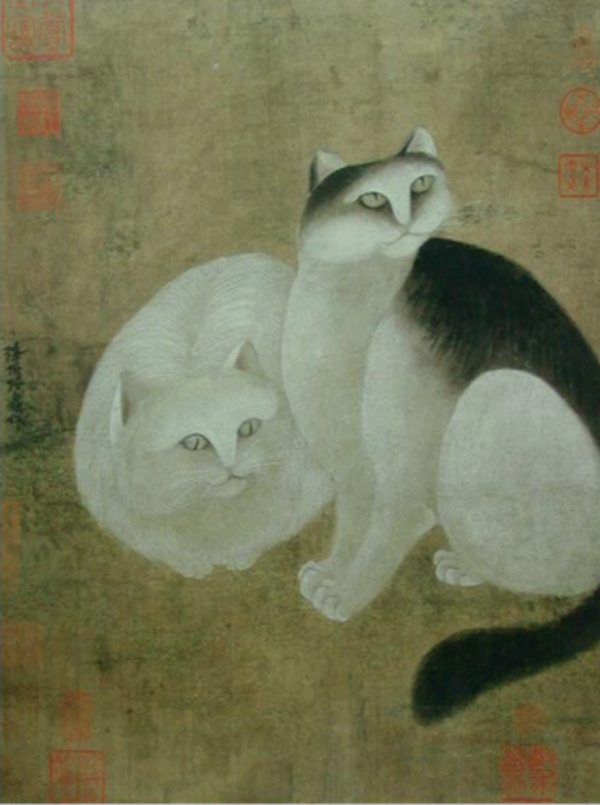
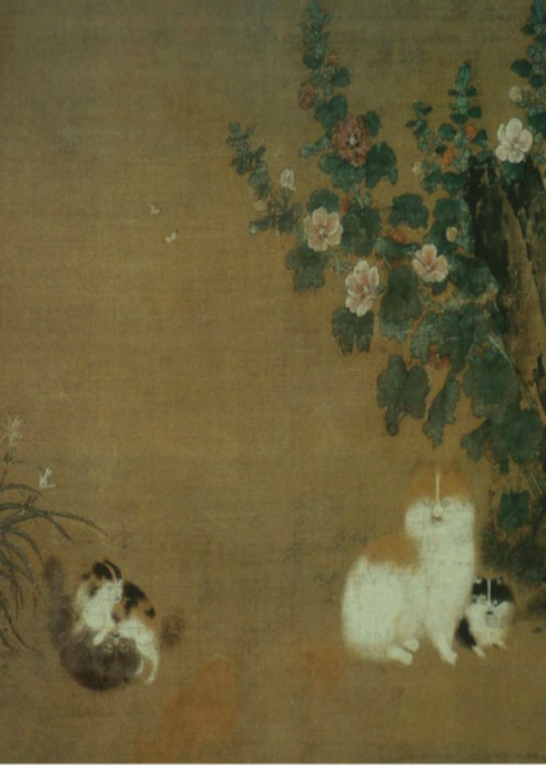
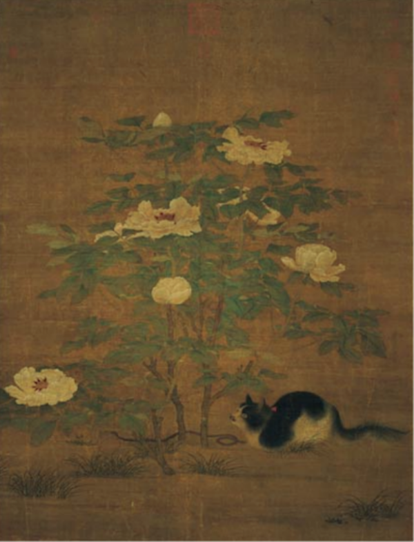
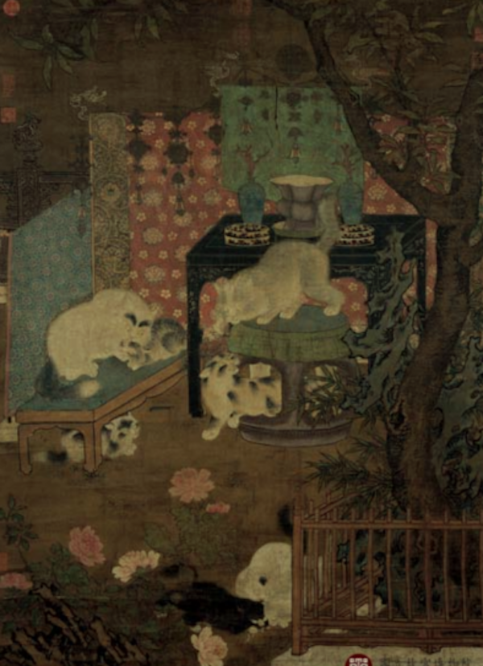
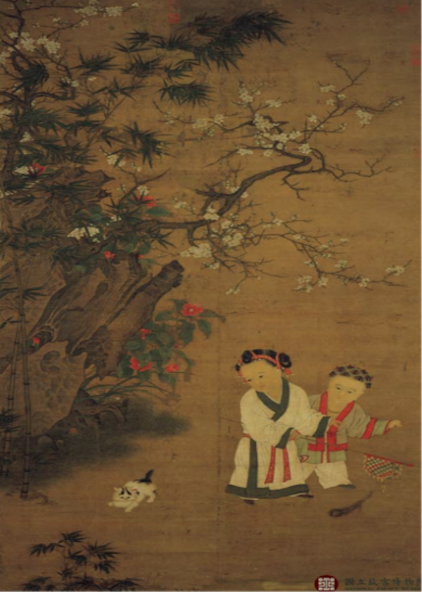
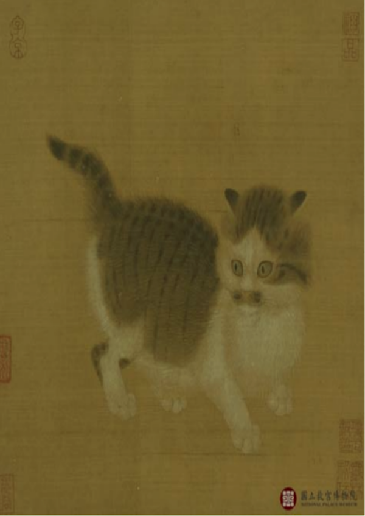
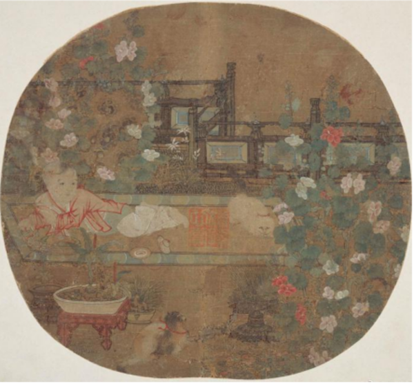
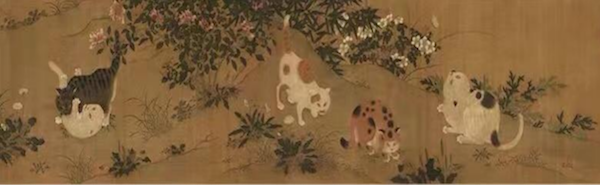

Notes on: 宋凯会,  (2024): 宋代猫奴手册一：衔蝉毛色白胜酥--品种、角色、猫市
===========================================================================

`View on The Paper <https://www.thepaper.cn/newsDetail_forward_26314793>`_

.. code-block:: bibtex

   @Article{宋凯会_宋代猫奴手册一_2024,
     author  = {宋凯会},
     title   = {宋代猫奴手册一：衔蝉毛色白胜酥--品种、角色、猫市},
     journal = {澎湃新闻},
     year    = 2024,
     url     = {https://www.thepaper.cn/newsDetail_forward_26314793},
     month   = {May},
   }

前言
----

在宋人笔下，猫的别称、寓意和象征意义丰富多样，在不同语境中的意象各不相同。比如
“狸奴”——“猫，本狸属，故名狸奴”——揭示了狸-猫之间驯化的发展顺序，也体现出在演变过
程中，主人对宠物的关爱逐渐加深，自愿称“奴”以表达亲密之情。又如“衔蝉”，其来源有多
种说法，一方面猫有衔蝉行为；另一方面，在古代文学作品中，猫象征着美丽女性，衔蝉因
此成为美丽的象征。此外，猫在夜间能够自如活动，因而被称为“衔烛”或“衔烛夜游”。其他
别称还有“白雪姑”“黑虎”“鬼尼”“虎舅”“鼠将”“於菟”“女奴”等。

宋猫品种
--------

宋代画作提供了关于猫品种的直观视觉依据，有助于深入了解当时的猫种类。根据文献记载
和遗存绘画作品，宋代猫毛色繁多，名目奇异。品种主要有“四时好”，“凡纯色，无论黄白
黑，皆名四时好”（ :numref:`catfig1` 左边纯白色猫）；“玳瑁斑”，“一种三色猫，盖兼
黄白黑，又名玳瑁斑”（ :numref:`catfig2` 左下角小猫）；“乌云盖雪”，“乌云盖雪，必
身背黑，而肚腿蹄爪皆白者方是（ :numref:`catfig3` ）。若仅止四蹄白者，名踏雪寻梅，
其纯黄白爪者同”（ :numref:`catfig4` 中下黑猫）；“挂印拖枪”，“纯白而尾独纯黑，额
上一团黑色，此名挂印拖枪，又名印星猫。人家得此主贵，故云：‘白额过腰通到尾，正中
一点是圆星’”（ :numref:`catfig5` ）；“金被银床”，“黄身白肚者，名金被银
床”（ :numref:`catfig6` ）；“雪里拖枪”，“纯白而尾独黑者，名雪里拖枪，最吉
（ :numref:`catfig7` 趴猫）。故云，‘黑尾之猫通身白，人家畜之产豪杰’。通身黑，而
尾尖一点白者，名垂珠”（ :numref:`catfig4` 左一猫）；“缠得过”，身上有花，四足及尾
又俱花，亦佳（ :numref:`catfig4` 桌脚猫）；“金簪插银瓶”，“通身白而尾独黄
者”（ :numref:`catfig8` 中间猫）。

.. _catfig1:

   （南宋）靳清：双猫图

.. _catfig2:

   （南宋）毛益：蜀葵游猫图

.. _catfig3:

   （北宋）佚名：富贵花狸图

.. _catfig4:

   （南宋）佚名：宋人戏猫图

.. _catfig5:

   （南宋）苏汉臣：冬日婴戏图

.. _catfig6:

   （南宋）佚名：狸奴图

.. _catfig7:

   （南宋）佚名：狸奴婴戏图

.. _catfig8:

   （北宋）赵佶：耄耋图

以地域划分，主要有海州猫、楚州猫、简州猫、临清狮猫、安陆野猫、南澳歧尾猫、贺州囊
狸、东海海狸等，带有浓重的区域色彩。除了本土猫外，诸多外来猫亦通过各种途径传入。
古籍中不乏域外贡猫、外来猫的记载：“猫自番来者有金眼银眼，有一金一银”，同时还提到
了“暹罗产狮猫”。（《猫苑·灵异》）《天南行记》记载，至正二十六年，安南国进贡皇后
中“有风狸一头”。在宋代，人们从契丹引进了一种名为“貔狸”的猫科动物，主要用途是食用。
据《渑水燕谈》记载，“貔狸”产自契丹国，体型类似大鼠但脚短且肥胖，肉质鲜美。《画墁
录》中也有类似的描述，南使至契丹时，对方会秘密供应“貔狸”，这种“貔狸”即黄鼠狼。
《梦溪笔谈》还对“貔狸”的口感进行了描述，称其味道如豚肉般鲜美且口感脆爽。

宋猫角色
--------

宋代猫可以角色分为四大类：捕鼠猫、定时猫、药用猫及宠物猫，其中甚至透视着宋代社会
结构。

捕鼠猫
~~~~~~

《西山读书记》对猫捕鼠的过程进行了详尽而细腻的描绘：“猫之捕鼠，四足据地，首尾一
直，目睛不瞬，心无他念，惟其不动，动则鼠无逃矣。”猫有类似于虎的捕食习性，常通过
划地预测猎物位置，民间称之为“鼠卜”。“猫属丁火，故尤灵于夜”，猫之目能夜视。（《物
性纂异》）《游秦岩》中描述：“龙遮侧岸路，猫护高廪藏。”《却鼠刀铭》提及：“夫猫鸷
禽，昼巡夜伺。”《失猫一首》中写道：“跳似猴难摄伏，纵擒无鼠敢从横。”陈著《怜猫示
内》描述：“黑花一衔蝉，捕攫奔走捷，巧黠乃其天。”这些文献显示，宋代人对猫的习性有
了相当程度的认识，并掌握了其独特的捕食技巧与行为习惯，从而能够更为有效地利用猫进
行捕鼠。

吴龙翰《持敬堂》“断断猫捕鼠”；林锡翁《猫儿石》“猫儿峰小眼精光，来护仙家石廪粮”；
钱时《义猫行》“我家老狸奴，健捕无其比。高卧不忧鼠”；张镃《虎斑猫》“百丈慵参老野
狐，一双俄得小於菟。眈眈肯听豺声怯，索索当令鼠辈无”；曾丰《社鼠》“依附宜灵寖陆梁，
乘人切忌肆为殃。不知猫在旁窥伺，才堕其机辄中肠”，这些都证明猫在宋人的生活中扮演
了得力助手的角色，甚至被视为家庭成员“同寝处”。《月河闻录》收录了一则颇具趣味的轶
事：一位胆怯之人夜宿严氏外楼，听闻楼板传来异响，疑为鬼魅降临，于是便拿起被子扑击
鬼魅。待天明时分，方才发现竟是一只狸猫。此故事亦揭示了狸猫捕鼠的特性与习惯，足以
让人想象出狸猫捕鼠生动活泼的身影。宋人甚至效仿猫鸣以吓退老鼠，“饥鼠稍出穴……痴儿
效猫鸣”，（《同谢师厚宿胥氏书斋闻鼠甚患之》）“鼠啮叱不止，呼奴效猫鸣”；（《和陶
渊明饮酒二十首》）“饥鼠知自迁，畜猫竟徒设”，（《和陶渊明饮酒二十首》）也从反面衬
托当时人认为捕鼠能力差的猫不算好猫。

定时猫
~~~~~~

民间百姓通过猫眼来辨识时辰，“猫眼定时甚验”。（《猫苑·灵异》）有歌云：“子午线，卯
酉圆，寅申巳亥银杏样，辰戌丑未侧如钱。”（《物类相感志·禽鱼》）《尔雅翼》云“目睛
早晚圆，日中如线，就阴则复圆”；《埤雅·释兽》“猫旦暮目睛皆圆，及午即敛如线”；赵孟
坚《高渭南席上烛照牡丹·其二》“日午猫睛一线时”；《梦溪笔谈》也载有：“猫眼黑睛如线，
此正午猫眼也。猫眼早暮则睛圆，日渐中狭长，正午则如一线耳。”古人将猫眼视为钟表，
认为猫的眼睛在早晨和傍晚时呈圆形，随着时间推移逐渐变为细长，到了正午则如一线。这
一颇具趣味的“计时”方式展现了他们日常生活之经验与敏锐观察力。据此，将一种宝石命名
为猫眼石，其质地晶莹洁白，透明如猫眼。

药用猫
~~~~~~

在宋代，猫是具有药用价值的动物。宋代医学著作中记载，猫肉、猫骨、猫脂等具有药用作
用，广泛应用于治疗各种疾病。野猫肉不仅具有解毒功效，可治疗鬼毒，《太平御览》云
“野猫肉，治鬼毒，皮中如针刺。孟诜曰：‘治鬼疟’。”还可治疗男女科，《本草衍义》载
“野猫阴茎，治妇人月水不通，男子阴㿗”；“狸，形类猫，皆可入药”。此外，《证类本草》
中载野猫骨能够镇心安神。在北宋的医学经典《太平圣惠方》中，记载了“狸头、蹄骨”可用
于治疗瘰疬肿痛。该书亦提及“猫头”具有收敛痈疽的功效。在宋代诸多医药典籍中，均有关
于猫类动物药用价值的记载。在《箧中方》中，“小儿阴疮，猫头骨烧灰，傅之”。《食物本
草》认为猫肉可治疗对口疮。《本草衍义》中记载，“猫涎，治瘰疬，刺破涂之”。《证类本
草》指出猫肝可用于治疗痨瘵，特别是黑猫肝疗效更佳。此外，《溥济方》中提到，猫儿头
上的毛可用于治疗鼻擦破伤，将其煎碎后混合唾液敷用。《大观本草》则记载了乌猫屎可治
疗小儿疟疾。《太平惠民和剂局方》认为，猫粪烧灰后服用可治疗齁哮痰咳。

宠物猫
~~~~~~

早期人们饲猫的初衷多为防治鼠患，更重视猫的功用性；而在饲养的过程中，人与猫之间逐
渐产生更多情感上的依赖。宋墓曾出土的家猫骨骼未发现人为痕迹，为特意放置的饲宠，是
人们为培养生活伴侣或寄托生活情趣而畜养的。古今名贤，有猫癖者多矣，与一般民家求其
“却鼠”不同，皇家贵族养猫则多作为休闲生活中的私宠伴侣，宠物猫多为狮猫，“形色丰美
可珍，惟耽慵逸，不能捕鼠”“狮猫身大，长毛蓬尾”，特见贵爱。古人甚至认为“梦狮猫，为
丰亨久安之象”。（《猫苑·灵异》）宋孝宗为刁光《蜂蝶戏猫图》题“白泽形容玉兔毛，纷
纷鼠辈命难逃”，文中用“白泽”“兔毛”形容猫，可以推断出图中猫咪的毛发光泽亮丽，养护
得当，应为一只“狮猫”。“衔蝉毛色白胜酥，搦絮推绵亦不如”，（《乞猫送猫诗》）描绘了
猫的毛发色泽亮丽，质地柔顺，堪称棉絮般的柔软洁白，从侧面反映了宠物猫的生活优越。
特权阶级的家猫，享有更为尊贵的地位。《老学庵笔记》载“桧女孙崇国夫人者，方六七岁，
爱一狮猫。亡之，限令临安府访索。逮捕数百人，致猫百计，皆非也。乃图行百本，张茶坊”，
此为宋代独一无二的寻猫启示，彰显特权阶层为追寻宠物猫而不顾扰民。乃至猫亦沦为贿赂
之品，《西湖志余》记载：“时任府尹曹泳，因偏爱之人以金猫行贿，方才作罢。”宋代皇宫
大内的猫狗甚至“皆有官名食俸”，“中贵养者”的猫被称呼为“老爷”。（牧仲《筠廊偶笔》）

随着养猫风的兴起，宠物猫饲养逐渐普及，广大民众尤其是文人阶层，多选择养猫作为精神
寄托。诸多文人因老鼠侵蚀书籍及物品，导致夜晚难以入眠，饱受鼠患之扰。他们往往将猫
视为守护书籍的得力助手，甚至通过诗歌表达对老鼠的忧虑以及对猫护书的感激之情，猫被
赋予了更多的正面形象和寓意。家中无猫者通过向其他人乞猫来捕鼠，由此衍生出了乞猫现
象。这一现象进一步推动了乞猫诗的兴盛。许多文人雅士通过诗词来表达他们对生活、自然
和动物的感悟和热爱，而乞猫诗作为他们情感表达的重要载体，更显得生活气息浓厚，情感
色彩丰富。如黄庭坚《乞猫》：“秋来鼠辈欺猫死，窥瓮翻盘搅夜眠。闻道狸奴将数子，买
鱼穿柳聘衔蝉。”周紫芝《次韵苏如圭乞猫》：“饥鼠窜旁舍，不复劳驱除。何为走老黥，贯
鱼乞狸奴。”曾几《乞猫二首·其一》：“春来鼠壤有余蔬，乞得猫奴亦已无。青蒻裹盐仍裹
茗，烦君为致小於菟。”这些乞猫诗通过描绘猫的形态、习性、性格等特点，表达对猫的喜
爱和赞美之情。还刻画与猫相处的场景，展现出人猫之间的亲密关系。

宋代“猫市”
----------

在宋代，并未设立专门针对猫的交易市场，然而相国寺内的万姓交易市场已有商贩从事猫的
买卖。“每月五次开放万姓交易，大三门上皆是飞禽猫犬之类，珍禽奇兽，无所不有”。
（《东京梦华录·相国寺内万姓交易》）《武林旧事》中记载：“市楼中有售玉面狸者”，亦
称“牛尾狸”。此物种在捕鼠方面表现勇猛迅速，且因其仅以山果为食，肉质口感鲜美醇香。
将其制成糟食更为美味，堪称醒酒佳品，为山珍之冠。因此玉面狸备受宋代民众青睐与推崇，
诗坛雅士为其挥毫泼墨。杨万里曾有幸获得一只牛尾狸并将其敬献。在献词中，杨万里将此
狸称为“皂衣郎”，并赋诗赞誉：“狐公韵胜冰玉肌，字则未闻号季狸”。皂衣郎原指古代官府
中的差役或侍从，常着黑色衣装。苏东坡亦曾作《牛尾狸》诗：“首如狸，尾如牛，攀条捷
崄如猱猴，橘柚为浆栗为糇。”在宋之前，人们已有食用猫肉的习俗。宋时，买卖和屠杀猫
的现象屡见不鲜，猫狗铺被称为“野味店”。商贩们甚至为了追求利益而偷窃猫。据《桯史》
记载，岳珂家中养了一只擅长捕鼠的青色猫，某日突然失踪。有人透露，“和宁门有肆，号
曰鬻野味，皆猫犬肉也”。由于市区居住地狭窄，猫容易被捕获，夜晚被送到和宁门商铺，
无一幸存。

宋代人还食用猫脂，成为当时肉食消费的组成部分。猫脂可作为食品，亦可蘸蜜糖一同食用。
此外，安陆产的野猫花猫，其皮毛每年皆需纳入贡品，适用于皮草制作。野猫之毛亦可作为
笔出售。灵猫与海狸则为香料动物，所产灵猫香及海狸香可用于上贡或对外销售。关于宋代
猫的价格，一例染色猫的交易案例颇为引人注目。南宋中期临安小巷的居民孙三，把一只白
猫染成“干红深色”，使用奸计骗得打算进献给皇帝的内侍买走：“竟以钱三百千取之”，
（《夷坚志·三志已·干红猫》）即300贯。这一事件不仅揭示了宋代猫的价格之高，还反映
了宠物市场的繁荣和人们对猫的需求。

宋人认为单胎猫更为贵，更受欢迎，双胎猫则较为便宜，一胎四子的猫被称为抬轿猫，价格
较低。若四子中有两子存活，则被视为佳品。随着养猫市场需求旺盛，与猫相关的手工艺品
市场亦逐渐繁荣，例如猫粮买卖，《东京梦华录》载有临安市场“养猫则供猫食并小鱼”，
（《东京梦华录·相国寺内万姓交易》）“卖生鱼则用浅抱桶，以柳叶间串，清水中浸，或循
街出卖”，所以聘猫时人们大都“买鱼穿柳”。诸如“猫窝、猫鱼、售猫崽、改良猫犬”等一系
列行业皆可见于当时。（《武林旧事·小经纪》）此外，还有一种专门用于捕鼠的器具，名
为“竹猫儿”，实为竹制器具，用以捕捉老鼠。（《武林旧事·小经纪》）这些行业的兴起皆
源于当时养猫风气的盛行。
