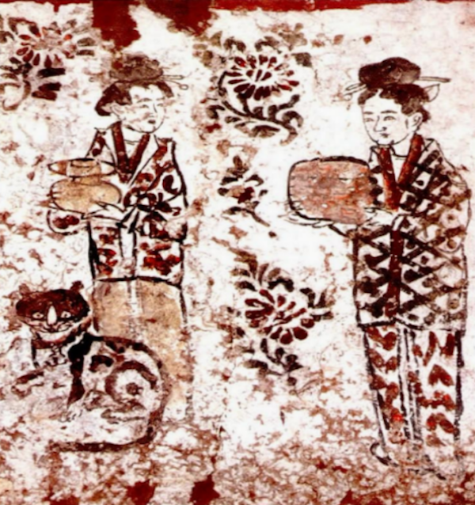
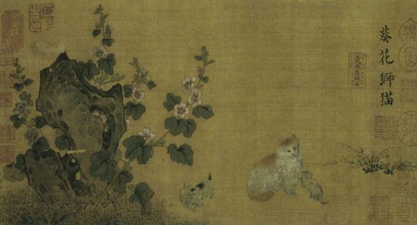
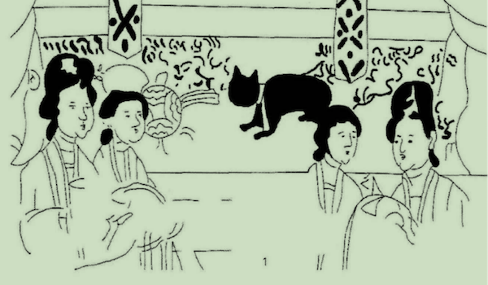
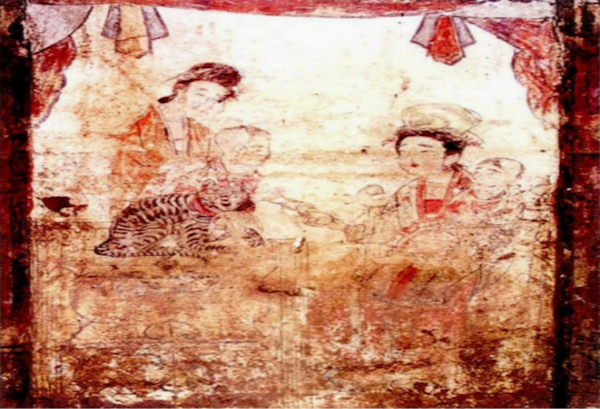
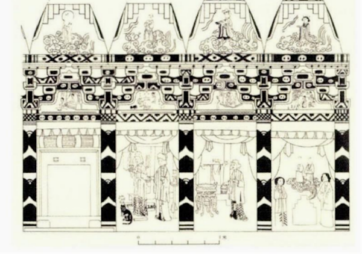
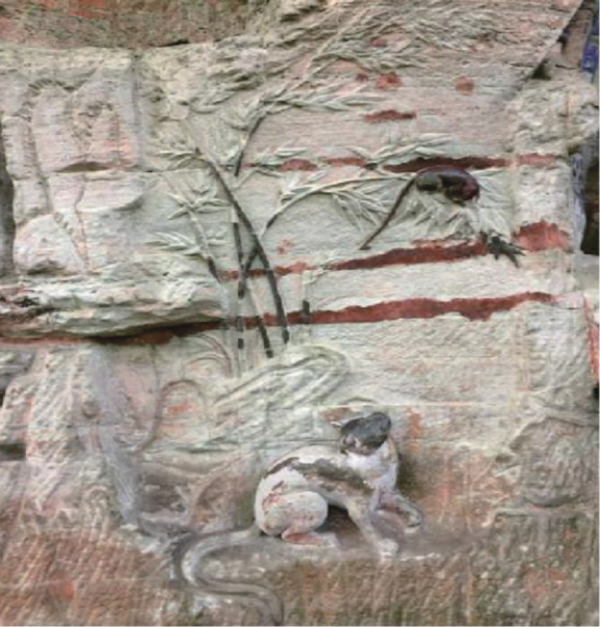
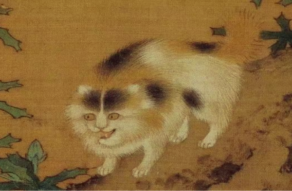
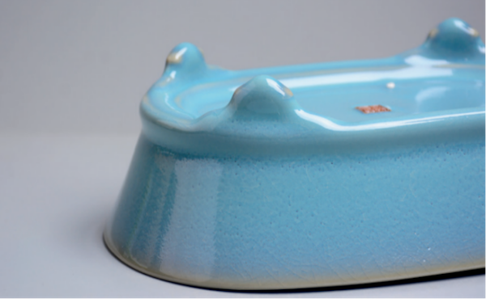
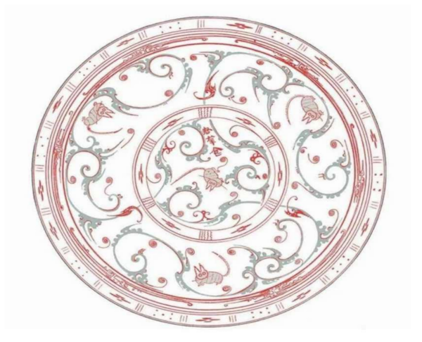

Notes on: 宋凯会,  (2024): 宋代猫奴手册三：闲看猫暖眠毡褥——画作、诗词、艺术品
=============================================================================

`View on The Paper <https://www.thepaper.cn/newsDetail_forward_26314835>`_

.. code-block:: bibtex

   @Article{宋凯会_宋代猫奴手册三_2024,
     author  = {宋凯会},
     title   = {宋代猫奴手册三：闲看猫暖眠毡褥——画作、诗词、艺术品},
     journal = {澎湃新闻},
     year    = 2024,
     url     = {https://www.thepaper.cn/newsDetail_forward_26314835},
     month   = {May},
   }

前言
----

在宋代，时代精神逐渐内敛，士人心态追求宁静安逸，社会审美观念发生了显著变化，人们
开始更加注重感官享受和情感体验，这种转变体现了更为细腻的审美追求。“于是那深庭小
院里的娇小动物——猫，便成为帝王将相、达官显宦、文人墨客和市井俗人的宠物”。（梁中
效《闲话宋代人的养猫热》）猫普遍进入世俗生活，动物形象较于前朝鉴赏与心灵愉悦层面
显著提高。在文献记录中“猫”位列于“狸”之前甚至在狗之前，宋人对狸、猫、狐等混用，词
义之间存在交叉重叠。然而，在诗词绘画中对狸猫类动物形态特征有了更为详尽的描绘。出
土文献资料显示，宋代墓葬壁画中，猫的形象融入了日常生活的各种场景，并赋予了其独特
的象征意义。

猫在宋代作为宠物获得了统治阶级、权贵家族、文人墨客、平民百姓的喜爱，开始作为一种
独立的主体活跃于文学艺术作品上。在文学作品中常常可以看到以捕鼠猫为主要形象的诗词
等作品，而在艺术作品中，宠物猫的形象则更多地通过绘画等形式展现出来。

.. _cath1:

   荥阳槐西村北宋壁画墓

画中情缘
--------

据《宣和画谱》记载，宋代猫画艺术作品数量丰富，达到了数百件。俗语有云：“狗来富，
猫来贵。”“猫”字与“耄”字谐音，由此被赋予祈求长寿的吉祥寓意，“猫”“蝶”谐音“耄耋”，
含有“耄耋富贵”之意，猫蝶结合成为绘画的佳选题材。在宋代，以宋徽宗赵佶为首，李迪、
祁序、靳青、何尊师、王凝、李霭之、苏汉臣等画家在猫画的创作上各具特色。他们擅长描
绘婴孩与猫共同嬉戏的场景，或以花木及名猫为题材，或创新性地将猫与蝴蝶、山雀、蛐蛐
相结合。在宋人观念里，供养花木可驱鬼辟邪，承载了丰富的象征内涵。牡丹象征着富饶与
福祉，蜀葵代表着阳光，而石榴则寓意着多子多福。蜜蜂代表勤劳和智慧，山雀象征喜庆和
欢乐，蛐蛐则寓意着热闹和繁荣。这些动植物与猫咪的结合，使得画作更具有生活情趣，也
使得猫的形象更加丰满和立体。这类画作反映了古人对美好生活的向往和对幸福的追求，同
时也展现了他们对生活哲学的独特理解。如《蜂蝶戏猫图》《芍药戏猫图》《牡丹戏猫图》
《猫竹图》《竹石猫雀图》《萱草小猫图》《花竹捕雀猫图》《藤墩戏猫图》《戏猫桃石图》
《顾蜂猫图》《蝼蝈戏猫图》《药苗戏猫图》《醉猫图》《药苗雏猫图》《戏猫图》《小猫
图》《虿猫图》《苋菜戏猫图》《子母猫图》《薄荷醉猫图》等，生动展现了宋人养猫、戏
猫、游猫的生活景象。通过“音译”“象征”等手法，为猫赋予一定的吉祥寓意，形成了美好的
民俗图像。

.. _cath2:

   （南宋）许迪：《葵花狮猫图》

这种图像在死后墓葬塑造中也得以延续，“猫的图像一直到宋代之前都鲜有出现。猫的装饰
图像在墓葬壁画中出现并非孤例，主要集中出现在宋金壁画墓中”，（赵丹坤《狸奴小影——
试论宋代墓葬壁画中的猫》）多数黑质白章，这些壁画中的黑猫形象，或许为狸类驯化为家
庭宠物提供了一定佐证。装饰画中有猫雀组合，“窃脂小雀，盖取音‘耆’也；则猫雀相合为
以图载音，因声求义，故取义‘耄耆’耳。所以，‘猫雀’与‘猫蝶’有着相同的图像语言，意喻
‘长命寿考’”。（袁泉《宋金墓葬猫雀题材考》）猫与妇女携子共现的图案，象征着庇佑后
代的期许。正如袁泉在《宋金墓葬猫雀题材考》中所述，“抱子猫雀”图展现了“生子见庙”祭
祀场景的独特风貌；“新嗣抱见，俯垂佑庇，俾之成人，富贵长命”。在我国传统文化中，石
榴一直以来也被视为多子多福的象征。正如民间俗语所说“千子如一”，寓意着家族繁荣昌盛，
子孙满堂。宋代《榴花戏猫图》便是典型的代表之一，也是祈愿家族繁荣，更是对后代的庇
佑与祝福。

.. _cath3:

   河南登封箭沟壁画墓

.. _cath4:

   登封黑山沟墓《育儿图》

猫与家具、侍女、宴饮、陶罐、精致配饰等相结合，审视之下，可见一族家庭展示出的富足
景象，底蕴丰厚，娱乐活动丰富多彩。这些带有猫元素的墓葬壁画主要分布在北方地区，特
别是河南一带，集中在当时的都城周边。它们以宠物形象出现在大量平民墓葬之中，一定程
度上揭示了都城的繁荣富庶，展现了宋朝全民娱乐的氛围，以及宋代享乐主义的盛行。且
“描绘多刻画女子日常生活，包括生产生活两方面……表现主题及所展现的内容场景较为具体、
精致”。（秦旭彤《北方宋墓动物图像研究》）在宋代文学作品中，猫与女子的形象结合颇
多。这主要是因为猫在宋代的社会地位有所提高，成为了人们日常生活中不可或缺的宠物。
同时，猫的灵动、优雅、独立的性格特点也与女性的柔美、婉约、神秘气质不谋而合，使得
猫成为文学作品中女性形象的象征。但是在宋代话本中，猫与女子结合，女子形象又被妖魅
化。

.. _cath5:

   登封高村壁画墓

在除诗词绘画等纸质表现手法之外，宋代艺术家们擅长将猫的形象融入到石质画作之中，例
如宝顶山大佛湾《六道轮回图》中的《猫鼠图》。石刻栩栩如生，竹上鼠缩尾垂，惧视下猫；
竹下猫抬爪背弓，欲捕鼠。动静结合巧妙地折射出当时社会主流的“儒、释、道三教调和，
各有所用”的心态。（童邦华《浅析大足石刻〈猫鼠图〉艺术造诣》）宋人普遍认为猫绘有
驱避老鼠的功效，因此在江南地区，每逢蚕丝养殖季节，蚕农们都会采用猫画来预防和控制
鼠害，这已成为当地农业生产中的传统习俗。在蚕房周围布设张贴猫木版画，以此寓意驱赶
老鼠，保护蚕茧的安全健康成长，以此寄托对丰收的期盼。

.. _cath6:

   宝顶山大佛湾《猫鼠图》

猫画艺术中的内容，既描绘了真实的生活场景，也体现了宋代百姓对美好生活的情感寄托。
猫作为宠物，不仅是一种艺术形式，更是一种文化符号，寄托了时人内心深处的生活愿景，
代表着当时社会的审美观念和价值取向。与之相应，文人创作了不少题画诗，诗歌意象日常
化与哲理化，具有普遍性和现实意义的同时具备深刻的思想和哲学观念。如陆游《题画薄荷
扇二首·其一》：“薄荷花开蝶翅翻，风枝露叶弄秋妍。自怜不及狸奴黠，烂醉篱边不用钱。”杨
万里《子上持豫章画扇其上牡丹三株黄白相间盛开一猫将二子戏其旁》：“暄风暖景政春迟，
开尽好花人未知。输与狸奴得春色，牡丹香里弄双儿。”李石《题马仲友画花下猫二首·其
一》：“花相春归画锦仙，轻云羃羃护花天。莫烧高烛三更月，自有真香一炷烟。”猫醉薄荷、
花间嬉戏、衔蝉扑蝶，若非细致观察则无法在诗画中传神。在这些题画诗中，猫被赋予了风
雅的文化意蕴，不言理、非托志，仅因心灵感悟而吟咏。

.. _cath7:

   （南宋）李迪：《秋葵山石图》

诗词世界
--------

“在宋代诗词中，“猫”相较其他意象而言，出现的频率也较之唐以前高出很多，这也与猫在
中国存在的历史以及宋代文人的心态密切相关”。（熊桂芳《从宋人诗词角度看猫意象内涵
及其历史变迁》）这一现象反映了宋代文人对自然界的敏锐观察与情感投射。这一时期，宋
徽宗赵佶以其对猫的热爱而闻名，他不仅在宫廷中蓄养宠物猫，还常以猫为题材创作书画作
品，他对皇家专属画院的赞助不遗余力。陆游、黄庭坚、方回等文人墨客也纷纷效仿，他们
不仅在诗词中赞美猫的美丽和优雅，还通过描绘猫的形象和习性来表达内心的情感和思想。
陆游的颂猫诗篇数量之丰，堪称诗坛之最。通过宋人笔触，我们得以一窥宋代文人与猫之间
的特殊关系。

在宋代诗词中，猫这一意象被视为心灵慰藉的依托，是悠闲烂漫生活的象征，象征着宁静安
逸的生活。如《指月录》“牡丹花下睡猫儿”，描绘了一幅宁静而美好的画面，在牡丹花丛中，
一只猫咪静静躺着享受阳光的温暖和花香的熏陶；叶绍翁《猫图》“醉薄荷，扑蝉蛾。主人
家，奈鼠何”，（《宋诗纪事·叶绍翁猫图》）诗中刻画出的小猫动态生动形象，身为家猫却
忽略天职醉心于卧草扑蛾，体现出作者的无奈与宠溺；《新暑追凉》“朝慵午倦谁相伴，猫
枕桃笙苦竹床”，一幅悠然自得的画卷扑面而来，人与自然达到了和谐共生的状态。心境也
随着这一景象的静谧变得平静起来。贾似道的《论脸》一诗中，“酒醉猫儿脸，花花白路纹。
此般生像者，弃物不须论”等句，生动描绘了猫与人类之间的紧密关联与陪伴，展现了诗人
对猫咪的宠爱之情。范成大诗：“闲看猫暖眠毡褥”，刻画了一幅温馨恬静的画面，猫儿在毡
褥上慵懒地入睡，给人以安宁与舒适的感觉。杨万里《子上持豫章画扇其上牡丹三株黄白相
间盛开一猫将二子戏其旁》“暄风暖景政春迟，开尽好花人未知。输与狸奴得春色，牡丹香
里弄双儿”，一只狸奴在牡丹的香气中，嬉戏于双生子之间，将春天的美好与生活的欢乐完
美地融合一起。这些诗句所勾勒出的画面，和谐温馨，令人如临其境。

猫也被视为填补人们在现实世界中的空虚灵魂，成为诗人在孤独困顿之际始终如一的陪伴者，
悉心照料书房内的丰富藏书以及与之相伴的点滴时光。《寄朱元晦长句以牛尾狸黄雀冬猫笋
伴书》“大武尾裔名季狸，目如点漆肤凝脂”，牛尾狸在冬日相伴左右，共度学时；张良臣
《祝猫》“江上孤篷雪压时，每怀寒夜暖相依”，诗人在大雪纷飞的江上孤篷之中，与猫共度
冬夜，相互依偎取暖；范成大《习闲》“闲看猫暖眠毡褥，静听犹寒叫竹篱”；胡仲弓《睡猫》
“瓶中斗粟鼠窃尽，床上狸奴睡不知。无奈家人犹爱护，买鱼和饭养如儿”；陆放翁诗“狸奴
毡暖夜相亲”，张无尽诗“更有冬裘共足温”。在诗人的笔下，猫们被赋予了丰富的情感和人
性，更是陪伴、温暖、慵懒、悠闲的化身。它们在寒冷的冬日里，为诗人带来温暖，填补了
他们在现实世界中的空虚灵魂。有的在书房内悉心照料丰富的藏书，有的在江上孤篷中陪伴
诗人度过雪压的时刻，有的在瓶中斗粟鼠窃尽时，依然能在床上慵懒地入睡。在诗人生活中，
成为了不可或缺的存在。在困境中，猫能带给诗人温暖和希望。

宋人还借猫寓人寓事以阐明哲理，将这些哲理运用于活实践之中。如强至《予家畜狸花二猫
一日狸者获鼠未食而花者私窃》：“狸猫得鼠活未食，戏局之地或前后。猫欺鼠困纵不逐，
岂防厥类怠其守。花猫狡计伺狸怠，帖耳偷衔背之走。家人莫究狸所得，只见花衔鼠在口。
予因窃觇见本末，却笑家人反能否。主人养猫不知用，谬薄狸能服花厚。花虽利鼠乃欺主，
窃狸之功亦花丑。人间颠倒常大此，利害于猫复何有。”主人养育猫儿却不善运用其捕鼠本
能，误以为花猫优于狸猫。花猫虽得利却欺骗主人，窃取狸猫之功，实则自曝其短。世间是
非颠倒往往如此，猫儿的利弊又岂能以此衡量。罗大经“陋室偏遭黠鼠欺，狸奴虽小策勋奇。
扼喉莫讶无遗力，应记当年骨醉时”，（《鹤林玉露·乙编·猫捕鼠》）寓意在现实生活中，
我们需要保持警惕，不要被表面现象所迷惑，要学会观察和分析事情的真相和利害关系，以
便做出正确的决策。

有时会假借猫不捕鼠来讽刺尸位素餐、祸国乱政之作，苏东坡奏疏云：“养猫以捕鼠，不以
无鼠而养不捕之猫。余谓不捕鼠犹可也，不捕鼠而捕鸡则甚矣。疾视正人，必欲尽击之，非
捕鸡乎？”各级官员应当忠实履行职责，勤奋努力，切勿懒散懈怠。用猫不捕鼠却捕鸡来寓
意那些祸国殃民、心术不正之徒，是对他们的讽刺与批评。“宋有卢仙姑者，指猫而问蔡京
曰：‘识之否？此章惇也。’意盖讽京”。（《洪范羽翼·猫》）卢仙姑的讽刺意味十足。她借
指猫为章惇，暗喻蔡京在政治上的狡诈。此外，涉及文学作品方面，例如宋代洪适所著《弃
猫文》为例，“主人有猫而不能捕……惟兹猫焉，捕鼠为职。胡为汝猫，乃蒙含育，彼既不能
咋喉而使之迹绝，又不能游堂而使之安穴，犹乞食以求餐，敢张颐而伸舌？非罢懦之弗堪，
殆尸素而饕餮。今汝椸无全衣，室无全器，以穿屋为常，以盗肉为易，致阴类之公行，宜汝
猫之获戾。曷不投远地，而迎善捕者代之”。洪适主张，猫若无法履行捕鼠之职，则犹如官
员疏于职务，理应受到惩处。他提倡驱离尸位素餐的猫，暗喻官员应恪尽职守，全力以赴地
为朝廷效力，否则便如同无所作为的猫，空占着职位却未尽职责。

艺术人文
--------

在宋代文化艺术品中，猫的形象频繁出现。诸如瓷枕、玉器、饮食器具等艺术品中，均可见
到猫温顺、可爱、精致之貌，彰显了宋代工艺美术的卓越发展。

在陶瓷艺术领域，猫纹图案被广泛应用于装饰设计。宋代汝窑水仙盆，被认为是猫食盆，其
器形椭圆，平底，侧壁斜上敞口，底部一圈窄边突出，四角则饰以猫耳状的底足。这些陶瓷
艺术品不仅展现了猫的优雅与灵动之姿，同时亦反映出宋代陶瓷工艺之精湛。在雕塑艺术领
域，猫的形象得以广泛运用，例如“雕刻木猫以捕鼠，设计机关于腹部，技艺精湛令人赞叹”。
《癸辛杂识》中记载了一种船具，称为“铁猫儿”。此外，在剪纸、刺绣等民间艺术中，猫也
是常见的题材之一。剪纸艺术家会剪出各种形态的猫，如睡猫、扑猫等，形象生动有趣。猫
在艺术作品中的表现形式多种多样，无论是诗词绘画、陶瓷雕塑等，都展示了猫的温顺形象，
也反映了宋代社会的文化氛围和人们的审美趣味。

.. _cath8:

   韩琴汝瓷柴烧水仙盆

.. _cath9:

   湖南长沙马王堆一号墓出土猫纹漆盘 湖南省博物馆藏

宋人在地理命名中，注重从日常生活中发掘人文之美。巧妙地将猫的形象与自然景观、城市
街巷相结合，为地理名称注入了更为生动、富有情趣的内涵。例如，象州有一山形状如猫，
名为“猫儿山”；池州有一条名为“猫儿溪”的河流；临安则有一条被称为“猫儿桥巷”的街区。
在宋代的官本杂剧中，诸多剧目皆以猫为名，诸如曲牌名“琥珀猫儿坠”、段落名“变猫封铺
儿”以及《乾淳舞队品目》中的“猫儿相公”等。《潜居录》中还将“赘婿”俗称曰“野猫”，意
指“衔妻而去也”，阐述猫在宋代社会日常生活中的广泛应用。

在宋代，养猫普及程度较高，已逐渐成为一种全民性的文化现象，同时也揭示了社会、经济
与文化相互交融的深层内涵。宋代养猫既强调实用性，如捕鼠、护书等实际需求，又注重文
化性，将猫视为宠物、艺术创作题材等。从社会角度来看，养猫在维护社会稳定方面发挥了
重要作用。猫的自然捕鼠能力为农业生产和民众生活提供了保障，同时，它们的温顺性格和
陪伴功能使得人们更加亲近，促进了人与自然的和谐氛围。在市场经济方面，养猫对手工业
产生了积极的推动作用，进而促进了商业发展。在文化层面，养猫对艺术创作和审美观念产
生了深远影响。宋人养猫不仅是一种生活方式，更是时代精神与社会发展相互交融的体现。
