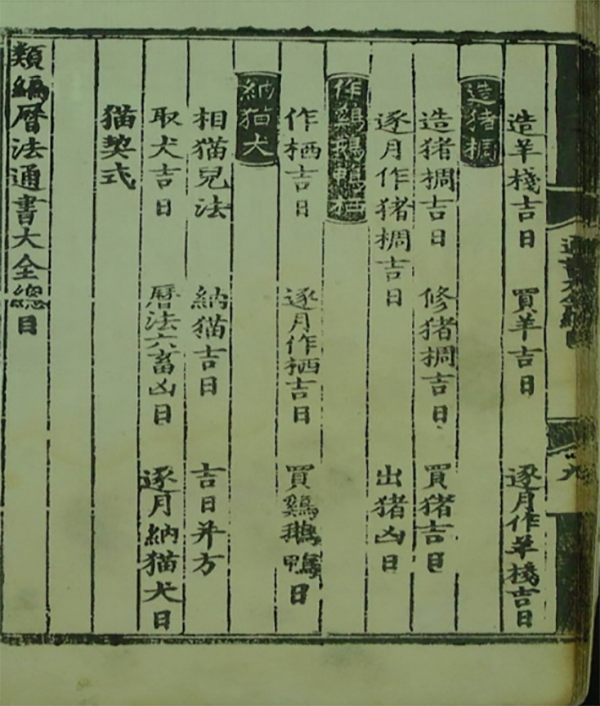
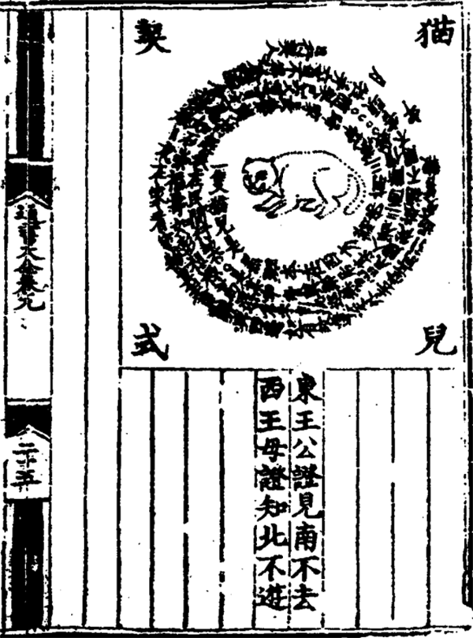

Notes on: 宋凯会,  (2024): 宋代猫奴手册二：裹盐迎得小狸奴——聘猫、养猫、信仰
===========================================================================

`View on The Paper <https://www.thepaper.cn/newsDetail_forward_26314821>`_

.. code-block:: bibtex

   @Article{宋凯会_宋代猫奴手册二_2024,
     author  = {宋凯会},
     title   = {宋代猫奴手册二：裹盐迎得小狸奴——聘猫、养猫、信仰},
     journal = {澎湃新闻},
     year    = 2024,
     url     = {https://www.thepaper.cn/newsDetail_forward_26314821},
     month   = {May},
   }

前言
----

宋代诗坛留下了众多以猫为礼的酬答诗和唱和诗。如曾几的《乞猫二首·其二》所述“江茗吴
盐雪不如，更令女手缀红。小诗却欠涪翁句，为问衔蝉聘得无”；章甫的《从贾倅乞猫》中
写道“渚宫茅屋住经年，墙壁苦遭群鼠穿。旋乞狸奴名去恶，中宵客枕得安眠”；李璜的《以
二猫送张子贤·其一》中描述“家家入雪白于霜，更有倚鞍似闹装。便请炉边叉手坐，从他鼠
子自跳梁”；黄庭坚的《谢周文之送猫儿》赞美“养得狸奴立战功，将军细柳有家风。一箪未
厌鱼餐薄，四壁当令鼠穴空”；赵蕃的《谢彭沅陵送猫》感激“怪来米尽鼠忘迁，嚼啮侵寻到
简编。珍重令君怜此意，不劳鱼聘乞衔蝉”；陆游的《赠猫》表达“裹盐迎得小狸奴，尽护山
房万卷书。惭愧家贫策勋薄，寒无毡坐食无鱼”；陈郁的《得狸奴》“穿鱼新聘一衔蝉，人说
狸花量直钱。旧日畜来多不捕，于今得此始安眼”。这些乞猫、赠猫、得猫诗，诗人对猫的
描绘细腻而生动，将猫的形象融入诗篇，传颂它们的美好品质，充满了宋人对猫的喜爱与对
小生命的敬畏。

聘猫仪式
--------

宋人对猫的喜爱和尊重首先体现在“聘猫”仪式上。在这些特殊的仪式中，人们不再用“买”来
形容猫，而是称之为“聘”，猫既用聘，亦可言嫁，具体方法有“买鱼穿柳”“裹盐”“裹茗”等，
此乃养猫者常谈。聘者，以鱼为礼，赠之以诚；嫁者，携之以归，承之以情。是故养猫者，
不唯以鱼为礼，更应心怀敬意与真诚。

据《猫苑猫乘》记载，宋代及以后完整的聘猫仪式大致是“相猫—选定日期—下聘行纳猫契—迎
猫回家—拜灶神、制猫厕—驯服安家”。（李妍颖《纳猫民俗研究：基于范热内普“过渡礼仪”
理论》）

.. _catg1:

   《类编历法通书大全》所载“纳猫”

选定良辰吉日：在宋代，朝廷会颁布大历，出售小历。历法包含月序、日序等内容，涵盖诸
神方位、四大吉时、吉凶宜忌等部分。在民间，百姓行事皆需审慎选择吉凶，遵循禁忌。
《齐东野语·月忌》载：“俗以每月初五、十四、二十三日为月忌，凡事必避之。”宋代民间
传统认为每月的初五、十四、二十三日为月忌日，各种事务均应避免在此期间进行。在正式
聘猫之前，主人会选择一个黄道吉日。纳猫的吉日应优先考虑甲子、乙丑、丙午、丙辰、壬
午、壬子、庚子。而天月德生炁日则应避免，同时也要避开飞廉、受死、惊走、归忌等不利
的日子。（《猫苑·名物》）

准备纳猫契：主人会写一份纳猫契，首先要写“东王公证见南不去，西王母证知北不游”作为
见证；甚至会画一只猫儿，围绕猫儿契文中通常会写明聘猫日期、猫的习性以及对它的期许，
后题行契人。如宋元历书载《猫儿契式》“一只猫儿是黑斑，本在西方诸佛前，三藏带归家
长养，护持经卷在民间……仓禾自此巡无息，鼠贼从兹捕不闲。不害头牲并六畜，不得偷盗食
诸般。日夜在家看守物，莫走东畔与西边。如有故逃走外去，堂前引过受笞鞭。年月日，行
契人。东王公证，见南不去。西王母证，知北不游”。“猫儿契式”并不是真正的契约文书，
而是养猫者送给乞猫者的象征性契约文书，当为一种民间习俗。（钱光胜、王晶波《猫儿契
式·猫画·佛经：俄藏敦煌写卷Дх.00147v〈猫儿题〉蠡测》）

.. _catg2:

准备聘礼：古人向猫主人征求猫时，通常会采用聘礼的方式，如陆放翁诗中所述“裹盐迎得
小狸奴”，以“盐”作为聘礼。盐在吴音中与“缘”谐音，因此以盐和头发作为礼物，寓意“有缘
法”。（《猫苑·名物》）此外，猫喜爱的鱼类亦被视为聘礼，诸如“穿鱼新聘一衔蝉”“买鱼
穿柳聘衔蝉”“穿柳鱼余欲聘猫”“买鱼贯柳酬策勋”等诗句即为明证。宋代文人对礼物的选择
通常包括新茶、当地土特产（如黄芝麻、大枣、豆芽等），以及文房四宝、书画作品等。

纳猫拜堂安家过程：在选定的黄道吉日，主人会举行纳聘仪式，手持纳猫契，携聘礼取猫。
纳猫时，用手桶或袋盛之，将计筯（筷子）一根与猫共置于桶内，这种做法源自旧时民间嫁
娶女子的习俗，丢一双筷子意味着新娘不再吃娘家饭，纳猫此举意喻嫁女，当时还有“嫁猫”
一说。途中需避免他人窥见，象征新生活起点及美好前程。遇水坑或缺处，放置石子，寓意
猫咪不再返回原有道路，彻底融入新生活环境。抵达新主人家后，取出猫咪，进行祭拜，将
猫筯置于土堆之上，通过制作古代猫砂，以防止猫在家中撒尿，随后令其在床上，以此防止
小猫离家出走，还要对小猫作“巴甫洛夫效应”测试，“携猫出门外，用细竹枝鞭之，放回家
再与肝二片。如此数次，小猫不再出走，则表示它已成为这个家庭中不可或缺的一员。

养猫习俗
--------

在宋代，人们对猫的生命周期具备深入的认识，涵盖从诞生至离世的全过程，以及饮食和疾
病等方面。古人了解到“大抵猫之交，常于春秋二季，其头交时，则牝牡相呼”，（《猫苑》）
猫的怀孕期为两个月，在怀胎时，会因为血气不足出现与人类一样小产等生理现象。猫的生
产过程可分为三月产和四月产，分别被称为奇窝和偶窝。猫的寿命可分为上寿、中寿和下寿
以及夭折。古人认为猫胎以少为贵，在腊月生产为最佳，初夏出生的猫被称为早蚕猫，也较
好，秋季次之，夏季最差，因为无法耐寒。如家里有公猫必须进行阉割，这样可以将其雄性
气质转化为柔顺，阉割的公猫容易肥胖。民间还有半阉猫，即仅去除内肾一侧，雄性气质尚
未完全消失，更加刚柔并济。《通书》记载，阉猫宜在伏断日进行，需注意在每月初一、初
四、初五、初七、初九、初十、十四、十五、二十一、二十二、二十三、二十四、二十五、
二十七、二十八、二十九、三十日这些日子，避开刀砧、血刃、飞廉、受死、血支等凶煞。
阉割过程中，需将猫头纳入卷簟之中，阉割完成后放开，猫会从后口奔走，以免被咬伤。
（《臞仙肘后经二》）

古代人们注重猫的养护，给予它们良好的饮食、住所。对养猫的喂养和训练也有一定的规范
和习俗。人们会定时给猫喂食，并注意饮食的均衡和营养的摄入。在膳食上，猫最喜爱的还
是鱼类，《梦粱录》载古人养猫时，每日都会为它们“供鱼鳅”，“奉鱼肉”，（《艾性夫·猫
犬叹》）“祭与饭与鱼”，“欲觅小鱼饲猫”，（《入蜀记》）“纤鳞喂乳猫”，（《残春感事十
首》）“鱼肉膏粱”；宋人还了解到猫的饮食禁忌，“不食虾蟹”，“捕雀蝶蛙蝉而食者，非狂
则野，生疣及蛆”，（《猫苑·名物》）“多食肉汤则坏肠”；猫的饮食习性也被宋人研究所掌
握，如“炙猪肝与食”可以让毛色光泽，“食鳝则壮，食猪肝则肥”。人们已经认识到猫食具有
防止食物变质的作用，《物类相感续志》中记载，“烰炭饼中安猫食，夏月亦不臭”，这都是
古人生活经验的积累。古人对薄荷的功效已有深入的了解，发现它可以令猫感到愉悦和兴奋，
“猫以薄荷为酒，食之即醉”，（《埤雅》）“醉薄荷”。

宋代主人还与猫同寝食，共喝粥，《安晚堂集·香山猫食粥》中写道：“梵宫新遣两狸奴，晨
粥饥餐食肉如。”《梦粱录新校注·十二月》中也提到“士庶家煮赤豆粥祀食神……有猫狗者亦
与焉”，这表明家中养的猫同样可以享用“人口粥”，体现了古人对生命的尊重以及对猫咪在
家庭中重要地位的认可。宋代猫还有专门的猫食盆，汝窑水仙盆便颇具代表性，有的甚至为
官窑定制。此外，古人还为猫咪准备了专门的猫窝，热则肆乎温凉，寒则登于寝席，还“用
草代箸，量猫尾，同其长短，插草于粪堆上”制作猫砂，“祝之勿在家撒屎”。宋人为宠物猫
装扮现象尤为流行，甚至给宠物猫美容的做法，用凤仙花液汁给猫狗染色，“今回回妇人多
喜此，或以染手并猫狗为戏”。（《癸辛杂识》续集上《金凤染甲》）

宋人对猫患病后的治疗也颇有研究，还总结了众多经验。猫犬病“乌药一味，磨水，灌之即
愈”；（《猫苑·名物》）小猫叫不绝声，“陈皮研末，涂鼻端，即止”；（《猫苑·名物》）
猫被人踏伤，“苏木煎汤灌之，可疗”；（《猫苑·名物》）猫癞，“用蜈蚣焙干，研末与食，
数次即愈。又法：桃叶捣烂，遍擦其毛，少顷洗去，又擦，自愈。治狗癞亦可”；（《猫苑·
名物》）猫生虱，“桃叶与楝树根捣烂，熟汤泡洗，虱皆死。樟脑末擦之亦可”。（《猫苑·
名物》）《奇疾方》载猫眼生疮，多食鸡肉鱼类，病症可自然痊愈。猫在煨火时皮肉烧伤，
将硫磺纳入猪肠中，煮熟后喂养，可使其痊愈。（《致富奇书》）猫死后还颇有说法，《埤
雅》云“猫死，不埋于土，悬于树上”，或是“裹以粗布而瘗之，勿使陷首也”，（《华西集》）
皇宫王朝还用金棺葬爱猫，并撰词题碑。（《明诗综》）

民间信仰
--------

“猫之形象也更为多样复杂，既是祥瑞、颇受好评的神兽，又是不祥、魅惑人心的妖兽，同
时具备鲜明的性格特征。这一动物兼备神性与妖性”。（郭心叶《神祇·祥瑞·妖魅：中国古
代笔记与小说中的猫故事研究》）猫在神仙层面表现为“猫神”“猫仙”以及具有果报性质；同
时，猫在妖怪形象中也有所体现，如“猫魅”“猫精”“猫魈”“猫怪”“猫鬼”等。

在宋代民间，猫被赋予神秘的象征意义，被视为一种具有特殊力量的吉祥动物。在古代迎接
猫神是腊八节的一种传统，人们相信通过这种方式可以“压制恶势力、降服凶猛的野兽、避
免鼠患”，因此猫被视为具有“辟邪”作用的吉祥物。京师宫眷和百姓还穿着“皮鞋，亦名猫儿
窝”，还绣兽头于鞋上，呼为猫头鞋。在宋代士人的女教作品中，“猫相乳”被用作鼓励女性
领悟孝悌之义的象征。士人以猫的忠诚友善训诫妻妾，期望女眷和睦、夫妻和悦。宋代“猫
相乳”诗发展出道德教化的意义，成为文人士大夫教化社会的范例。民间还素有在家中悬挂
猫儿画像的习俗，甚至出现邀请文人画家专门创作猫画以达到驱鼠之效的现象。《画继补遗》
中提及：“每往人家画土神，其家必富，画猫则无鼠。”此类信仰在《苏文忠公集》《尊生八
笺》等古籍中亦有踪迹，均认为“画猫能辟鼠”。

宋代猫被尊崇，源于其捕鼠之能，对农业产生积极影响，因此成为祭祀活动的重要对象，礼
文中亦包括於菟、猫等元素。据《太平广记》记载，宋人会在特定节日举行猫的祭祀仪式，
以期国家安定、家庭安宁、吉祥如意。《尔雅翼》中阐述：“古者，蜡礼迎而祭之，夫猫虎
虽能食田豕田鼠，然所以主此者，盖必有神于此。”宋朝郊庙朝会祭祀的场面及礼仪中，“祭
列坊庸，礼迨猫虎。有功斯民，祀乃其所”。（《宋史》卷137《志第九十·乐十二·蜡祭》）
《文苑英华》云“伊祈氏季春迎猫”。由此可见，猫成为祭祀对象，旨在祈求福祉与庇佑，凸
显其在古代社会地位之尊贵，具有驱邪避灾之神力，被视为祥瑞之兽。

在宋代，三教融合的趋势愈发明显，这为因果报应思想的发展提供了丰富的土壤。因果报应
不仅仅是一种宗教观念，更是一种深入人心的道德准则。在宋代，猫曾被视为具有果报性质
的灵异生物，表现出福祸相随的双重特性，《青琐高议·猫报记》记载：朱沛家富裕，养百
余只鸽。一日，猫食鸽，朱沛断猫四足，猫死。再食，再断，数猫死。后妻生无手足二子，
弃。朱沛不悟。《夷坚志》也载轶事一则，庖婢庆喜因猫偷食兔肉被主母责骂，愤而掷猫于
柴火，猫腹被木叉刺穿而死。一年后，庆喜因摔倒被竹片伤及小腹而死，此乃猫之报复，以
猫寓事来注重对现世、当下生命的关怀，赋予其深刻的道德训诫和伦理内涵。《续墨客挥犀》
又载，龚晃仲家中有众多妖异现象，请女巫徐姥来处理。家中一只猫突然站立起来，拱手作
揖，令巫师惊讶。数日后，龚晃仲及族人均传佳音。宋时“资阳县民支渐，葬母，自负土成
坟”，（《文昌杂录》）有狸猫似感受到支渐的诚意与孝心，久久不愿离去。这也说明猫对
人类善良美德的一种认可和颂扬。猫融入了无数的故事和传统之中，不仅是传说轶事，更是
对人性、道德与因果报应的深刻反思，要时刻保持敬畏之心。

在关于猫妖性质的深入探讨中，我们可以发现，许多关于猫成精怪的记载显示，这一阶段的
猫幻化魈魅主要表现为引发灾异或是诱使世间男女陷入困境等行为。这类故事在古籍中比比
皆是，如《夷坚志》“临江军治内野猫，两目如丹，出则以前足抱头而睢盱人立，凡见之者
必有灾咎”。另外《夷坚志》记载，临安周五之女很美，但昼眠不寤，夜不寝，且自言自语。
羽三知晓后断定其为猫魈所迷。法剑斩其首，女醒魈绝。又载，顾端仁秀才未婚，某日见少
女，每晚出现。其父疑虑，向黄法师求助。黄法师认为是猫精，书三符防之。当晚女未至，
数月后复来，怒斥秀才害她。秀才病逝。这几个故事中，猫妖的形象主要与灾异和不幸相连，
其角色定位充满了神秘和恐怖的色彩。

在宋代，猫与佛、道之间颇具历史渊源。诸多佛教与道教的文献中，对猫的描述颇多。佛教
绝大多数由僧人创作，以颂古与偈颂形式呈现。在僧侣的观念中，猫具备通灵与佛性。《五
灯会元》系宋代著名禅师释普济所著的一部佛学著作，书中多次呈现了佛教元素与猫的结合，
彰显了猫与佛教的深厚渊源，如“慧觉广照禅师，传僧问：‘莲花未出水时如何’？师曰：‘猫
儿戴纸帽’”；“‘凡圣同居如何’？曰：‘两个猫儿一个狞’”；“祖印禅师上堂，才坐，忽有猫
儿跳上身。师提起示众。良久，抛下猫儿，便下座”。《夷坚志》记载，全椒山庵有僧居，
养猫犬。僧遣仆买盐，盗至杀僧裹财。猫守僧旁护僧，鼠不加害，盗被捕。这则轶事不仅阐
述了猫的捕鼠功能，更是对其主人的忠诚属性。《湖湘野录》《雁门野说》及《传灯录》等
文献中，亦记载了佛教与猫之间的诸多因缘际会及故事。

关于道教，猫、炼丹与鹤三者相结合，鹤与炼丹通常作为道教象征。如“苏子由曾试黄白之
法，既举火，见一大猫据炉而溺，叱之不见，丹终不成”。《乘异记》中，“许遨市药造炉，
使其人自守而候之。将成，必有猫触，其炉破，双鹤飞去”。《清异录》记载：“居士李巍，
求道雪窦山中，畦蔬自供。有问巍曰：‘日进何味？’答曰：‘炼鹤一羹，醉猫三瓶’。”于此，
猫、鹤与炼丹并置共融，彰显出修行者对纯洁、自然、无欲无求境界的向往，淋漓尽致地展
现了修行者超脱尘世、淡泊名利的品格风貌。此外，纳猫的“猫儿契式”或许借鉴了道教“契”
的神异色彩，将道士用来请神兵鬼将的兵符社契融入民俗，寓意请猫兵驱鼠患。（郭心叶
《神祇·祥瑞·妖魅：中国古代笔记与小说中的猫故事研究》）

显然，佛道教以猫为寓言，其背后不仅与寺、观养猫的现实状况紧密相连，而且突显了宋代
猫所兼具的神性与妖性双重特质。这种现象反映出浓厚的劝化与说教思想，展现了佛道与民
间信仰的交融，以及佛道教在大众化进程中的发展趋势。猫既可以被视为施恩布德的神秘神
兽，也可被认为是蛊惑人心的妖邪之徒。同时，猫象征着吉祥如意，却又预示着不幸与灾祸。
猫与女子的结合，既象征着庇佑后代、多子多福的吉祥寓意，同时又代表着妖魅化的形象。
宋人逐渐接纳文化中神秘诡异的元素，对猫的喜爱与赞赏越发明显，而对猫妖性灾祸一面的
避讳则相较前代有所减弱。
