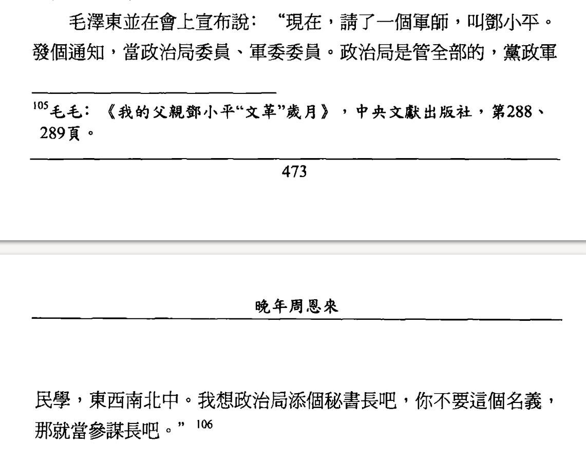

Notes on: 高文谦 (2003): 晚年周恩来
===================================

`View on DouBan <>`_

.. code-block:: bibtex

   @Book{高文谦_晚年周恩来_2003,
     author =    {高文谦},
     title =        {晚年周恩来},
     publisher =    {明镜出版社},
     year =         2003,
   }

第四章 乱局中的隐忍顺守之道
---------------------------

大闹怀仁堂
~~~~~~~~~~

邓小平后来在党内高层谈到周恩来在文化大革命中的作用时，曾说过两句值得玩味的话。一
句是：如果没有总理，文化大革命的局面可能更糟。另一句是：没有总理，文化大革命也不
会拖得那么久。尽管历史是无法假设的，但邓小平对周的这段评价却切中要害，点出了周氏
在文革期间所扮演的双重历史角色————既减轻了历史灾难，又延长了历史灾难。

在政治与良知之间的选择
~~~~~~~~~~~~~~~~~~~~~~

一九六八年十月，中共八届十二中全会批准了周恩来代表中央所作的《关于叛徒、内奸、工
贼刘少奇罪行的审查报告》，并通过决议，宣布“把刘少奇永远开除出党，撤销其党内外一
切职务，并继续清算刘少奇及其同伙叛党叛国的罪行。”这件事成为周氏在文革中一大历史
污点。知夫莫若妻。前面邓颖超所提到的就是指的这件事。她曾对中共党内一批想“扬周贬
毛”的老干部说过这样的话：你们不要这么搞，恩来什么时候反对过毛主席？他这个人你们
不是不了解，路线对了，他就对了，路线错了，他就错了。你们那样说，那样搞，无法向历
史向后人交代么。应该说，邓颖超在这一点上还是有点自知之明的，知道有些事情在历史上
是回避不了的，也无法为自己的丈夫辩白，只能听任历史来评判。

第六章 林彪之死的致命一击
-------------------------

批陈整风的前台主角
~~~~~~~~~~~~~~~~~~

当毛泽东让林彪见斯诺，他拒不接见，还以颜色，并私下对家人发泄对毛的不满，揭他的老
底，说：“今后再也不随便讲话了！讲话都要有根据，不然你好心好意拥护毛主席，还会犯
拥护过头的错误。”并愤愤地表示：“什么路线，就是毛线。”“什么讲老实话，他就是最反对
讲老实话，最喜欢吹捧，谁讲老实话，谁就完了。”

第七章 试图扭转文革困局的挫败
-----------------------------

周为何嚎啕大哭
~~~~~~~~~~~~~~

.. _gaowq_znl_p01.png:

.. _gaowq_znl_p02.png:

毛对病中交权的反悔
~~~~~~~~~~~~~~~~~~

.. _gaowq_znl_p03.png:

.. _gaowq_znl_p04.png:

.. _gaowq_znl_p05.png:

.. _gaowq_znl_p06.png:

第八章 中美和解与“周恩来外交”风波
---------------------------------

功高盖主
~~~~~~~~

.. _gaowq_znl_p07.png:

.. _gaowq_znl_p08.png:

.. _gaowq_znl_p09.png:

邓小平在会上的角色
~~~~~~~~~~~~~~~~~~

.. _gaowq_znl_p10.png:

.. figure:: images/gaowq_znl_p10.png
   :align: center

.. _gaowq_znl_p11.png:

.. _gaowq_znl_p12.png:

.. _gaowq_znl_p13.png:

.. _gaowq_znl_p14.png:

.. _gaowq_znl_p15.png:

.. _gaowq_znl_p16.png:

“他做脸，我们做屁股”
~~~~~~~~~~~~~~~~~~~~

.. _gaowq_znl_p17.png:

.. _gaowq_znl_p18.png:

治病要服从大局
~~~~~~~~~~~~~~

.. _gaowq_znl_p19.png:

.. _gaowq_znl_p20.png:

.. _gaowq_znl_p21.png:

.. _gaowq_znl_p22.png:

.. _gaowq_znl_p23.png:

.. _gaowq_znl_p24.png:

第十章 周恩来之死与毛泽东时代的终结
-----------------------------------

批“经验主义”
~~~~~~~~~~~~

.. _gaowq_znl_p25.png:

.. _gaowq_znl_p26.png:

形式逆转
~~~~~~~~

.. _gaowq_znl_p27.png:

.. _gaowq_znl_p28.png:

.. _gaowq_znl_p29.png:

.. _gaowq_znl_p30.png:

